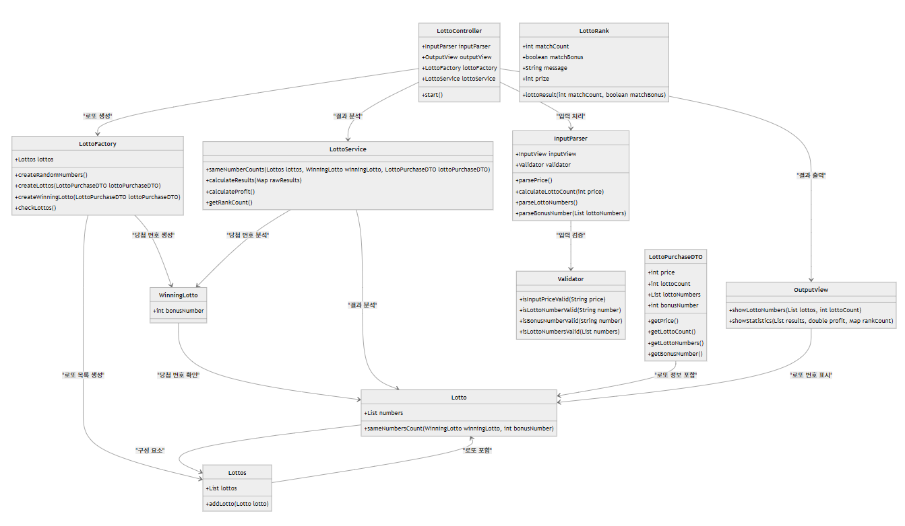

# 프리코스 3주차 미션 - 로또

## 미션 목표
> 간단한 로또 발매기를 구현한다.

## 기능 목록

- [x] 로또 발매기의 입출력 틀 구현하기
    - [x] 입력 기능
        - [x] 사용자로부터 로또 구입 금액 입력 받기
        - [x] 사용자로부터 당첨 번호 입력 받기 - 쉼표(,)를 기준으로 구분
        - [x] 사용자로부터 보너스 번호 입력 받기
    - [x] 출력 기능
        - [x] 발행한 로또 수량 및 번호 출력하기 - 로또 번호 오름차순 정렬
        - [x] 당첨 내역 출력하기
        - [x] 수익률 출력하기 - 소수점 둘째 자리에서 반올림
        - [x] 에러는 "[ERROR]"로 시작하게 구현하기
- [x] 로또 발행하기 - 수량 : 구입 금액/1000원
- [x] 사용자의 로또 번호와 당첨 번호 비교하기
- [x] 사용자의 당첨 수익률 구하기
- [x] 예외 발생 시 다시 입력 받기
- [x] 예외 처리하기
    - [x] 숫자가 아닌 것을 입력했을 경우
    - [x] 숫자가 1~45 범위를 넘을 경우
    - [x] 중복되는 숫자를 입력할 경우
    - [x] 구입 금액이 1000원 단위가 아닐 경우

## 사고 흐름 및 개발 과정

시스템의 책임 : **로또 발매기를 구현하는 것**

책임을 더 작게 분할하면 다음과 같다.
- 사용자로부터 로또 구입 금액, 당첨 번호, 보너스 번호를 입력받는다.
- 당첨 여부를 가리기 위한 로또를 진행한다.
- 발행한 로또 수량, 번호, 당첨 내역, 수익률을 출력한다.

어떤 객체가 필요할까?
- 입력 기능을 수행하는 입력 객체 InputView
- 입력 기능을 기반으로 파싱하는 객체 InputParser (추가)
- 출력 기능을 수행하는 출력 객체 OutputView
- 입력을 기반으로 로또를 생성하는 객체 LottoFactory (추가)
- 로또 한 장을 발행하는 객체 Lotto
- 여러 장의 로또를 모아둔 객체 Lottos
- 당첨 숫자로 로또를 발행하는 객체 WinningLotto (추가)
- 로또 랭크를 관리하는 객체 LottoRank (추가)
- 로또를 구매한 후 데이터를 저장하는 객체 LottoPurchaseDTO (추가)
- 로또 세팅 및 입출력 관리(흐름 제어)를 담당하는 객체 LottoController
- 로또 내부 로직을 담당하는 객체 LottoService
- 에러 메시지를 저장하는 객체 ErrorMessages
- 프롬프트를 저장하는 객체 Prompts (추가)
- 기타 상수를 저장하는 객체 Constants
- 검증 기능을 수행하는 검증 객체 Validator

## 프로젝트 구조
```text
C:.
└───java
    └───lotto
        │   Application.java
        │
        ├───common
        │       Constants.java
        │       ErrorMessages.java
        │       Prompts.java
        │
        ├───controller
        │       LottoController.java
        │
        ├───dto
        │       LottoPurchaseDTO.java
        │
        ├───model
        │       Lotto.java
        │       LottoFactory.java
        │       LottoRank.java
        │       Lottos.java
        │       WinningLotto.java
        │
        ├───service
        │       InputParser.java
        │       LottoService.java
        │
        ├───util
        │       Validator.java
        │
        └───view
                InputView.java
                OutputView.java
```

## 객체의 역할, 책임, 협력


## 요구사항 목록
### 기본

- [x] JDK 21 버전임을 확인하기
- [x] 자바 코드 컨벤션을 지키면서 코드 구현하기
- [x] README.md에 정리한 기능 목록을 기반으로 커밋하기
- [x] AngularJS Git 커밋 메시지 커벤션을 지키면서 커밋 메시지 작성하기
- [x] 함수가 한 가지 일만 하도록 만들기

### 기타

- [x] Randoms 및 Console API 사용하기
- [x] indent depth 2까지만 구현하기
- [x] 3항 연산자 쓰지 않기
- [x] 메서드의 길이가 15라인을 넘어가지 않도록 하기
- [x] else 예약어 대신 return 사용하기
- [x] enum 적용하기
- [x] 객체지향적으로 프로그래밍하기
- [x] 클래스와 함수에 대한 단위 테스트 코드 작성하기

## 코드 작성 시 숙지 사항

- [x] 리드미 상세히 작성하기
- [x] 값을 하드 코딩하지 않기
- [x] 구현 순서 : 상수 -> 멤버 변수 -> 생성자 -> 메서드
- [x] 변수 이름에 자료형 포함하지 않기
- [x] 작은 단위부터 테스트 코드 작성하기

## 추가 학습내용 및 과제수행 시 중점 사항

- [프로젝트 시작 전 공부](https://github.com/cyunlee/java-project-preparation)
- [자바 개념 및 문법 정리하기(~ing) 2탄](https://github.com/cyunlee/java-enhanced-notes)
- 과제수행 시 중점 사항 (신경 쓴 부분)
  - DTO의 개념을 도입하기
  - 팩토리메서드 디자인 패턴을 사용해보기
  - Lotto 객체를 담은 Lottos 클래스를 일급 컬렉션으로 구현하기
  - InputView와 InputParser의 역할을 명확히 나누기
  - toString 오버라이드하여 객체 표현하기