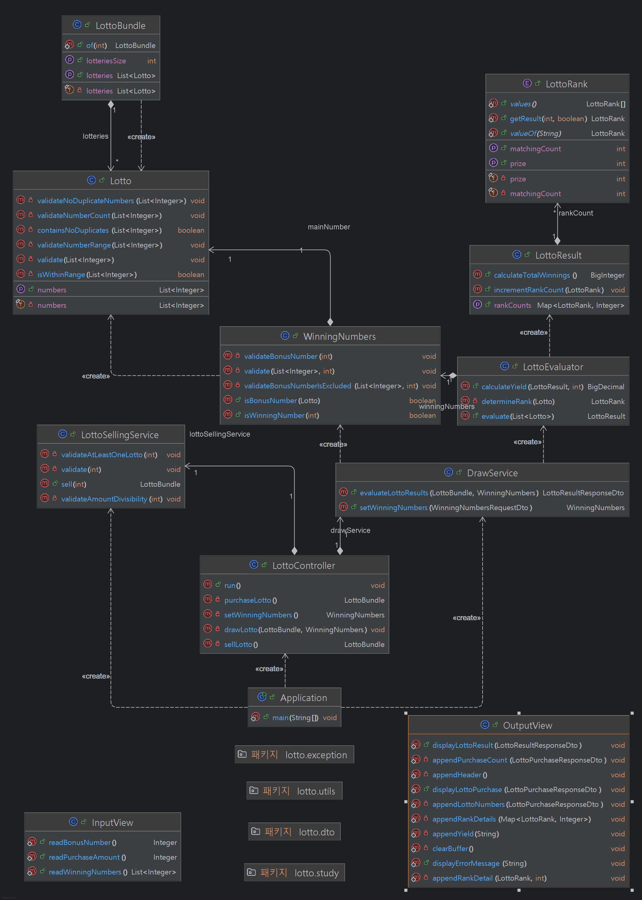

# 🎰로또 게임

---

우아한 테트 코스의 3주차 미션인 **로또 게임** 입니다. 최대한 **객체끼리의 협력**을 통해서 기능을 구현하고자 하였습니다. ✨

<br>

## 🎡 로또 게임 소개

---

간단한 로또 발매기라고 생각하시면 프로그램 이해에 도움되실 것 같습니다.

다만, 일반적인 로또 추첨과 다른 점은 **당첨 번호와 보너스 번호를 사용자에게 입력**받는다는 점과 **발행한 로또 표는 자동 선택**되는 상황이라고 생각하시면 좋을 것 같습니다!

<br>

### 🎫 로또 발매 진행 방식

1. **원하시는 로또 수량만큼 로또 구입 금액을 입력합니다.**

   **(로또 표는 장당 1,000원입니다.)**

    - 이때 구입 금액은 `1,000원 단위`로만 입력 받습니다. 잔돈이 없습니다.😂

      (숫자의 양쪽 공백은 제거되어 들어옵니다)

    - 아래와 같이 잘못 입력 했을 경우 재입력 부탁드립니다.
        - null일 경우
        - 입력 값에 숫자가 아닌 것이 존재하는 경우
        - 0보다 작을 경우
        - **1000원으로 나누어 떨어지지 않는 경우**

<br>

2. **당첨 번호를 입력합니다.**
    - 로또 번호의 `숫자 범위는 1~45`까지이며, `중복되지 않는 6개의 숫자`를 입력 받습니다.

      (번호는 `쉼표(,)`를 기준으로 구분되며, 숫자의 양쪽 공백은 제거되어 들어옵니다.)

    - 아래와 같이 잘못 입력 했을 경우 재입력 부탁드립니다.
        - null일 경우
        - 입력 값에 숫자가 아닌 것이 존재하는 경우
        - 번호가 **6**개가 아닌 경우
        - 번호가 **1부터 45 사이의 숫자**가 아닌 경우
        - **중복된 숫자가 있을 경우**

<br>

3. **보너스 번호를 입력합니다.**
    - 보너스 번호의 `숫자 범위 또한 1~45`까지이며, `당첨 번호와 중복되지 않는 1개의 숫자`를 입력 받습니다.
    - 아래와 같이 잘못 입력 했을 경우 재입력 부탁드립니다.
        - null일 경우
        - 입력 값에 숫자가 아닌 것이 존재하는 경우
        - 번호가 **1부터 45 사이의 숫자**가 아닌 경우
        - **당첨 번호와 중복되는 경우**

<br>

4. **출력되는 발행한 로또 수량과 로또 번호를 확인해주세요 .**
    - 구입 금액에 해당하는 만큼 로또가 발행됩니다.
    - 발행한 로또는 1부터 45 사이의 중복되지 않는 6개의 숫자의 로또 번호가 자동으로 생성됩니다.
    - 출력 예시는 아래와 같으며, 로또 번호는 오름차순 정렬되어 보여집니다.

        ```c
        8개를 구매했습니다.
        [8, 21, 23, 41, 42, 43]
        [3, 5, 11, 16, 32, 38]
        [7, 11, 16, 35, 36, 44]
        [1, 8, 11, 31, 41, 42]
        [13, 14, 16, 38, 42, 45]
        [7, 11, 30, 40, 42, 43]
        [2, 13, 22, 32, 38, 45]
        [1, 3, 5, 14, 22, 45]
        ```

<br>

5. **출력되는 당첨 내역을 확인합니다.**
    - 당첨은 1등부터 5등까지 있으며, 당첨 기준과 금액은 아래와 같습니다.
        - 1등: 6개 번호 일치 / 2,000,000,000원
        - 2등: 5개 번호 + 보너스 번호 일치 / 30,000,000원
        - 3등: 5개 번호 일치 / 1,500,000원
        - 4등: 4개 번호 일치 / 50,000원
        - 5등: 3개 번호 일치 / 5,000원
    - 구매하신 로또 번호와 당첨 번호를 비교하여 나온 당첨 내역의 출력 예시는 아래와 같습니다.

        ```c
        3개 일치 (5,000원) - 1개
        4개 일치 (50,000원) - 0개
        5개 일치 (1,500,000원) - 0개
        5개 일치, 보너스 볼 일치 (30,000,000원) - 0개
        6개 일치 (2,000,000,000원) - 0개
        ```

<br>

6. **출력되는 수익률을 확인합니다.**
    - 구매하신 로또 번호와 당첨 번호를 비교하여 수익률이 측정됩니다.
    - 수익률은 소수점 둘째 자리에서 반올림됩니다.

      (ex. 100.0%, 51.5%, 1,000,000.0%)

    - 아래는 수익률의 출력 예시입니다.

        ```c
        총 수익률은 62.5%입니다.
        ```

<br>

7. **🎡 이후 프로그램은 종료되며, 최종적인 실행 결과는 아래와 같습니다.**

    ```c
    구입금액을 입력해 주세요.
    8000
    
    8개를 구매했습니다.
    [8, 21, 23, 41, 42, 43] 
    [3, 5, 11, 16, 32, 38] 
    [7, 11, 16, 35, 36, 44] 
    [1, 8, 11, 31, 41, 42] 
    [13, 14, 16, 38, 42, 45] 
    [7, 11, 30, 40, 42, 43] 
    [2, 13, 22, 32, 38, 45] 
    [1, 3, 5, 14, 22, 45]
    
    당첨 번호를 입력해 주세요.
    1,2,3,4,5,6
    
    보너스 번호를 입력해 주세요.
    7
    
    당첨 통계
    ---
    3개 일치 (5,000원) - 1개
    4개 일치 (50,000원) - 0개
    5개 일치 (1,500,000원) - 0개
    5개 일치, 보너스 볼 일치 (30,000,000원) - 0개
    6개 일치 (2,000,000,000원) - 0개
    총 수익률은 62.5%입니다.
    ```

<br>

# 🤗 객체

프로그램 이해를 돕고자 객체들의 상호작용을 설명드리겠습니다. 여러분(사용자)이 로또를 구매하고 당첨 여부를 확인할 수 있도록, 여러 **직원 객체들**이 협력하여 하나의 비즈니스 서비스를 제공하고 있습니다.🤗 각 객체들은 팀처럼 함께 협력하며, 로또 구매와 당첨 확인이라는 서비스를 완성해갑니다.

---

### 서비스 전체 흐름: 로또 구매와 당첨 결과 제공

1. **Controller (컨트롤러)** 👨‍💼
   - 프로그램의 관리자 역할을 담당합니다. 각 서비스를 사용자의 요청에 따라 필요한 곳으로 연결해줍니다.
   - 사용자가 입력한 금액을 **로또 구매 서비스**로 전달하여 로또를 생성합니다.
   - 당첨 번호와 보너스 번호 입력 시, **로또 당첨 확인 서비스**로 보내 당첨 여부를 확인합니다.
   - 결과를 **View**에 전달하여 사용자에게 표시할 수 있도록 관리합니다.
2. **View (뷰)** 🖥️
   - 사용자와 직접 상호작용하며, 입력을 받고 결과를 출력하는 화면입니다.
   - 사용자가 금액을 입력하거나 당첨 번호와 보너스 번호를 입력할 때 필요한 정보를 보여주고 입력을 받습니다.
   - 컨트롤러가 전달한 결과 데이터를 화면에 표시하여 사용자가 로또 구매와 당첨 결과를 쉽게 확인할 수 있도록 돕습니다.

3. **로또 구매 서비스(LottoSellingService)** 🎟️
   - 여러분이 금액을 입력하면 **로또 구매 서비스**가 구매 가능한 로또 개수를 계산하여, 적절한 수량의 로또를 제공해주는 역할을 합니다.
   - **로또 구매 서비스는 LottoBundle 등을 통해** 사용자에게 로또 리스트를 제공합니다.
1.  **로또 당첨 확인 서비스(DrawService)** 🏆
    - 로또를 구매한 후, 여러분이 당첨 번호와 보너스 번호를 입력하면, **로또 당첨 확인 서비스**가 여러분의 로또와 당첨 번호를 비교해 당첨 여부와 수익률을 확인합니다.
    - 이 서비스는 **WinningNumbers**, **LottoEvaluator** 등이 협력해 등수와 당첨 금액, 수익률 등을 종합적으로 계산하여 여러분에게 전달합니다.

---

### 객체들 소개: 서비스 제공을 위한 직원들

우리 프로그램에는 **로또 구매 서비스와 당첨 확인 서비스**를 제공하기 위해 각자 역할을 수행하는 여러 객체들이 있습니다.

---

### 🛒 로또 구매 서비스와 팀원들

1. **Lotto (로또)** 🎫
   - **역할**: 한 장의 로또를 나타내며, 번호가 유효한지 확인합니다.
   - **아는 것**: 로또 번호 리스트(numbers)와 로또 가격(LOTTO_PRICE).
   - **하는 일**:
      - 사용자가 받을 로또 번호가 올바르게 생성되었는지 검증합니다.
      - 유효한 번호라면 번호를 정렬하여 저장합니다.
2. **LottoBundle (로또 묶음)** 📦
   - **역할**: 로또 여러 장을 하나의 묶음으로 관리합니다.
   - **아는 것**: 로또 리스트(lotteries)
   - **하는 일**:
      - 사용자가 요청한 개수만큼 1~45 범위에서 중복되지 않는 숫자 6개로 구성된 로또 번호를 생성하여, 로또 묶음으로 만듭니다.

### 🏆 로또 당첨 확인 서비스와 팀원들

1. **WinningNumbers (당첨 번호)** 🎉
   - **역할**: 여러분이 입력한 당첨 번호와 보너스 번호를 관리합니다.
   - **아는 것**: 당첨 번호 리스트(mainNumber)와 보너스 번호(bonusNumber).
   - **하는 일**:
      - 당첨 번호와 보너스 번호가 유효한지 확인하고, 중복되지 않도록 관리합니다.
2. **LottoEvaluator (로또 판독기)** 🔍
   - **역할**: 구매한 로또와 당첨 번호를 비교하여 당첨 여부를 판정합니다.
   - **아는 것**: 당첨 번호 객체(WinningNumbers), 로또 묶음(LottoBundle)
   - **하는 일**:
      - 구매자가 보유한 로또와 당첨 번호를 비교하여 등수를 판별하고, 모든 당첨 금액과 수익률을 계산합니다.
3. **LottoRank (로또 등수)** 🥇
   - **역할**: 각 로또의 등수를 나타내며, 등수별로 상금을 결정합니다.
   - **아는 것**: 등수별로 일치하는 번호 개수(matchingCount)와 상금(prize).
   - **하는 일**:
      - 로또와 당첨 번호를 비교해 일치하는 번호 수에 따라 1등부터 5등까지의 등수를 판별합니다.
4. **LottoResult (당첨 결과)** 📝
   - **역할**: 각 등수별 당첨 횟수와 총 당첨 금액을 관리합니다.
   - **아는 것**: 등수별 당첨 횟수(rankCount)와 총 당첨 금액.
   - **하는 일**:
      - 로또 판독기가 계산한 등수를 기록하고, 등수별 당첨 횟수를 종합해 총 당첨 금액을 구합니다.

---

이처럼, 우리 프로그램의 모든 객체들은 **각자 맡은 역할을 수행하며** 서로 협력하여 여러분께 **완벽한 로또 서비스**를 제공하고 있답니다! 🥳

<br>


# 구현 목록

---

### 사용자 입력 관련

- [x]  구입 금액
    - [x]  숫자의 양쪽 공백 제거
    - [x]  [예외] null일 경우
    - [x]  [예외] 입력 값에 숫자가 아닌 것이 존재하는 경우
    - [x]  [예외] 입력 값이 9자가 넘어가는 경우 (정수형이 넘어가는 경우 대비)
    - [x]  [예외] 구입 금액으로 한 개도 살 수 없는 경우
    - [x]  [예외] 1000원으로 나누어 떨어지지 않는 경우
- [x]  당첨 번호 입력 받기
    - [x]  숫자의 양쪽 공백 제거
    - [x]  [예외] null일 경우
    - [x]  [예외] 입력 값에 숫자가 아닌 것이 존재하는 경우
    - [x]  [예외] 입력 값이 9자가 넘어가는 경우 (정수형이 넘어가는 경우 대비)
    - [x]  [예외] 번호가 6개가 아닌 경우
    - [x]  [예외] 번호가 1부터 45 사이의 숫자가 아닌 경우
    - [x]  [예외] 중복일 경우
- [ ]  보너스 번호 입력 받기
    - [x]  숫자의 양쪽 공백 제거
    - [x]  [예외] null일 경우
    - [x]  [예외] 입력 값에 숫자가 아닌 것이 존재하는 경우
    - [x]  [예외] 입력 값이 9자가 넘어가는 경우 (정수형이 넘어가는 경우 대비)
    - [x]  [예외] 번호가 1부터 45 사이의 숫자가 아닌 경우
    - [x]  [예외] 당첨 번호와 중복되는 경우

### 로또

- [x]  구입 금액에 해당하는 만큼 로또 발행
    - [x]  로또 수량 구하기
    - [x]  로또 수량에 따른 1부터 45 사이의 중복되지 않는 6개의 숫자의 로또 번호 생성
    - [x]  로또 번호 오름차순 정렬
- [x] 총 당첨 내역 구하기 (3개부터 6개 일치까지)
    - [x]  번호 일치 갯수와 보너스 번호를 통해 로또 등수 계산
      - [x] 로또가 당첨 번호에서 몇개 포함되어 있는 지 계산
      - [x] 로또가 보너스 번호를 가지고 있는 지 확인
- [x]  총 수익률을 소수점 둘째 자리에서 반올림하여 계산
  - [x] 당첨금 총액 구하기
    - [x] 총 금액이 너무 큰 숫자일 경우 처리


### 사용자에게 출력

- [x]  발행한 로또 수량 및 번호 출력
- [x]  당첨 통계 출력
- [x]  수익률(= 당첨 금액 /구입 금액 * 100) 출력

<br>

# 🛠구현 로직

----

