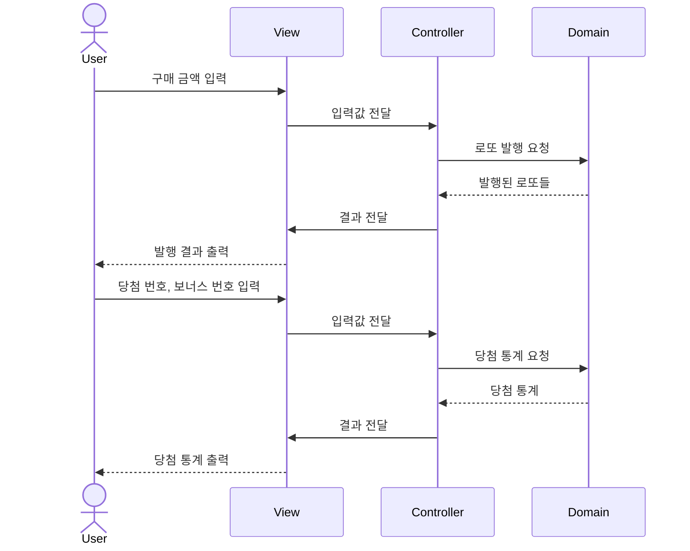

# 로또

## 기능 목록

### 1. 로또 구입 금액을 입력 받는다.

- 1000원 단위의 구입 금액 입력
- 구매 금액 저장

### 2. 로또를 발행한다.

- 로또 구매 금액으로부터 구매할 로또 수량 계산
- 로또 수량만큼
    - 1~45 사이의 중복되지 않은 6개의 숫자 뽑음
    - 로또 저장
- 발행한 로또 수량 출력
- 발행한 로또 번호 오름차순으로 정렬하여 출력

### 3. 당첨 번호를 입력 받는다.

- 쉼표(,)로 구분된 당첨 번호 입력
- 당첨 번호 저장

### 4. 보너스 번호를 입력 받는다.

- 보너스 번호 입력 및 저장

### 5. 당첨 내역 계산한다.

- 로또 수량만큼
    - 당첨 번호와 발행한 로또 번호가 일치한 개수 계산
    - 보너스 번호가 발행한 로또 번호 중 하나에 일치하는지 확인
    - 등수를 구하여 당첨 내역에 저장
- 로또 당첨 내역 출력

### 6. 수익률을 계산한다.

- 당첨 내역에 따라 총 당첨 금액 계산
- 구입 금액과 당첨 금액을 이용해 수익률 계산
- 수익률 출력

## 예외 처리

### 입력값 검증

#### 1. 공통 검증

- null 값 검증
- 빈 문자열 또는 공백 검증

#### 2. 숫자 변환 및 검증

- 정수 형식 검증
- 실수 형식 검증

### 도메인별 검증

#### 1. 구매 금액 관련

- 1000원 단위 금액만 허용
- 자연수만 허용 (0원 이하 불가)
- 정수만 허용 (소수점 불가)

#### 2. 로또 번호 관련 (당첨 번호, 보너스 번호 공통)

- 숫자 범위 검증 (1~45)

#### 3. 로또 관련

- 6개 번호로 구성
- 중복 번호 불가

#### 4. 보너스 번호 특별 검증

- 당첨 로또 번호와 중복 불가

#### 5. 구매 수량 관련

- 자연수만 허용 (0 이하 불가)

#### 6. 로또 게임 관련

- 구매한 로또 존재 여부 검증

## 입출력 예시

```prolog
구입금액을 입력해 주세요.
8000

8개를 구매했습니다.
[8, 21, 23, 41, 42, 43] 
[3, 5, 11, 16, 32, 38] 
[7, 11, 16, 35, 36, 44] 
[1, 8, 11, 31, 41, 42] 
[13, 14, 16, 38, 42, 45] 
[7, 11, 30, 40, 42, 43] 
[2, 13, 22, 32, 38, 45] 
[1, 3, 5, 14, 22, 45]

당첨 번호를 입력해 주세요.
1,2,3,4,5,6

보너스 번호를 입력해 주세요.
7

당첨 통계
---
3개 일치 (5,000원) - 1개
4개 일치 (50,000원) - 0개
5개 일치 (1,500,000원) - 0개
5개 일치, 보너스 볼 일치 (30,000,000원) - 0개
6개 일치 (2,000,000,000원) - 0개
총 수익률은 62.5%입니다.
```

## 시퀀스 다이어그램


