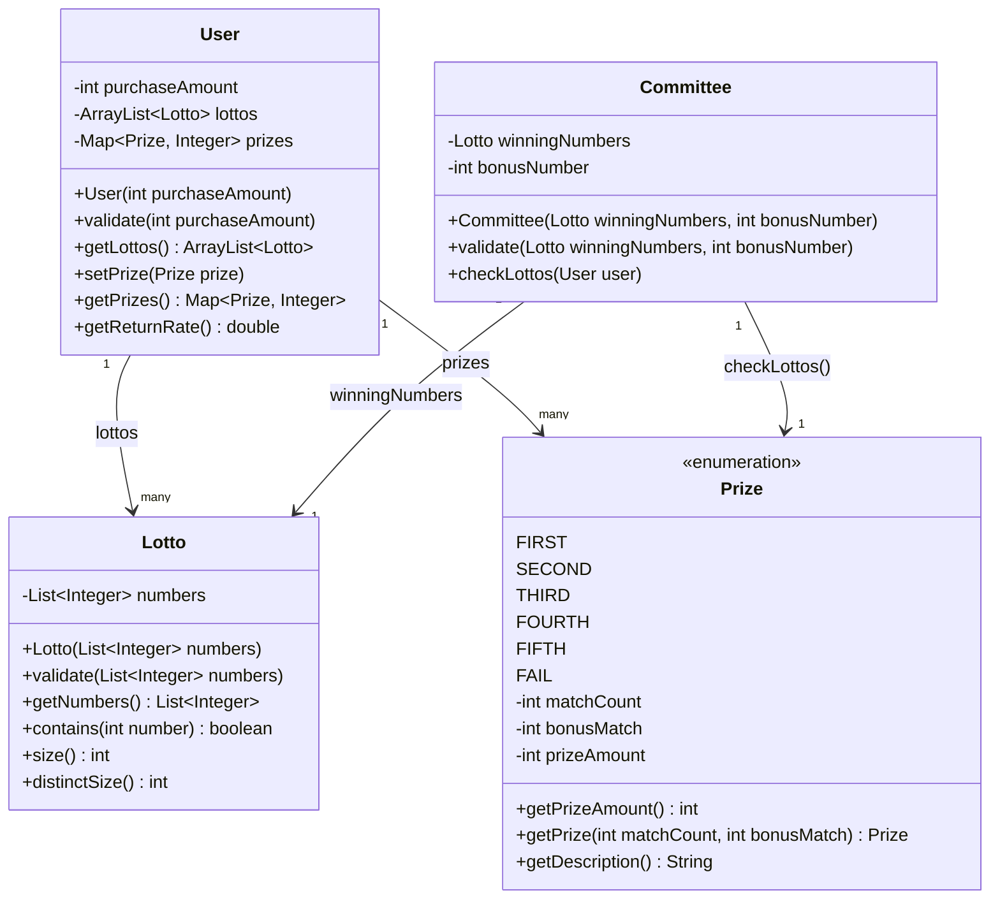

# java-lotto-precourse
## 기능 목록
- [x] 로또 구입 금액 입력받기
- [x] 로또 구입 금액에 따른 로또 수량 계산 및 수량에 맞게 로또 생성
- [x] 당첨번호와 보너스 번호 입력받기
- [x] 로또 당첨 번호와 보너스 번호에 따른 당첨 결과 계산하여 출력
- [x] 당첨 수익률 계산하여 출력
- [x] 예외 상황 시 `IllegalArgumentException` 에러 문구 출력
  - [x] 로또 구입 금액이 1000으로 나누어 떨어지지 않는 경우
  - [x] 로또 구입 금액이 숫자가 아닌 경우
  - [x] 로또 당첨 번호와 보너스 번호가 중복되는 경우
  - [x] 로또 당첨 번호와 보너스 번호가 1~45 범위를 벗어나는 경우
  - [x] 로또 당첨 번호와 보너스 번호가 숫자가 아닌 경우
  - [x] 로또 당첨 번호기 6개가 아닌 경우
- [x] 예외 발생 시 그 부분부터 입력을 다시 받게하기

## 클래스 다이어그램

## 정리

#### 새롭게 배운 점

- enum의 활용

이전의 저는 enum을 사용해보긴 했지만 그저 간단히 자주 사용되는 값들의 집합정도의 용도로만 사용했습니다. 
이번 미션에서 enum을 활용해보라는 문구를 보고 우선 맨 처음 로또 당첨금액을 enum으로 만드는게 좋을 것 같다는 생각을 했습니다. 그리고 인터넷 검색을 통해 enum 사용법을 다시 되짚어보다가 이전에 사용해보지 못한 방법으로 enum을 활용할 수 있다는 것을 알았습니다. 
enum에도 생성자를 만들 수 있다는 것을 알게 되고, 각 등수별로 맞춰야하는 번호의 개수와 상금을 생성자에 넣어서 관리하게 되니 정말 편했습니다. 
거기다가 당첨통계를 출력할 때 같은 형태의 문자열들을 등수별로 출력해야 했는데, 이게 enum에 저장한 값들을 통해 출력할 수 있는 부분이라서 이 형태에 맞춰서 return할 수 있도록 enum 내에 메서드를 처음으로 구현해봤습니다. 
이 과정을 통해 enum을 활용하는 방법을 더 깊게 알게 되었고, 만족스러운 enum 활용 결과를 얻을 수 있었습니다.

- static 메서드

클래스를 정의한 후 메서드를 구현할 때 static을 넣을 수 있고 넣지 않을 수 있다길래 static이 무슨 역할을 하는지 궁금했습니다. 
static 메서드는 new를 통해 해당 클래스의 인스턴스 생성 없이 호출이 가능한 메서드라는 것을 검색을 통해 알게 되었습니다. 
현재 내 과제를 진행하는 데에 있어서는 static 메서드가 적합하지 않아서 사용하지 않았지만, 함수를 추가할 때 마다 static함수로 구현할 수 있을지 생각해보며 고민해볼 수 있는 기회가 되었습니다.

#### 과제를 진행하면서 느낀점

이번 과제에선 class를 활용하면서 class의 생성자를 어떻게 구성할지, 변수는 어떤 것을 갖게 할지, static함수로 구현해야할 지 등등을 고민해볼 수 있던 시간이었습니다. 
클래스를 통해 구현하기 위해서 이전 객체지향을 설명한 전공 서적을 다시 보았는데, class는 현실단위에서 여러 공통 관심사를 묶어놓은 것이라고 되어 있어 현재 이 lotto 프로그램이 실제 lotto 시스템이라면 어떤식으로 구성되어야할 지 생각했습니다.
그래서 실제 로또를 구매하는 사용자가 있을 테고, 로또를 주관하는 운영기관이 있을 테고, 사용자가 갖고 있는 로또 종이가 있을 것이라고 생각했습니다. 
이들이 로또가 진행되기에 가장 중요한 요소들이라 생각하여 이를 class로 구현하게 되었습니다. 그러고 나니 이 class들이 어떤 변수와 메서드를 가지고 있어야 할지 생각하기 쉬었습니다. 
로또는 선택한 번호들을 가져야 하고, 사용자는 구입한 개수만큼 로또를 가져야 하고, 기관은 당첨번호와 보너스 번호 그리고 해당 사용자가 몇등인지 알려주는 기능을 갖고 있어야하겠다 생각해서 설계가 간단히 끝나고 구현을 하게 되었습니다. 
이렇게 현실과 대입하여 class를 구성하는 과정이 재미있었고, 효율도 좋았다고 생각합니다.

#### 많은 시간을 투자한 부분

과제의 요구사항 중 `사용자가 잘못된 값을 입력할 경우 IllegalArgumentException을 발생시키고, "[ERROR]"로 시작하는 에러 메시지를 출력 후 그 부분부터 입력을 다시 받는다.`을 만족시키는 데에 시간을 많이 소요했습니다. 
입력받는 과정 각각을 함수로 나누어서 구현하다보니 예외가 발생할 때마다 재귀호출을 통해 다시 입력을 받게 하려고 했는데, 이렇게 하니 ApplicationTest의 예외 테스트를 진행할 때 무한으로 프로그램이 실행되면서 오버플로우가 발생했습니다. 
이를 해결하기 위해 여러 방법을 시도해봤는데 결국 깔끔한 해결 방법을 찾지 못해서 타협을 보았는데, 바로 5번까지만 잘못된 입력 예외 상황에 다시 입력을 받게 하고, 5번 이상이 되면 프로그램을 종료하게 하였습니다. 
이렇게 타협을 통해 해결하였지만, 더 깔끔한 해결 방법을 찾아보고 싶었고, 이를 통해 예외 처리에 대해 더 공부해야겠다는 생각이 들었습니다.

그리고 클래스들을 리팩토링하는 데에 시간을 많이 투자했습니다. 
처음에 User 클래스와 Committee 클래스에 입력을 받는 매커니즘까지 추가해버렸는데, 이 역할은 Class내에서 할 작업은 아닌것 같다는 생각이 들어 Application에서 진행하도록 수정하고, Class는 각 Class에 필요한 정보를 생성자에서 입력받도록 수정하였습니다. 
이와 같이 수정하니 Test 코드를 작성할 때도 더 편리하게 작성할 수 있었고, 역할 분담이 더 잘 되어졌다고 생각합니다.

#### 더 고민할 부분

프리코스 커뮤니티에 들어가서 다른 분들의 1,2주차 PR을 보았고, 저와 다르게 다양하게 구현된 코드들을 보면서 제가 놓친 부분들을 되짚어보았습니다. 
그 중 코드 리뷰를 위해 PR링크를 올린 분들을 보면 대부분 MVC 패턴을 적용하였던 것을 확인했습니다. 
이 부분에 대해서 저는 어떤 것이 더 나은 구현 방향인 것인지 고민이 되었습니다. 
1,2주차에 저는 하나의 파일로 구현을 끝냈고 다른 분들은 체계적으로 코드를 나눠놓으셨던데, 1,2주차를 진행할 때의 저는 규모가 있는 과제를 진행하는 것이 아니어서 이와같이 구현하는게 오히려 더 가독성이 있고 좋다고 생각을 해서 하나의 파일로 구현하게 되었습니다. 
물론 MVC 패턴을 적용하면서 코드를 나누는 것이 확장성 면에서 이점이 있다는 것을 더 공부해보면서 알게 되었지만, 어떤 것이 더 효율적으로 구성된 프로젝트인지 고민이 되었습니다. 
그러나 대부분 코드 리뷰를 진행하시는 분들은 MVC 패턴을 적용했길래 내가 모르는 더 큰 이점이 있나 생각이 들지만 아직까지는 제 프로젝트에서 MVC 패턴을 적용하는 데에 더 이점이 되는것이 무엇인지 잘 모르겠습니다. 
그래서 이 부분을 더 고민하여 4주차를 임해야 할 것 같습니다.

## 3주차 회고

벌써 3주차가 끝나 간다니 시간이 정말 빨리 가는 것 같습니다. 
이번 과제는 내가 지금 효율적으로 코드를 짜고 있는 것인지에 대해 고민을 할 거리가 많은 과제였습니다. 
그러다 보니 다 구현했다고 생각해놓고 일상을 보내다가 갑자기 머리에서 "어 이거 이렇게 하면 안될거같은데"라는 생각이 팍 나면서 계속 노트북을 펴서 수정을 하게 되던 한주였습니다. 
제가 놓쳐버릴 뻔 했던 가장 큰 실수는 User클래스와 Committee클래스에서 입력 메커니즘까지 같이 넣어버리려고 했던 실수였습니다. 
클래스에선 해당 클래스에서 필요로하는 필드를 생성자에서 받아서 초기화하고, 메서드는 해당 클래스의 역할에 맞게 구현하는 것이 훨씬 적합하게 구현하는 것이라고 생각을 하게 됐고, 다행히 이 생각을 제출을 하기 전에 한 덕분에 수정을 할 수 있었습니다. 
그리고 Lotto 클래스로 번호 6개를 입력받는 class를 잘 만들어 놓고선 Committee에서 당첨 번호를 따로 ArrayList로 관리하고 있덨다 보니 같은 과정으로 예외처리를 중복해서 하는 것이 보였습니다. 그래서 이 부분도 당첨 번호를 Lotto 형으로 저장하도록 수정하니 훨씬 간결해져서 이 부분을 리팩토링한 것은 잘 했다고 생각합니다.