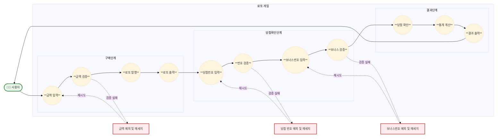

# 🎲 미션 - 로또

사용자가 구매한 로또와 당첨 번호를 비교하여 **당첨 내역과 수익률을 계산**하는 프로그램을 구현한다.
<br/>

## 🎯 사용자 Usecase

1. 사용자는 구매할 로또의 금액을 입력한다.
2. 사용자는 발행된 로또 번호들을 확인한다.
3. 사용자는 당첨 번호 6개를 입력한다.
4. 사용자는 보너스 번호 1개를 입력한다.
5. 사용자는 당첨 내역과 수익률을 확인한다.
6. 사용자는 잘못된 입력을 했을 때 에러 메시지를 확인하고 해당 단계부터 재시도한다.
   <br/>

## ✨ 기능 구현 목록

> 오른쪽의 <-> 버튼을 누르면 잘 보여요



### 📝 1. 구매 단계

- 로또 구매 금액 입력 받기
    - 안내 문구 출력: `구입금액을 입력해 주세요.`
    - 사용자 입력값 검증
        - 입력값이 숫자인지 확인
          - 금액은 99억까지 입력 가능 (10자리 이하)
        - 1,000원 단위의 금액인지 확인
        - 검증 실패 시 `IllegalArgumentException` 발생 및 예외 처리
- 로또 발행하기
    - 입력받은 금액만큼 로또 발행
        - 1장당 1,000원
        - 각 로또는 1~45 사이의 서로 다른 숫자 6개로 구성
        - `Randoms.pickUniqueNumbersInRange(1, 45, 6)` 사용
    - 발행된 로또 출력
        - 로또 수량 출력: `n개를 구매했습니다.`
        - 각 로또 번호는 오름차순 정렬
        - 로또 번호는 `[8, 21, 23, 41, 42, 43]` 형식으로 출력

### 🎯 2. 당첨 확인 단계

- 당첨 번호 입력 받기
    - 안내 문구 출력: `당첨 번호를 입력해 주세요.`
    - 사용자 입력값 검증
        - 쉼표(,)로 구분된 6개의 숫자
        - 각 숫자는 1~45 사이
        - 중복된 숫자 없음
        - 검증 실패 시 `IllegalArgumentException` 발생 및 예외 처리
- 보너스 번호 입력 받기
    - 안내 문구 출력: `보너스 번호를 입력해 주세요.`
    - 사용자 입력값 검증
        - 1~45 사이의 숫자
        - 당첨 번호와 중복되지 않음
        - 검증 실패 시 `IllegalArgumentException` 발생 및 예외 처리

### 📊 3. 결과 단계

- 당첨 내역 계산
    - 각 로또별 당첨 여부 확인
        - 각 발행 로또와 당첨 번호 비교
            - 일치하는 번호 개수 카운트
            - 5개 일치하는 경우 보너스 번호 일치 여부도 확인
        - 당첨 등수별 기준과 상금
          | 등수 | 일치 조건 | 상금 |
          |------|-----------|------|
          | 1등 | 6개 번호 일치 | 2,000,000,000원 |
          | 2등 | 5개 번호 + 보너스 번호 일치 | 30,000,000원 |
          | 3등 | 5개 번호 일치 | 1,500,000원 |
          | 4등 | 4개 번호 일치 | 50,000원 |
          | 5등 | 3개 번호 일치 | 5,000원 |
        - 수익률 계산
            - 총 당첨금 계산
                - 등수별 당첨 개수 × 해당 등수의 상금
            - 수익률 계산 공식
                - 수익률 = (총 당첨금 / 구입 금액) × 100

- 통계 출력
    - 당첨 통계 헤더와 구분선 출력
    - 등수별 당첨 내역 출력 (낮은 등수부터)
        - 형식: `n개 일치 (n,nnn원) - n개`
        - 2등의 경우: `5개 일치, 보너스 볼 일치 (30,000,000원) - n개`
    - 수익률 계산 및 출력 (소수점 둘째 자리에서 반올림), 천 단위마다 콤마(,) 표시
        - 형식: `총 수익률은 n,nnn.n%입니다.`
    - 출력 예시:
        ```
        당첨 통계
        ---
        3개 일치 (5,000원) - 1개
        4개 일치 (50,000원) - 0개
        5개 일치 (1,500,000원) - 0개
        5개 일치, 보너스 볼 일치 (30,000,000원) - 0개
        6개 일치 (2,000,000,000원) - 0개
        총 수익률은 62.5%입니다.
        ```

<br/>

## 🔍 비기능적 요구사항

> 프로그램의 확장성과 유지보수성을 위해 아래 요구사항을 준수해야 한다.  
> 비기능적 요구사항도 자체 테스트를 통해 검증하도록 한다.

### ⚙️ 프로그래밍 제약사항

* JDK 21 사용
* 주어진 `Lotto` 클래스 활용
    * `numbers` 외 필드 추가 금지
    * `private` 접근 제어자 변경 금지
* 외부 라이브러리 사용 금지
* `System.exit()` 사용 금지
* Java 코드 컨벤션 준수

### 📐 설계 제약사항

* indent depth 2까지 허용
* 3항 연산자 사용 금지
* else 예약어 사용 금지 (switch/case 포함)
* 메서드 길이 15라인 이하
* Java Enum 적용
* 모든 기능은 단위 테스트 작성 (UI 로직 제외)
