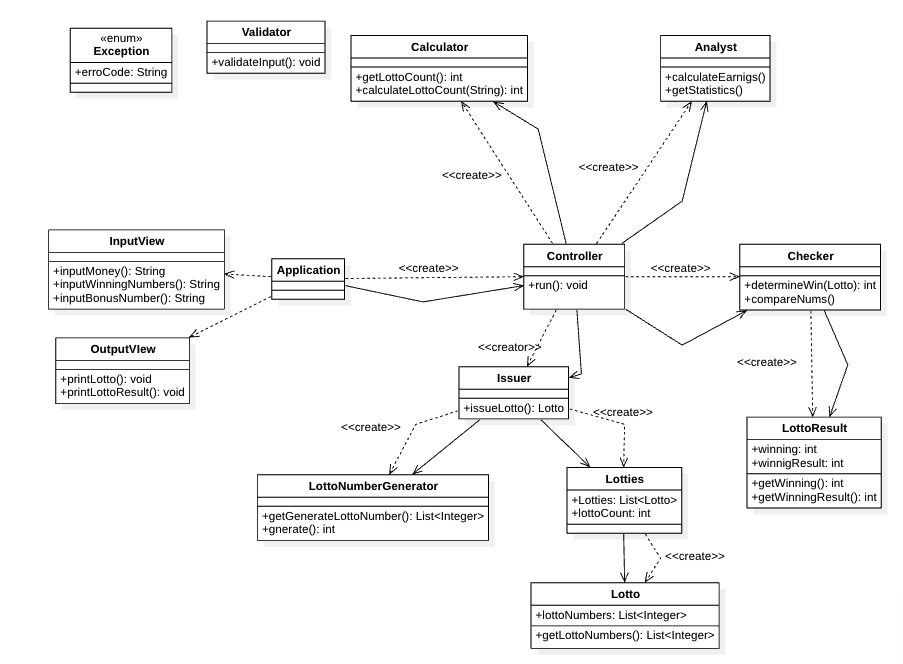
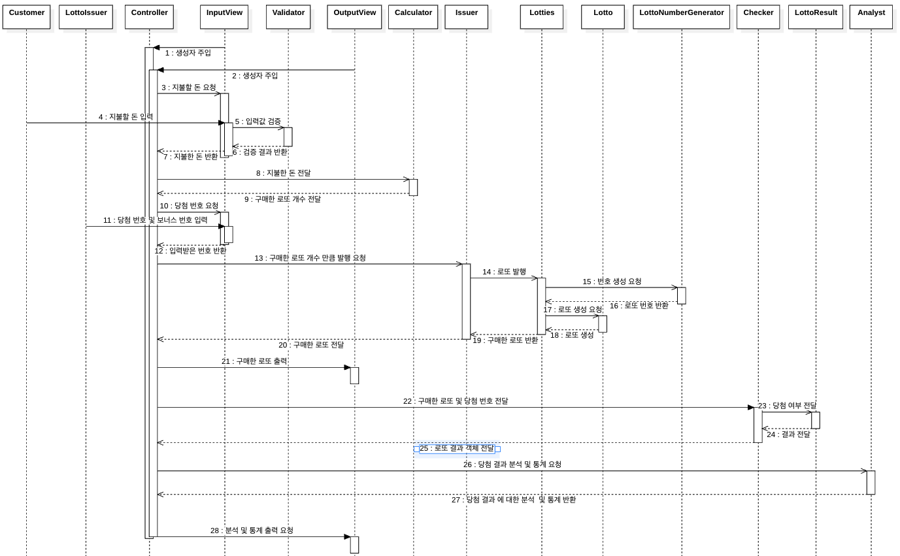

# java-lotto-precourse

## 구현할 기능 목록
#### 입출력
-[x] 금액을 입력받는다.
-[x] 당첨 번호 및 보너스 번호를 입력받는다.
-[x] 로또 개수를 출력한다.
-[x] 로또 번호를 출력한다.
-[x] 로또 결과를 출력한다.
-[x] 로또 결과에 따른 수익률을 출력한다.

#### 로또
Issuer
-[x] 로또를 발행한다.
-[x] 발행한 로또를 전달한다.

Lotto
-[x] 로또 번호를 저장한다.
-[x] 로또 번호 개수를 검증한다.
-[x] 로또 번호의 중복을 검증한다.

Lottos
-[x] Lotto 객체를 관리한다.

LottoNumberGenerator
-[x] 로또 번호를 생성한다.

Calculator
-[x] 입력받은 돈을 바탕으로 구매한 로또 개수를 계산한다.

Checker
-[x] 같은 숫자의 개수를 계산한다.
-[x] 같은 숫자의 개수를 확인하고, 랭킹을 매긴다.
-[x] 랭킹과 함께 당첨금을 통해 로또 결과를 생성한다. 
-[x] 판단 결과를 전달한다.

LottoResult
-[x] 당첨 여부와 당첨금을 저장한다.
-[x] 기록한 정보를 전달한다.

LottoResults
-[x] LottoResult를 생성한다.
-[x] Check 객체를 생성한다.
-[x] LottoResult를 관리한다.

Analyst
-[x] 당첨된 복권의 개수를 계산한다.
-[x] 당첨된 복권을 통해 번 돈을 게산한다.
-[x] 분석한 결과를 토대로 통계(수익률)을 계산한다.
-[x] 각 값을 반환한다.

WinningNumbers 
-[x] 당첨 번호와 보너스 번호를 같이 관리한다.
-[x] 중복 검증을 한다.

#### 흐름 제어 및 관리
-[x] 컨트롤러를 통해 전체적인 흐름 제어를 구현한다.

#### 예외처리
Exception
-[x] 각종 예외 사항을 enum으로 관리한다.

Validator
-[ ] 입력값을 검증한다.

#### 상수 관리
-[ ] 로또 관련 정보를 enum으로 관리한다.

-- -- --
## 예외 사항
#### 예외 검증은 다음과 같은 규칙 하에 진행한다.
1. validator는 입력값만 검증한다.
2. 이외에는 객체 내에서 검증한다.
3. 사용자가 잘못된 값을 입력할 경우 IllegalArgumentException을 발생시키고, "[ERROR]"로 시작하는 에러 메시지를 출력 후 그 부분부터 입력을 다시 받는다.

InputPurchaseAmount
-[x] 숫자가 아닌 값 입력
-[x] 공백 입력
-[x] 음수 입력
-[x] 0 입력

InputWinningLottoNumber
-[x] 숫자가 아닌 값 입력
-[x] 공백 입력
-[x] 유효하지 않은 delimiter 입력
-[x] 음수 입력
-[x] 0 입력

InputBonusNumber
-[ ] 숫자가 아닌 값 입력
-[ ] 공백 입력
-[ ] 음수 입력
-[ ] 0 입력

Calculator
-[ ] 자료형을 넘는 범위 입력
-[ ] 1000 단위가 아닌 숫자 입력

WinningNumbers
-[x] 당첨 번호 중복 입력

WinningLottoNumber
-[ ] 6개 이상의 숫자 입력
-[ ] 중복된 숫자 입력
-[ ] 1~45 사이가 아닌 숫자 입력

BonusNumberValidate
-[ ] 1~45 사이가 아닌 숫자 입력

-- -- --
## 다이어그램
#### 클래스 다이어그램 (설계 기준)

#### 시퀀스 다이어그램 (설계 기준)

-- -- --
## 요구사항 분석
협력 목표: 로또를 구매해서, 로또 당첨 여부와 결과를 알려주는 것

시나리오:
1. 구매자는 로또를 구매하기 위해 판매자에게 돈을 지불한다.
2. 판매자는 구매자로부터 받은 돈을 확인한다.
3. 판매자는 돈을 직원에게 건네고 직원은 해당 금액으로 구매할 수 있는 로또 개수를 계산한다.
4. 살 수 있는 로또 개수를 판매자에게 알려준다.
5. 판매자는 구매자에게 몇 개의 로또를 구매했는지 알려준다.
6. 판매자는 계산한 로또 개수만큼 발행을 판매점 직원에게 요청한다.
7. 판매점 직원은 각 로또를 발행하기 위해, 1~45 사이의 중복되지 않은 정수 6개를 무작위로 선택하여 번호를 생성한다.
8. 발행된 각 로또 번호를 직원이 확인하여 잘못된 번호가 없는지 검토한다.
9. 직원은 로또를 판매자에게 전달한다.
10. 판매자는 발행된 로또를 받아서 발행된 로또 번호를 구매자에게 알려준다.
11. 판매자는 구매자가 구매한 로또를 보관하고 있다가, 일정 시간이 지난 후 발행사에 당첨 번호를 요청한다.
12. 발행사는 이번 회차의 당첨 번호와 보너스 번호를 판매자에게 알려준다.
13. 판매자는 구매자가 구매한 로또 번호와 당첨 번호를 판매점 직원에게 전달하여 당첨 여부를 확인하도록 요청한다.
14. 판매점 직원은 구매자의 로또 번호와 당첨 번호를 비교하여, 각 로또 티켓에서 몇 개의 숫자가 일치하는지 계산한다.
15. 또 다른 직원이 비교 결과를 받아서 기록한다.
16. 기록한 데이터를 바탕으로 전체 로또 티켓의 당첨 통계를 계산한다.
17. 판매자는 계산된 통계 정보를 받아서 구매자에게 전달한다.
18. 구매자는 판매자로부터 받은 통계 정보를 통해 로또 당첨 여부와 결과를 확인한다.

역할: 구매자, 판매자, 로또 개수 계산하는 직원, 로또 발행 직원, 로또를 비교하는 직원, 기록하고 통계내는 직원, 발행사

협력:
- 구매자는 판매자에게 로또를 사겠다는 의사를 전달
  - 판매자는 구매자의 의사에 맞게 돈을 요청
  - 구매자는 판매자에게 로또 비용 지불
- 판매자는 구매자가 건네준 돈을 직원에게 전달하여 몇 개의 로또를 살 수 있는지 계산을 요청
  - 직원은 몇 개의 로또를 살 수 있는지 계산하고 이를 판매자에게 전달
  - 판매자는 구매자에게 이 정보를 전달
- 판매자는 구매자가 산 로또 개수만큼 직원에게 로또 발행을 요청
  - 직원은 전달받은 로또 개수만큼 로또를 발행
- 직원은 로또 번호 발행기에 1~45사이의 중복되지 않은 정수 6개를 무작위로 선택하여 번호를 요청
  - 직원 로또를 전달 받은 번호를 통해 로또를 발행
  - 발행된 로또를 확인하여 검토하고 판매자에게 전달
- 판매자는 전달받은 로또를 받아서 구매자에게 로또 번호를 전달
- 판매자는 구매자가 구매한 로또를 보관하고 있다가, 발행사에 당첨 번호를 요청
  - 발행사는 당첨 번호와 보너스 번호를 판매자에게 전달
- 판매자는 전달받은 번호와 로또를 직원에게 전달하고 당첨 여부 확인을 요청
  - 직원은 전달받은 번호와 로또를 바탕으로 당첨 여부를 판단
- 직원은 판단한 정보를 다른 직원에게 알려주고 기록을 요청
  - 다른 직원은 당첨 여부와 당첨금을 기록
- 기록한 직원은 또 다른 직원에게 당첨 여부 및 결과에 대한 통계를 요청
  - 또 다른 직원은 당첨금을 바탕으로 당첨 여부와 결과에 대한 통계를 계산
  - 또 다른 직원은 계산한 정보를 판매자에게 전달
- 판매자는 정보를 전달받고 결과를 구매자에게 전달

책임:
**구매자**
- 하는 것: 로또 비용을 지불

**판매자** (Controller)
- 하는 것: 구매자로부터 받은 돈을 전달, 로또 발행 요청, 발행사에 당첨 번호 요청, 구매자에게 정보 전달, 당첨 여부 및 결과 요청

**판매자** (Output)
- 하는 것: 전달받은 모든 정보를 구매자에게 전달
- 아는 것: 구매자가 받아야 할 정보

**직원 (Calculator)**
- 하는 것: 로또 개수 계산, 계산 결과를 판매자에게 전달
- 아는 것: 로또 비용, 구매자가 산 로또의 개수

**직원 (Issuer)**
- 하는 것: 로또 발행, 발행한 로또를 판매자에게 전달
- 아는 것: 로또 번호, 발행한 로또 개수

**로또 번호 생성기**
- 하는 것: 1~45 사이의 6개의 랜덤한 숫자를 선택하여 로또 번호를 생성, 생성한 번호를 전달, 번호의 중복 검사
- 아는 것: 로또 번호 범위, 생성한 숫자의 중복 여부

**로또**
- 하는 것: 생성된 번호가 6개인지 확인
- 아는 것: 자신의 번호

**발행사**
- 하는 것: 판매자에게 당첨 번호 및 보너스 번호를 전달
- 아는 것: 당청 번호 및 보너스 번호

**직원 (Checker)**
- 하는 것: 발행된 로또 번호와 당첨 번호를 확인, 당첨 여부 판단, 판단 결과 전달
- 아는 것: 각 로또의 당첨 여부 판단 결과

**직원 (LottoResult)**
- 하는 것: 당첨 여부와 당첨금을 기록
- 아는 것: 각 로또의 당첨 여부, 담청금

**직원 (Analyst)**
- 하는 것: 당첨 여부와 당첨금을 바탕으로 각 로또의 당첨 여부와 당첨 결과를 분석(수익률 계산), 분석한 결과를 바탕으로 통계 생성
- 아는 것: 로또 개수, 분석 결과, 통계 결과(수익률)

클래스 설계
- MVC 패턴 적용
- Validator 적용
- Exception enum class 사용
- 함수(또는 메서드)가 한 가지 일만 잘 하도록 구현
  - 반환하는 것도 하나의 일인가?
  - 어디까지가 하나의 일인가?
- Strategy 패턴 적용
- 싱글톤 패턴 적용
  - stateless? stateful? 한 클래스인가?
  - 인스턴스가 하나만 있어도 되는 클래스인가?

InputView (구매자와 발행사)
- 금액을 입력받는다.
- 당첨 번호 및 보너스 번호를 입력받는다.

OutputView
- 로또 개수를 출력한다.
- 로또 번호를 출력한다.
- 로또 결과를 출력한다.
- 로또 결과에 따른 수익률을 출력한다.

Controller
- 전반적인 클래스 생성 및 호출을 관리한다.

Issuer
- 로또를 발행한다.
- 발행한 로또를 전달한다.

Lotto
- 로또 번호를 저장한다.
- 입력된 로또 번호 개수를 검증한다.

LottoNumberGenerator
- 로또 번호를 생성한다.
- 1~45 사이의 숫자인지 검증한다.

Calculator
- 입력받은 돈에 따른 로또 개수를 계산한다.

Checker
- 당첨 여부를 판단한다.
- 판단 결과를 전달한다.

LottoResult
- 당첨 여부와 당첨금을 저장한다.
- 기록한 정보를 전달한다.

Analyst
- 당첨 여부와 당첨금에 따른 로또 결과를 분석한다.
- 분석한 결과를 통계로 생성한다.
- 통계를 전달한다.

Exception
- 각종 예외 사항을 enum class로 관리한다.

Validator
- 입력값을 검증한다.

Lottos
- Lotto 객체를 관리한다.

LottoResults (+ 구현 중 추가)
- LottoResult를 관리한다.

WinningNumbers (+ 구현 중 추가)
- 당첨 번호와 보너스 번호를 같이 관리한다.
- 중복 검증을 한다.

