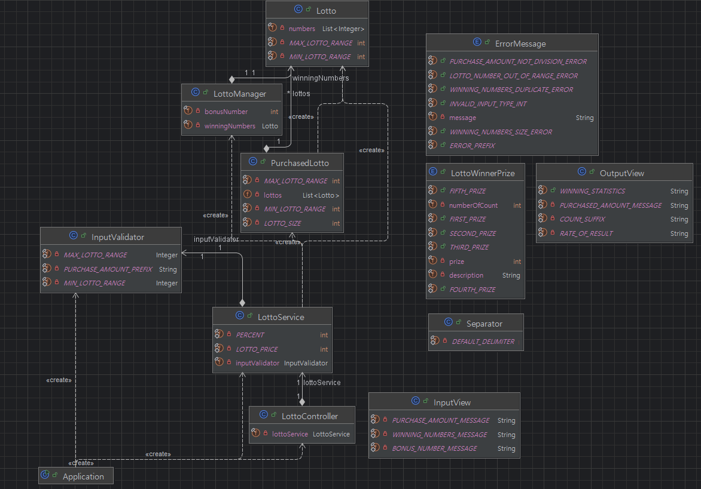

# Java Lotto Precourse 🎰

## 📜 프로그램 설명
이 프로젝트는 간단한 로또 발매기를 구현한 프로그램입니다.  
사용자가 입력한 금액에 따라 로또 번호를 자동으로 생성하고 사용자가 제공한 당첨 번호와 비교하여 당첨 내역 및 수익률을 계산합니다.    
객체지향 프로그래밍의 원칙을 적용하여 코드의 구조를 유지하는 데 중점을 두었습니다.

## 🚀 기능 구현

### 사용자로부터 필요한 입력 받기
- [✔️] **구입 금액 입력 받기**
    - 구입 금액이 1,000원 단위로 나누어 떨어지지 않으면 예외 처리합니다.
- [✔️] **당첨 번호 입력 받기**
    - 중복된 숫자가 존재하는 경우 예외 처리합니다.
- [✔️] **보너스 번호 입력 받기**

### 로또 로직 구현
- [✔️] **로또 구입 금액만큼 로또 발행**
    - 발행된 번호는 오름차순으로 정렬됩니다.
- [✔️] **당첨 내역 계산**
- [✔️] **수익률 계산**

### 사용자에게 필요한 프롬프트 출력
- [✔️] **발행한 로또 수량 출력**
- [✔️] **발행한 로또 번호 출력**
- [✔️] **당첨 내역 출력**
- [✔️] **수익률 출력**

### Class Diagram
 

---

## 기능 요구 사항

간단한 로또 발매기를 구현합니다.
- 로또 번호의 숫자 범위는 **1~45**까지입니다.
- 1개의 로또를 발행할 때 중복되지 않는 **6개의 숫자**를 뽑습니다.
- 당첨 번호 추첨 시 중복되지 않는 **6개**와 **보너스 번호 1개**를 뽑습니다.

### 당첨 기준 및 금액
| 등수 | 일치 번호 조건                       | 당첨 금액          |
|------|------------------------------------|-------------------|
| 1등  | 6개 번호 일치                      | 2,000,000,000원   |
| 2등  | 5개 번호 + 보너스 번호 일치      | 30,000,000원      |
| 3등  | 5개 번호 일치                      | 1,500,000원       |
| 4등  | 4개 번호 일치                      | 50,000원          |
| 5등  | 3개 번호 일치                      | 5,000원           |

- 로또 구입 금액을 입력하면 구입 금액에 해당하는 만큼 로또를 발행해야 합니다.
- 로또 1장의 가격은 **1,000원**입니다.
- 당첨 번호와 보너스 번호를 입력받습니다.
- 사용자가 구매한 로또 번호와 당첨 번호를 비교하여 당첨 내역 및 수익률을 출력하고 로또 게임을 종료합니다.
- 사용자가 잘못된 값을 입력할 경우 **IllegalArgumentException**을 발생시키고, "[ERROR]"로 시작하는 에러 메시지를 출력한 후 해당 부분부터 입력을 다시 받습니다.
- 예외는 명확한 유형(IllegalArgumentException, IllegalStateException 등)을 처리합니다.

---

## 실행 결과 예시
```markdown
구입금액을 입력해 주세요.
8000

8개를 구매했습니다.
[8, 21, 23, 41, 42, 43] 
[3, 5, 11, 16, 32, 38] 
[7, 11, 16, 35, 36, 44] 
[1, 8, 11, 31, 41, 42] 
[13, 14, 16, 38, 42, 45] 
[7, 11, 30, 40, 42, 43] 
[2, 13, 22, 32, 38, 45] 
[1, 3, 5, 14, 22, 45]

당첨 번호를 입력해 주세요.
1,2,3,4,5,6

보너스 번호를 입력해 주세요.
7

당첨 통계
---
3개 일치 (5,000원) - 1개
4개 일치 (50,000원) - 0개
5개 일치 (1,500,000원) - 0개
5개 일치, 보너스 볼 일치 (30,000,000원) - 0개
6개 일치 (2,000,000,000원) - 0개
총 수익률은 62.5%입니다.
```
