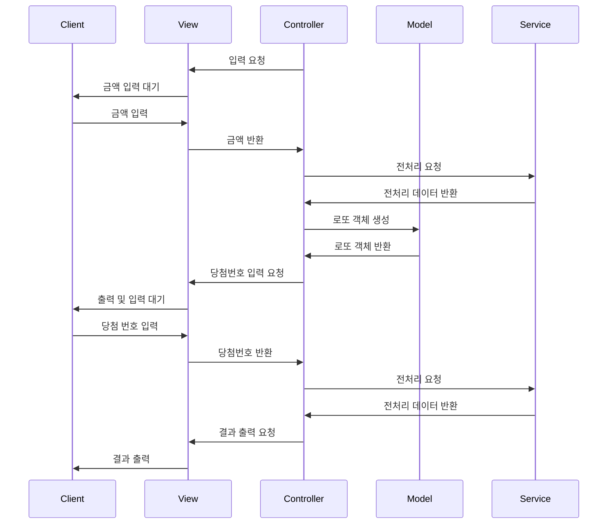

# java-lotto-precourse
이 파일은 [우아한 테크코스](https://apply.techcourse.co.kr/)의 프리코스 미션 파일입니다!
# 3주차 미션 : 로또


<details>
	<summary>과제 세부 내용</summary>

## 과제

간단한 로또 발매기를 구현한다.
- 로또 번호의 숫자 범위는 1~45까지이다.
- 1개의 로또를 발행할 때 중복되지 않는 6개의 숫자를 뽑는다.
- 당첨 번호 추첨 시 중복되지 않는 숫자 6개와 보너스 번호 1개를 뽑는다.
- 당첨은 1등부터 5등까지 있다. 당첨 기준과 금액은 아래와 같다.
    - 1등: 6개 번호 일치 / 2,000,000,000원
    - 2등: 5개 번호 + 보너스 번호 일치 / 30,000,000원
    - 3등: 5개 번호 일치 / 1,500,000원
    - 4등: 4개 번호 일치 / 50,000원
    - 5등: 3개 번호 일치 / 5,000원
- 로또 구입 금액을 입력하면 구입 금액에 해당하는 만큼 로또를 발행해야 한다.
- 로또 1장의 가격은 1,000원이다.
- 당첨 번호와 보너스 번호를 입력받는다.
- 사용자가 구매한 로또 번호와 당첨 번호를 비교하여 당첨 내역 및 수익률을 출력하고 로또 게임을 종료한다.
- 사용자가 잘못된 값을 입력할 경우 `IllegalArgumentException`을 발생시키고, "[ERROR]"로 시작하는 에러 메시지를 출력 후 그 부분부터 입력을 다시 받는다.
    - `Exception`이 아닌 `IllegalArgumentException`, `IllegalStateException` 등과 같은 명확한 유형을 처리한다.

### 입출력

- 입력 1
	- 지불할 로또 구매 비용
	- 당첨 번호 및 보너스 번호
- 출력
	- 랜덤하게 뽑은 로또
	- 당첨 내용(개수)와 총 수익률
- 에러 메시지
	- [ERROR]로 시작해야함
	- ex) `[ERROR] 로또 번호는 1부터 45 사이의 숫자여야 합니다.`

ex)

```java
구입금액을 입력해 주세요. 
8000

8개를 구매했습니다.
[8, 21, 23, 41, 42, 43]
[3, 5, 11, 16, 32, 38]
[7, 11, 16, 35, 36, 44]
[1, 8, 11, 31, 41, 42]
[13, 14, 16, 38, 42, 45]
[7, 11, 30, 40, 42, 43]
[2, 13, 22, 32, 38, 45]
[1, 3, 5, 14, 22, 45]

당첨 번호를 입력해 주세요.
1,2,3,4,5,6

보너스 번호를 입력해 주세요.
7

당첨 통계
---
3개 일치 (5,000원) - 1개
4개 일치 (50,000원) - 0개
5개 일치 (1,500,000원) - 0개 5개 일치, 보너스 볼 일치 (30,000,000원) - 0개
6개 일치 (2,000,000,000원) - 0개
총 수익률은 62.5%입니다.
```

</details>

## 구현 기능 목록
### 입력
- [ ] 비용 입력
	- 역할 : 비용(숫자)를 입력받음
	- 메시지 : `구입금액을 입력해 주세요.`
	- 예외
		- 숫자가 아닌 입력 (IllegalArgumentException `[ERROR] Can't parse to int.`)
		- 오버플로우 (자체 에러메시지)
		- 1000으로 나누어 떨어지지 않는 입력 (IllegalArgumentException `[ERROR] I got some change. (The amout of paid is not divided into price.)`)
- [ ] 당첨 번호 (6개) 입력
	- 역할 : 당첨번호 6개(문자열)를 입력받음
	- 메시지 : `당첨 번호를 입력해 주세요.`
	- 예외
		- 숫자와 공백, comma(,) 외의 문자가 있을 경우 (IllegalArgumentException `[ERROR] Invalid input, there's something other than numbers`)
		- 숫자의 개수가 6개가 아닐 경우 (IllegalArgumentException `[ERROR] You shold pick 6 numbers`)
		- 숫자의 범위가 적절하지 않을 경우 (1-45) 및 오버플로우 (IllegalArgumentException `[ERROR] Input value is not in range.`, 자체 에러 메시지)
		- 중복된 숫자가 있을 경우 (IllegalArgumentException `[ERROR] There's duplicated numbers.`)
- [ ] 보너스 번호 입력
	- 역할 : 보너스 번호를 입력받음
	- 메시지 : `보너스 번호를 입력해 주세요.`
	- 예외
		-  숫자와 공백, comma(,) 외의 문자가 있을 경우 (IllegalArgumentException `[ERROR] Invalid input, there's something other than numbers`)
		- 숫자의 범위가 적절하지 않을 경우 (1-45) 및 오버플로우 (IllegalArgumentException `[ERROR] Input value is not in range.`, 자체 에러 메시지)
		- 중복된 숫자가 있을 경우 (IllegalArgumentException `[ERROR] There's duplicated numbers.`)
- [ ] 결과 출력
	- 역할 : 당첨 통계를 출력함
	- 메시지 : `당첨 통계\n---\n...`

## flow chart

