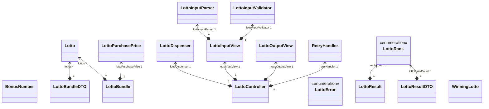
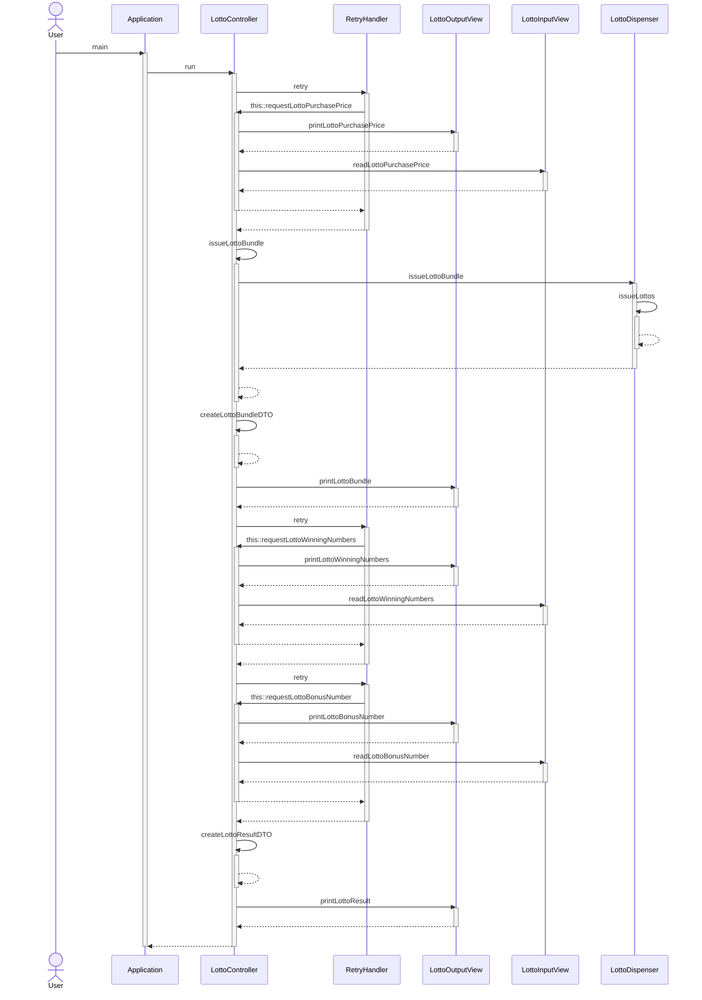

# java-lotto-precourse
## 프로젝트 설명

> 주어진 금액에 맞는 로또를 발급하고, 발급된 로또들의 당첨 여부를 검사해주는 애플리케이션입니다.
>

### 기능

1. 입력해주신 금액에 맞춰 로또를 발행합니다.
2. 발급된 로또들의 수와 이 로또들의 번호들을 오름차순 정렬하여 볼 수 있습니다.
3. 당첨 번호와 보너스 번호를 입력해주시면 이를 토대로 앞에서 발급한 로또들의 당첨 통계와 수익률을 계산하여 볼 수 있습니다. (당첨 기준은 아래의 출력에 나타나 있습니다.)

**1. 로또의 구입과 발급**

- 아래는 6000원의 구입 금액을 입력 하였고, 로또 가격에 맞춰 6개의 로또를 발행한 뒤, 오름차순으로 발행된 로또들의 번호들을 보여줍니다.

```
구입금액을 입력해 주세요.
6000

6개를 구매했습니다.
[17, 30, 33, 39, 42, 44]
[1, 16, 30, 33, 37, 43]
[8, 13, 14, 16, 34, 40]
[1, 5, 14, 17, 28, 42]
[1, 11, 13, 15, 33, 39]
[2, 9, 12, 39, 43, 44]
```

**2. 로또의 당첨 통계와 수익률**

- 아래는 당첨번호 `17,30,33,1,2,3` 와 보너스 번호 `42` 를 입력하였고, 결과로 3등이 2개 당첨되었습니다.
- 6000원으로 10000원의 수익을 얻어 166.7%의 수익률을 보였습니다.

```
당첨 번호를 입력해 주세요.
17,30,33,1,2,3

보너스 번호를 입력해 주세요.
42

당첨 통계
---
3개 일치 (5,000원) - 2개
4개 일치 (50,000원) - 0개
5개 일치 (1,500,000원) - 0개
5개 일치, 보너스 볼 일치 (30,000,000원) - 0개
6개 일치 (2,000,000,000원) - 0개
총 수익률은 166.7%입니다.
```

### **입력 가이드**

### 로또 구입 금액 입력

구입하시려는 로또 금액은 다음의 조건이 있고, 아래는 예제 입력입니다.

1. 로또 가격 이상의 금액을 입력하셔야 합니다.
2. 최대 구매 가격은 10억원 미만입니다.
3. 로또 가격으로 나누어 떨어지는 금액을 입력하셔야 합니다.

```
// o
1000 
20000
999999000

// x
0
1500
1000000000
```

### 로또 당첨 번호 입력

로또 당첨 번호의 입력은 다음의 조건이 있고, 아래는 예제 입력입니다.

1. 6개의 당첨 번호를 입력하셔야 합니다.
2. 로또 당첨 번호에는 중복이 없어야 합니다.
3. 각 번호들은 1이상, 45이하의 값이 주어져야 합니다.
4. 각 번호들은 ‘,’ 구분자로 구분되어 입력되어야 합니다.

```
// o
1,2,3,4,5,6
10,11,12,13,14,15

// x
1,2,3,4,5,6,7
1, 2, 3, 4, 5, 6, 7
1,2,3,4,5,46
1,2,3
```

### 보너스 번호 입력

보너스 번호 입력은 다음의 조건이 있고, 아래는 예제 입력입니다.

1. 앞에서 입력하신 로또 당첨번호와 중복되지 않는 수를 입력해야 합니다.
2. 번호는 1이상, 45 이하의 값이 주어져야 합니다.

```
// 로또 당첨 번호가 아래가 같은 경우로 가정
1,2,3,4,5,6
// o
7
15
45

// x
0
1
46
```

### 프로젝트 패키지 구조
**Class Diagram**

> 클래스들의 연관관계
>



**Sequence Diagram**

> 도메인의 흐름을 제외한, 컨트롤러 흐름을 나타내는 시퀀스 다이어그램
>


**트리 구조**
```
lotto
  ├── Application.java
  ├── controller
  │   └── LottoController.java
  ├── domain
  │   ├── BonusNumber.java
  │   ├── Lotto.java
  │   ├── LottoBundle.java
  │   ├── LottoDispenser.java
  │   ├── LottoPurchasePrice.java
  │   ├── LottoResult.java
  │   └── WinningLotto.java
  ├── dto
  │   ├── LottoBundleDTO.java
  │   └── LottoResultDTO.java
  ├── enums
  │   ├── LottoConfig.java
  │   ├── LottoError.java
  │   └── LottoRank.java
  ├── factory
  │   └── WoowaLottoControllerFactory.java
  ├── handler
  │   └── RetryHandler.java
  └── view
      ├── LottoInputParser.java
      ├── LottoInputValidator.java
      ├── LottoInputView.java
      └── LottoOutputView.java
```
### 문서화된 프로젝트 설명
# v1.0 (11/04)

- 버전 커밋 : https://github.com/changuii/java-lotto-7/commit/afef081441da3f320e68223e73b417198db2105d

## controller

### LottoController

> LottoController는 LottoInputView들을 제어하여 사용자로부터 입력을 받고, LottoOutputView를 제어하여 사용자에게 인터페이스를 제공한다. 또한, 도메인들을 제어하여 데이터를 처리할 수 있고 이를 통해 사용자에게 출력되는 로직과 비즈니스 로직에 대한 의존성을 지울 수 있다, 또한 DTO를 사용하여 뷰가 도메인을 참조하지 않도록 하였다.
>
- 멤버 변수

  `private final LottoInputView` : 이 객체를 이용해 사용자로부터 입력을 가져온다.

  `private final LottoOutputView` : 이 객체를 이용해 사용자에게 출력을 보여준다.

  `private final RetryHandler` : 이 객체를 이용해 에러 발생 시, 해당 로직을 재시도한다.

  `private final LottoConfig` : 해당 객체를 이용해 전체적인 로또의 게임을 설정한다.

  `private final LottoDispenser` : 해당 객체는 로또를 발급한다.

- public 메서드
  - run()

    > controller를 작동시키는 메서드이다.
    >
    - 뷰와 도메인을 제어하여 전체 Lotto 어플리케이션이 동작할 수 있게 만들어준다.
- private 메서드

  `LottoPurchasePrice requestLottoPurchasePrice()` : 사용자로부터 로또 구입 금액을 입력받는다.

  `LottoBundle issueLottoBundle(LottoPurchase)` : 로또 구입 금액을 이용해 로또를 발급한다.

  `LottoBundleDTO createLottoBundleDTO(LottoBundle)` : LottoBundle의 데이터를 이용해 LottoBundleDTO를 생성한다.

  `WinningLotto requestLottoWinningNumbers()` : 사용자로부터 당첨 번호를 입력받는다.

  `BonusNumber requestLottoBonusNumber(BonusNumber)`  : 사용자로부터 보너스 번호를 입력받는다.

  `LottoResultDTO createLottoResultDTO(LottoResult)` : LottoResult의 데이터를 이용해 LottoResultDTO를 생성한다.


## domain

### BonusNumber

> 사용자로부터 입력받은 BonusNumber를 저장하는 도메인, 보너스 숫자에 대한 로직을 처리하거나, 검증작업을 수행한다.
>
- 멤버 변수

  `private final int number` : 보너스 번호를 담고있다.

- 생성자

  `private BonusNumber(int number, WinningLotto winningLotto, LottoConfig lottoConfig)`

  - 보너스 번호, 당첨 로또, 로또의 규칙을 이용해 객체를 생성하며, 정적 팩토리 메서드로 활용하기 위해 private로 선언하였다.
- public 메서드

  `static BonusNumber ofNumberAndWinningLottoAndConfig(int number, WinningLotto winningLotto, LottoConfig lottoConfig)`

  - BonusNumber의 정적 팩토리 메서드로 생성에 필요한 매개변수가 어떤 것들이 있는지 명확하게 표현하였다.

  `boolean isMatch(int number)`

  - 매개변수로 들어온 입력값과 보너스 번호를 비교하여 일치한다면, true를 반환하고 일치하지 않는다면 false를 반환한다.
- private 메서드

  `void validate(int number, WinningLotto winningLotto, LottoConfig lottoConfig)`

  - 매개변수로 들어온 number를 검증하는 메서드이다.

  `void validateDuplicationNumber(int number, WinningLotto winningLotto)`

  - 매개변수로 들어온 number가 winningLotto와 중복되지 않는지 검사하는 메서드이다.

  `void validateMoreThanLottoNumberMin(int number, LottoConfig lottoConfig)`

  - 매개변수로 들어온 number가 로또의 최소 번호 이상인지 검사하는 메서드이다.

  `private void validateLessThanLottoNumberMax(int number, LottoConfig lottoConfig)`

  - 매개변수로 들어온 number가 로또의 최대 번호 이하인지 검사하는 메서드이다.


### Lotto

> 번호(로또 번호들)을 저장하는 도메인, 로또에 대한 로직을 처리하거나, 검증 작업을 수행한다.
>
- 멤버 변수

  `private final List<Integer> numbers`  : 로또 번호를 표현한다.

- 생성자

  `private Lotto(List<Integer> numbers, LottoConfig lottoConfig)`

  - 정적 팩토리 메서드를 활용하기 위해 private 접근제어자를 사용했고, 임의의 난수들을 입력받는다.
- public 메서드

  `static Lotto ofNumbersAndConfig(List<Integer> numbers, LottoConfig lottoConfig)`

  - Lotto의 정적 팩토리 메서드로, 생성자 대신 필요한 매개변수를 명확하게 표현하였다.

  `List<Integer> getNumbers()`

  - 로또의 데이터인 번호들을 반환한다.

  `int getMatchCountWinningLotto(WinningLotto winningLotto)`

  - 번호를 WinningLotto와 비교하여, 몇 개가 포함되는지 카운트하여 반환하는 메서드이다.

  `boolean isMatchBonusNumber(BonusNumber bonusNumber)`

  - BonusNumber와 비교하여, 일치하는 수가 존재하는지 여부를 반환하는 메서드이다.
- private 메서드

  `void validate(List<Integer> numbers, LottoConfig lottoConfig)`

  - 전체 검증 로직을 묶어주는 메서드이다. 번호들을 검증한다.

  `void validateDuplicationNumbers(List<Integer> numbers)`

  - 번호들에 중복이 포함되어 있는지 검증하는 메서드이다.

  `void validateNumberRange(int number, LottoConfig lottoConfig)`

  - 번호들의 숫자 범위와 관련된 검증을 묶어낸 메서드이다.

  `void validateMoreThanLottoNumberMin(int number, LottoConfig lottoConfig)`

  - 현재 번호가 최소값 이상인지 검사하는 메서드이다.

  `void validateLessThanLottoNumberMax(int number, LottoConfig lottoConfig)`

  - 현재 번호가 최대값 이하인지 검사하는 메서드이다.

  `void validateLottoNumberCount(int numberCount, LottoConfig lottoConfig)`

  - 로또 번호들의 수가, 6개인지 검사하는 메서드이다.


### LottoBundle

> 로또들을 저장하는 도메인, 로또 집합에 대한 로직을 처리하거나 검증을 수행한다.
>
- 멤버 변수

  `private final List<Lotto> lottos` : 로또들을 저장하고 있다. 인스턴스가 변경될 수 없도록 final 키워드를 달아주었다.

  `private final LottoPurchasePrice lottoPurchasePrice` : lottoPurchasePrice를 담고있으며, 또한 인스턴스가 변경될 수 없도록 final 키워드를 달아주었다.

- 생성자

  `private LottoBundle(List<Lotto> lottos, LottoPurchasePrice lottoPurchasePrice)`

  - 로또들과 로또 구입금액을 받아 생성하며, 정적 팩토리 메서드를 활용해주기 위해 private 접근 제어자로 선언하였다.
- public 메서드

  `static LottoBundle ofLottosAndPurchasePrice(List<Lotto> lottos, LottoPurchasePrice lottoPurchasePrice)`

  - 정적 팩토리 메서드로, 더 정확한 객체 생성 방법을 표현하기 위해 사용하였다.

  `public LottoResult makeLottoResult(WinningLotto winningLotto, BonusNumber bonusNumber)`

  - 당첨 번호들과 보너스 번호를 매개변수로 받아, 로또들의 당첨 갯수와 수익률을 계산해 LottoResult를 반환하는 메서드이다.

  `public List<Lotto> getLottos()`

  - 로또들을 반환한다.

- private 메서드

  `void validateLottoCount(List<Lotto> lottos, LottoPurchasePrice lottoPurchasePrice)`

  - 매개변수로 들어온 로또들의 개수와 lottoPurchasePrice의 로또 개수가 일치하는지 여부를 검사한다.

  `List<LottoRank> checkLottoRank(WinningLotto winningLotto, BonusNumber bonusNumber)`

  - 로또들의 당첨 여부를 검사해 리스트로 반환하는 메서드이다.

  `Map<LottoRank, Integer> calculateLottoRankCount(List<LottoRank> lottoRanks)`

  - 로또들의 당첨 여부들을 이용해 갯수를 카운트하여 반환하는 메서드이다.

  `Map<LottoRank, Integer> initLottoRankCount()`

  - 로또들의 당첨 여부들의 갯수를 집계하기 위한 Map을 초기화하여 반환한다.

  `private double sumLottoPrizeMoney(List<LottoRank> lottoRanks)`

  - 로또들의 당첨 여부를 이용해 상금의 총합을 계산하여 반환하는 메서드이다.


### LottoDispenser

> 로또들을 발급해주는 발행기이다. CONFIG에 따라 다른 로또를 발급해준다.
>
- 멤버 변수

  `private final LottoConfig lottoConfig`  : Lotto 어플리케이션의 규칙 상수 집합

- 생성자

  `private LottoDispenser(LottoConfig lottoConfig)`

  - 규칙을 받아서 로또 발급기를 생성한다. 정적 팩토리 메서드를 활용하기 위해 private로 선언하였다.
- public 메서드

  `static LottoDispenser fromConfig(LottoConfig lottoConfig)`

  - 정적 팩토리 메서드로 Lotto 규칙을 이용해 로또 발급기를 생성하여 반환한다.

  `LottoBundle issueLottoBundle(LottoPurchasePrice lottoPurchasePrice)`

  - LottoPurchasePrice를 이용해 갯수만큼 LottoBundle을 발급하여 반환하는 메서드이다.
- private 메서드

  `List<Lotto> issueLottos(int lottoCount)`

  - 매개변수로 들어온 갯수만큼 로또를 발급해 List로 반환하는 메서드이다.

  `List<Integer> generateRandomNumbers()`

  - 규칙에 따라 번호 리스트를 생성하여 반환하는 메서드이다.

### LottoPurchasePrice

> 로또 구입 금액을 저장하는 도메인, 로또 구입 금액에 대한 로직을 처리하거나 검증을 수행한다.
>
- 멤버 변수

  `private static final int *PERCENTAGE* = 100`  : 퍼센트 연산을 위한 100이다.

  `private final int purchasePrice`  : 로또 구입 금액을 표현한다.

  `private final int lottoCount`  : 로또 구입 금액에 따른 갯수를 나타낸다.

- 생성자

  `private LottoPurchasePrice(int purchasePrice, LottoConfig lottoConfig)`

  - 로또 구입 금액과 규칙을 받아 갯수도 계산하여 저장하는 생성자로 정적 팩토리 메서드를 활용하기 위해 private로 선언하였다.
- public 메서드

  `static LottoPurchasePrice ofPurchasePriceAndConfig(int purchasePrice, LottoConfig lottoConfig)`

  - 정적 팩토리 메서드로, 구입 금액과 규칙을 이용해 LottoPurchasePrice를 생성해 반환한다. 생성자보다 자세하게 표현하기위해 사용하였다.

  `int getLottoCount()`

  - 로또 구입 가격에 따른 로또의 갯수를 반환한다.

  `double calculateProfit(double totalPrizeMoney)`

  - 입력으로 들어온 상금의 총합을 이용해 구입 금액에 따른 수익률을 double로 반환한다.
- private 메서드

  `void validate(int purchasePrice, LottoConfig lottoConfig)`

  - 전체적인 검증 과정을 묶어주는 메서드로 입력으로 들어온 구입 금액이 규칙에 맞는지 검증한다.

  `void validateNumberRange(int purchasePrice, LottoConfig lottoConfig)`

  - 금액의 범위를 검증하는 과정을 묶어주는 메서드이다.

  `void validateDivisibleByLottoPrice(int purchasePrice, LottoConfig lottoConfig)`

  - 로또 구입 금액이 로또 가격으로 나누어지는지 여부를 검증하는 메서드이다.

  `void validateMoreThanMinLottoPurchasePrice(int purchasePrice, LottoConfig lottoConfig)`

  - 로또 구입 금액이 최소값 이상인지 검증하는 메서드이다.

  `void validateLessThanMaxLottoPurchasePrice(int purchasePrice, LottoConfig lottoConfig)`

  - 로또 구입 금액이 최대값 이상인지 검증하는 메서드이다.

### LottoResult

> 로또의 결과(로또의 당첨 갯수와 로또 수익률)를 저장하는 도메인이다.
>
- 멤버 변수

  `private final Map<LottoRank, Integer> rankCount`  : 로또의 당첨여부를 카운트한 Map이다.

  `private final double lottoProfitRate` : 로또의 수익률이다.

- 생성자

  `private LottoResult(Map<LottoRank, Integer> rankCount, double lottoProfitRate)`

  - 로또의 당첨 여부와 로또의 수익률을 받아 객체를 생성한다. private로 선언하여 정적 팩토리 메서드를 활용하도록 만들었다.
- public 메서드

  `static LottoResult ofRankCountAndProfitRate(Map<LottoRank, Integer> rankCount, double lottoProfitRate)`

  - 정적 팩토리 메서드로 로또 당첨 카운트와 로또 수익률을 받아 LottoResult 객체를 반환하며 생성자 대신 더 명확하게 매개변수를 나타내도록 만들었다.

  `Map<LottoRank, Integer> getRankCount()`

  - 로또 당첨 카운트를 반환하는 메서드이다.

  `double getLottoProfitRate()`

  - 로또 수익률을 반환하는 메서드이다.

- private 메서드

  X


### WinningLotto

> 로또의 당첨 번호들을 저장하는 도메인, 로또의 당첨 번호에 대한 로직을 처리하거나 검증을 수행한다.
>
- 멤버 변수

  `private final List<Integer> numbers`  : 당첨 번호들을 나타낸다.

- 생성자

  `private WinningLotto(List<Integer> numbers, LottoConfig lottoConfig)`

  - 당첨 번호들과 규칙을 이용해 WinningLotto를 생성한다. 정적 팩토리 메서드를 활용하기 위해 private로 선언해주었다.
- public 메서드

  `static WinningLotto ofNumbersAndConfig(List<Integer> numbers, LottoConfig lottoConfig)`

  - 정적 팩토리 메서드로, 생성자보다 명확하게 표현하기 위해 사용하였다.

  `public boolean isContains(int number)`

  - 입력으로 들어온 숫자가 로또의 당첨 번호에 포함되어 있는지 여부를 true false로 반환한다.
- private 메서드

  `void validate(List<Integer> numbers, LottoConfig lottoConfig)`

  - 로또 당첨 번호를 검증을 묶어주는 메서드이다.

  `void validateDuplicationNumbers(List<Integer> numbers)`

  - 번호들에 중복이 포함되어있는지 검증하는 메서드이다.

  `void validateNumberRange(int number, LottoConfig lottoConfig)`

  - 매개변수로 들어온 번호가 규칙의 번호 범위에 있는지 여부를 검증하는 메서드이다.

  `void validateMoreThanLottoNumberMin(int number, LottoConfig lottoConfig)`

  - 매개변수로 들어온 수가 최소값 이상인지 검증하는 메서드이다.

  `void validateLessThanLottoNumberMax(int number, LottoConfig lottoConfig)`

  - 매개변수로 들어온 수가 최대값 이하인지 검증하는 메서드이다.

  `void validateLottoNumberCount(int numberCount, LottoConfig lottoConfig)`

  - 로또들의 수가 로또 번호 수와 일치하는지 검증하는 메서드이다.

## dto

### LottoBundleDTO

> LottoBundle 도메인의 데이터를 View로 보내주기위해 사용되는 Data Transfer Object로 이를 통해 뷰가 도메인을 참조하지 않도록 해주는 동시에, 뷰가 도메인의 메서드를 참조하거나 데이터를 수정하는 등의 일을 하지 못하도록 막아주었다.
>

### LottoResultDTO

> LottoResult 도메인의 데이터를 View로 보내주기 위해 사용되는 Data Transfer Object로 이를 통해 뷰가 도메인을 참조하지 않도록 해주는 동시에, 뷰가 도메인의 메서드를 참조하거나 데이터를 수정하는 등의 일을 하지 못하도록 막아주었다.
>

## enums

> enum, 즉 상수와 관련된 enum을 담고있다.
>

### LottoConfig

> 로또와 관련된 설정들을 담고 있다. WOOWA_CONFIG는 프리코스의 미션에 해당하는 요구사항을 담고있는 상수 집합이다.
>

### LottoError

> 로또 어플리케이션의 예외 메시지 상수들을 관리하는 enum이다.
>

### LottoRank

> 로또들의 당첨 여부를 나타내는 상수 집합으로 message와 상금, 로또가 해당 순위인지 검증하는 BiPredicate를 담고있다.
>

## factory

### WoowaLottoControllerFactory

> 프리코스 미션에 부합하도록 LottoController 객체를 만들어 반환하는 Factory이다.
>

## handler

### RetryHandler

> 재시도 로직을 담당하는 핸들러이다. 예외가 발생하지 않을 때까지 로직을 재수행한다.
>

## View

### LottoInputParser

> 로또의 입력에 대한 파싱을 담당하는 클래스이다.
>

### LottoInputValidator

> 로또의 입력에 대한 검증을 담당하는 클래스이다.
>

### LottoInputView

> 로또의 입력에 대한 뷰이다.
>

### LottoOutputView

> 로또의 출력에 대한 뷰이다.
>

### 프로젝트 기능 목록

### 1. 로또 구입 금액을 입력받는다.

- [x]  로또 구입 금액을 입력받기 위한 문자열을 출력한다.
- [x]  로또 구입 금액을 입력받는다.

### 2. 로또 구입 금액을 검증한다.
- 기능 요구사항
  - [x]  로또 구입 금액이 1000원으로 나누어 떨어지지 않는다면, 예외를 발생시킨다.
  - [x]  로또 구입 금액이 1000원보다 작다면, 예외를 발생시킨다.
  - [x]  로또 구입 금액이 10억 이상이라면, 예외를 발생시킨다.
- 입력 요구사항
  - [x]  숫자로 이루어져 있지 않다면, 예외를 발생시킨다.

### 3. 앞의 과정에서 예외가 발생한다면 1번으로 돌아간다.

- [x]  예외 메시지를 출력한다.
- [x]  1번으로 돌아간다.

### 4. 로또 구입 금액만큼 로또를 발행한다.

- [x]  중복되지 않는 난수를 뽑는다.
- [x]  난수들을 이용해 로또를 발행한다.

### 5.  구입한 로또를 출력한다.

- [x]  로또의 구매 갯수를 출력한다.
- [x]  로또 번호들을 오름차순으로 출력한다.

### 6. 당첨 번호를 입력받는다.

- [x]  당첨 번호를 입력받기 위한 문자열을 출력한다.
- [x]  당첨 번호들을 입력받는다.

### 7. 당첨 번호를 검증한다.
- 기능 요구사항
  - [x]  당첨 번호들의 수가 6개가 아니라면, 예외를 발생시킨다.
  - [x]  당첨 번호들 중 중복이 존재하면, 예외를 발생시킨다.
  - [x]  당첨 번호들 중 1미만이 존재하면. 예외를 발생시킨다.
  - [x]  당첨 번호들 중 45초과가 존재하면, 예외를 발생시킨다.
- 입력 요구사항
  - [x]  당첨 번호의 형식이 올바르지 않다면, 예외를 발생시킨다.
     - [x]  “숫자, 숫자,숫자” 와 같은 패턴인가?

### 8. 앞의 과정에서 예외가 발생한다면 6번으로 돌아간다.

- [x]  예외 메시지를 출력한다.
- [x]  6번으로 돌아간다.

### 9. 보너스 번호를 입력받는다.

- [x]  보너스 번호를 입력받기 위한 문자열을 출력한다.
- [x]  보너스 번호를 입력받는다.

### 10. 보너스 번호를 검증한다.

- 기능 요구사항
  - [x]  보너스 번호가 1미만이라면, 예외가 발생한다.
  - [x]  보너스 번호가 45초과라면, 예외가 발생한다.
  - [x]  보너스 번호가 당첨 번호들에 포함되어 있다면, 예외를 발생시킨다.
- 입력 요구사항
  - [x]  보너스 번호가 숫자로 구성되어 있지 않다면, 예외를 발생시킨다.

### 11. 앞의 과정에서 예외가 발생한다면 9번으로 돌아간다.

- [x]  예외 메시지를 출력한다.
- [x]  9번으로 돌아간다.

### 12. 당첨 통계를 생성한다.

- [x]  각 로또를의 당첨 여부를 검사한다.
- [x]  당첨 여부를 바탕으로 당첨 통계를 생성한다.

### 13. 당첨 통계를 출력한다.

- [x]  당첨 통계 출력을 위한 문자열을 출력한다.
- [x]  당첨 통계를 출력한다.

### 14. 수익률을 계산한다.

- [x]  구입 금액 대비 당첨금을 계산하여 수익률을 계산한다.

### 15. 수익률을 출력한다.

- [x]  수익률을 출력한다.


### 도메인 예외 상황 
**LottoPurchasePrice**
- [x]  로또 구입 금액이 1000원으로 나누어 떨어지지 않는다면, 예외를 발생시킨다.
- [x]  로또 구입 금액이 1000원보다 작다면, 예외를 발생시킨다.
- [x]  로또 구입 금액이 10억 이상이라면, 예외를 발생시킨다.

**WinningLotto**
- [x]  당첨 번호들의 수가 6개가 아니라면, 예외를 발생시킨다.
- [x]  당첨 번호들 중 중복이 존재하면, 예외를 발생시킨다.
- [x]  당첨 번호들 중 1미만이 존재하면. 예외를 발생시킨다.
- [x]  당첨 번호들 중 45초과가 존재하면, 예외를 발생시킨다.

**BonusNumber**
- [x]  보너스 번호가 1미만이라면, 예외가 발생한다.
- [x]  보너스 번호가 45초과라면, 예외가 발생한다.
- [x]  보너스 번호가 당첨 번호들에 포함되어 있다면, 예외를 발생시킨다.

**LottoBundle**
- [x]  purchasePrice의 로또 개수와, lottos의 개수가 다르다면, 예외가 발생한다.  