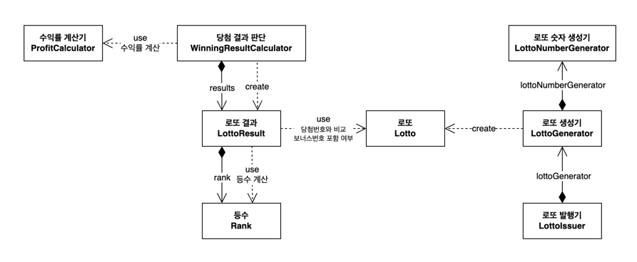

# java-lotto-precourse

## 📝 로또 발매기 프로그램
1. 로또 구입 금액을 입력하면 자동으로 로또가 구매된다.
    - 로또 1장 가격은 1,000원이다.
2. 당첨 번호와 보너스 번호를 지정한다.
3. 당첨 내역과 수익률을 확인할 수 있다.

## 📍 주요 클래스 구조 및 역할

| 클래스                       | 역할                         |  
|---------------------------|----------------------------|  
| `Lotto`                   | 로또 번호의 유효성을 검사하고 로또 번호를 관리 |  
| `LottoNumberGenerator`    | 로또 번호를 생성                  |  
| `LottoGenerator`          | 로또를 생성                     |  
| `LottoIssuer`             | 지정된 수량만큼 로또를 발행            |  
| `Rank`                    | 당첨 기준과 당첨 금액을 관리           |  
| `LottoResult`             | 개별 로또의 당첨 결과를 계산하고 관리      |  
| `WinningResultCalculator` | 전체 로또의 당첨 결과를 계산하고 수익률을 계산 |  
| `ProfitCalculator`        | 총 당첨 금액과 구입 금액을 통해 수익률을 계산 |  

## 📍 의존성 다이어그램

## 📍 기능 목록
### 로또
- 로또 숫자 생성기에서 생성된 번호를 관리한다.
- 로또 번호에 대한 유효성 검사를 수행한다.

### 로또 숫자 생성기
- 로또 번호를 생성하여 로또 발행기에 반환한다.
- 로또 번호의 숫자 범위는 1~45이다.
- 숫자 6개를 중복없이 생성한다.

### 로또 생성기
- 로또 하나를 생성한다.
    - 로또 숫자 생성기를 사용하여 로또 객체를 생성한다.

### 로또 발행기
- 주어진 개수만큼 로또를 발행한다.
    - 로또 생성기를 사용하여 로또를 발행한다.

### 구입 금액
- 사용자가 입력한 구입 금액을 관리한다.
    - 구입 금액에 대한 유효성 검사를 수행한다.
- 금액에 해당하는 만큼 로또 수량을 계산한다.
    - 로또 1장 가격은 1,000개이다.

### 로또 등수 및 당첨금
- 등수와 당첨 금액을 관리한다.
- 당첨 기준에 따라 1등부터 5등까지 분류한다.
- 일치 개수와 보너스 번호 일치 여부를 기반으로 적절한 등수를 반환한다.

### 로또 결과
- 개별 로또의 당첨 정보를 관리한다.
- 로또 번호와 당첨 번호를 비교하여 로또 등수와 당첨 금액을 계산한다.

### 당첨 결과 판단
- 로또 결과를 생성하고 관리한다.
    - 모든 로또에 대해 각 로또 결과를 생성하고 저장한다.
    - 로또 결과 목록을 관리한다.
- 총 당첨금을 계산한다.
- 수익률 계산기를 사용하여 수익률을 계산한다.

### 수익률 계산기
- 당첨 금액과 구입 금액을 받아 수익률을 계산한다.
- (총 당첨 금액 / 구입금액)을 계산한다.
    - 수익률은 소수점 둘째 자리에서 반올림한다.

### 입력 처리
1. 구입 금액을 입력 받는다.
    - 1,000원 단위로 입력받는다.
    - 1000원 이상(1개)부터 구매가 가능하다.

2. 당첨 번호를 입력 받는다.
    - 번호는 쉼표(,)를 기준으로 구분한다.

3. 보너스 번호를 입력 받는다.
    - 1개를 입력받는다.

- 모든 입력에 대한 유효성 검사:
    - 입력이 유효하지 않은 경우 `IllegalArguementException`을 발생시킨다.
    - "[ERROR]"로 시작하는 에러 메시지를 출력한다.
    - 사용자가 잘못 입력한 부분부터 다시 입력 받는다.

### 출력 처리
1. 발행한 로또 수량 및 번호를 출력한다.
   - 리스트 형식으로 오름차순 정렬하여 보여준다.
2. 당첨 내역을 출력 한다.
    - 일치한 개수, 당첨 금액, 당첨 개수를 출력한다.
3. 수익률을 출력한다.

## ⛔️ 유효성 검사

### 공통 유효성 검사
- 공백이거나 빈 문자열일 수 없다.
- 숫자여야 한다.
### 구입 금액
- 1,000원으로 나누어 떨어져야 한다.
- 구입 금액은 1,000원 이상이어야 한다.
    - 구입 금액이 0원이면 안 된다.
### 로또 번호, 당첨 번호
- 번호는 6개여야 한다.
- 로또 숫자 범위(1~45)여야 한다.
- 번호는 중복되지 않아야 한다.

### 보너스 번호
- 당첨번호와 중복되지 않아야 한다.
- 로또 숫자 범위(1~45)여야 한다.