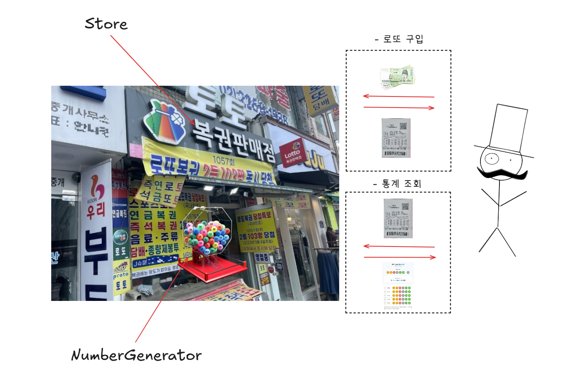
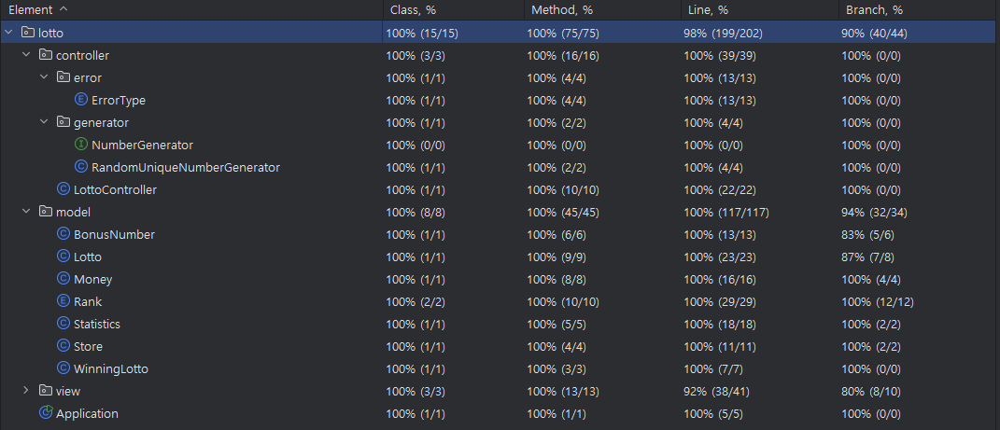

# 로또

## 구조도

## 기능 목록

### 1. 입력 처리

- **구입 금액 입력**
    - [x] 로또 구입 금액을 입력받는다.

- **당첨 번호 입력**
    - [x] 당첨 번호 6개를 입력받는다.
    - [x] 번호는 쉼표(,)를 기준으로 구분한다.

- **보너스 번호 입력**
    - [x] 보너스 번호를 입력받는다.

### 2. 로또 생성 및 당첨 확인

- **로또 발행**
    - [x] 구입 금액에 해당하는 개수의 로또를 발행한다.

- **당첨 결과 계산**
    - [x] 사용자가 구매한 로또 번호와 당첨 번호 및 보너스 번호를 비교하여 등수를 계산한다.
    - [x] 당첨 통계와 총 수익률을 계산한다.

### 3. 출력 처리

- **로또 구매 결과 출력**
    - [x] 구매한 로또의 개수와 각 로또 번호를 출력한다.
    - [x] 로또 번호는 오름차순으로 정렬하여 출력한다.

- **당첨 내역 출력**
    - [x] 당첨 통계를 등수별로 출력한다.
    - [x] 총 수익률을 소수점 둘째 자리에서 반올림하여 출력한다.

- **예외 문구 출력**
    - [x] 예외 상황 시 에러 문구를 출력한다.
    - [x] 에러 문구는 "[ERROR]" 로 시작한다.

## 예외 목록

1. **입력 값 예외**
    - [x] 입력이 null이거나 빈 문자열일 경우 `IllegalArgumentException`을 발생시킨다.
    - [x] 구분자가 잘못 되었을 경우 `IllegalArgumentException`을 발생시킨다.

2. **구입 금액 예외**
    - [x] 금액이 int 범위를 벗어났거나, 숫자가 아닌 경우 `IllegalArgumentException`을 발생시킨다.
    - [x] 금액이 0보다 작은 경우 `IllegalArgumentException`을 발생시킨다.
    - [x] 금액이 1,000원 단위로 나누어떨어지지 않는 경우 `IllegalArgumentException`을 발생시킨다.

3. **당첨 번호 예외**
    - [x] 당첨 번호가 int 범위를 벗어났거나, 숫자가 아닌 경우 `IllegalArgumentException`을 발생시킨다.
    - [x] 당첨 번호 개수가 6개가 아닌 경우 `IllegalArgumentException`을 발생시킨다.
    - [x] 당첨 번호가 1~45 범위를 벗어나는 경우 `IllegalArgumentException`을 발생시킨다.
    - [x] 당첨 번호에 중복된 숫자가 있는 경우 `IllegalArgumentException`을 발생시킨다.

4. **보너스 번호 예외**
    - [x] 보너스 번호가 int 범위를 벗어났거나, 숫자가 아닌 경우 `IllegalArgumentException`을 발생시킨다.
    - [x] 보너스 번호가 1~45 범위를 벗어나는 경우 `IllegalArgumentException`을 발생시킨다.
    - [x] 보너스 번호가 당첨 번호와 중복되는 경우 `IllegalArgumentException`을 발생시킨다.

## 주요 내용

- **책임 분리**
    - controller는 view와 model을 연결하는 역할만을 수행한다.
        - 유연한 구조를 위해 view와 model의 구체 클래스를 의존하지 않고, 인터페이스를 통해 역할을 의존한다.
    - model은 비즈니스 로직을 담당하고 있다.
        - 생성자와 정적 팩토리 메서드를 이용하여 다양한 값을 입력받아 변환하고 검증한다.
        - 자신의 책임을 메서드를 통해 수행하며, 다른 객체와 협력한다.
    - view는 사용자의 입력을 받아 controller에게 전달하고, controller로부터 결과를 받아 출력한다.
        - 대체 가능성이 많으므로 최대한 단순하게 구성한다.
    - main에서 구체 클래스를 생성해 controller에 전달하고, controller의 메소드를 호출하여 프로그램을 실행한다.

## 테스트

- 인터페이스 기반 설계를 통해 구현체를 Mocking하여 테스트할 수 있도록 하였다.
