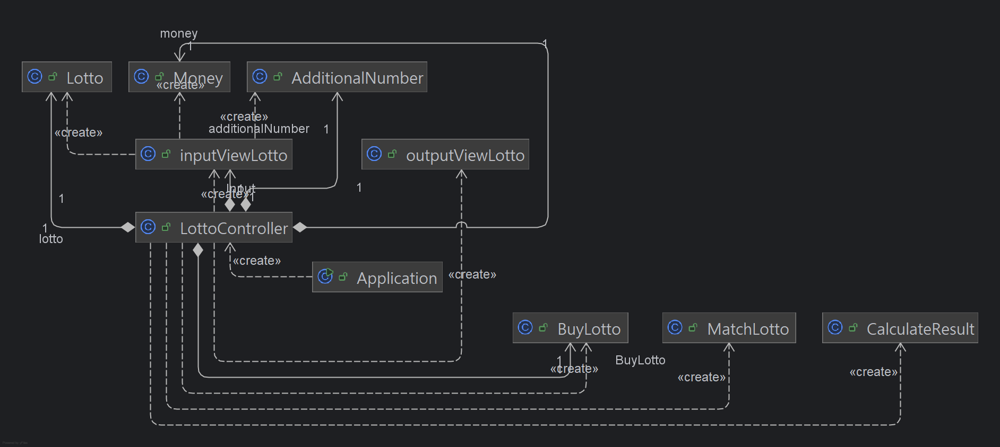
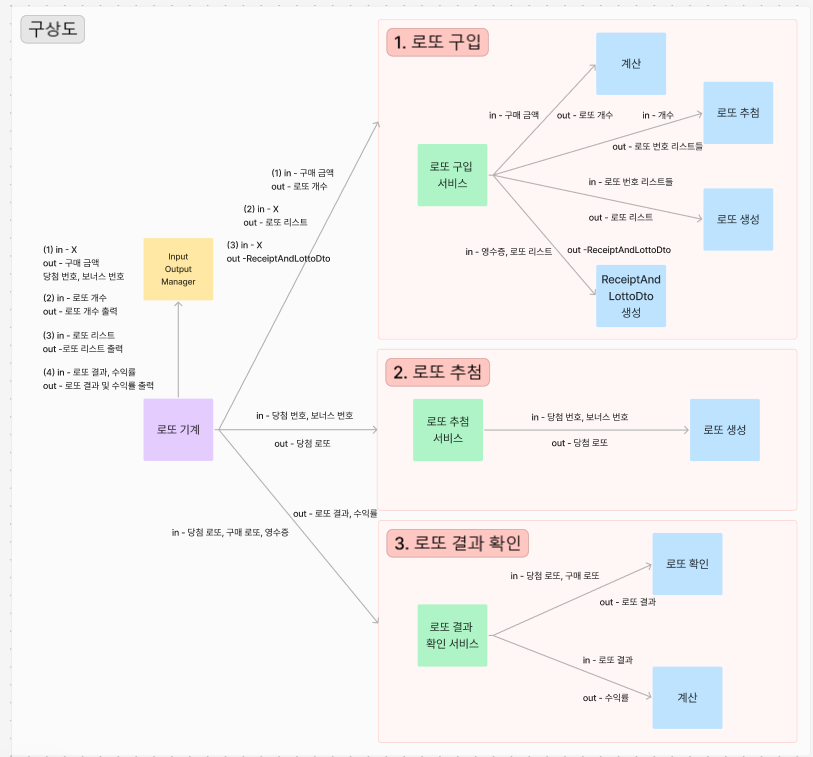
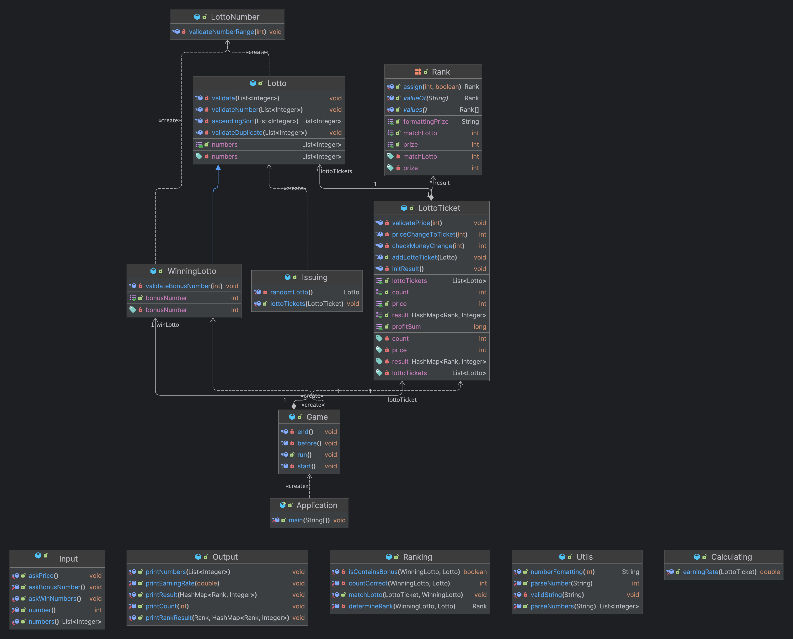
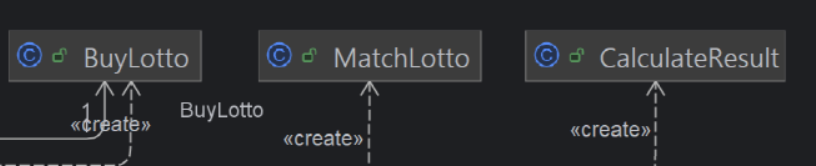

# java-lotto-precourse
## 전체 클래스 다이어그램

## 각 패키지 및 클래스 설명
### 1. item package

1) Lotto 클래스
   - 로또 번호에 대한 일급클래스
   - 로또 클래스에서 필요한 검증로직 포함
2) Mondy 클래스
   - 사용자가 입력할 돈에 대한 일급클래스
   - String으로 받으며 Integer로 변환 확인 등 검증로직 포함
   - 최종 값은 Integer 형식
3) AdditionalNumber 클래스
    - 사용자가 입력할 보너스 값에 대한 일급클래스
    - 보너스 값에 대한 검증로직 포함

### 2. view package

1) inputViewLotto 클래스
   - 사용자에게서 Lotto, Money, AdditionalNumber를 받음
   - 사용자가 옳지 않은 값을 입력할 경우 다시 받음
2) OutputViewLotto 클래스
   - model 패키지에서 구현한 값들을 controller를 통해 받아옴
   - 로또 몇장인지 출력, 로또번호 출력, 당첨현황 및 수익률 출력

### 3. controller package

1) LottoController 클래스
   - InputViewLotto로부터 사용자 입력값을 받음
   - OutputViewLotto에 출력값을 전달함
   - Application의 main에 의해 최종 실행되는 메서드 보유

### 4. model package

1) BuyLotto 클래스
   - 사용자의 돈을 받아 로또 리스트를 타입으로 가지는 일급클래스
   - 리스트 안에 리스트로 로또를 저장함
2) MatchLotto 클래스
   - BuyLotto의 리스트와 사용자가 입력한 당첨로또를 비교
   - 각 상금을 키값으로 가지는 해시맵에 결과를 저장하여 리턴
3) CalculateResult 클래스
   - MatchLotto 클래스로부터 계산된 결과 해시맵을 기반으로 총 수익 계산
   - float 리턴

---
## 예상 질의사항!!
### Q1. 왜 보너스점수와 로또번호 중복 검증 로직이 controller부에 있죠?
- 처음에는 AdditionalNumber를 일급클래스로 만들 때 검증하는 로직에 포함하려 했습니다.
- 하지만 일급클래스는 클래스의 캡슐화 및 불변성을 보장하기 위해 작성하는 것인데, 다른 클래스를 들여와 검증로직을 수행하는 것은 클래스간 캡슐화를 깬다고 생각했습니다.
- 그렇다고 inputview에서 연산을 하는 것은 view의 역할에 맞지 않다고 생각했습니다.
- model부에서 수행하는 것이 맞긴 하지만 검증 로직 목적이 '로직에 맞지 않으면 다시 사용자에게서 값을 받는것'인데 model부에서 수행하면 불필요하게 변수들의 이동이 잦을 것 같았습니다.
- 그래서 inputview에서 controller부로 받자마자 간단한 검증메서드를 통과하는 로직을 구현했습니다.

### Q2. 단위테스트에 대해 설명해주세요!