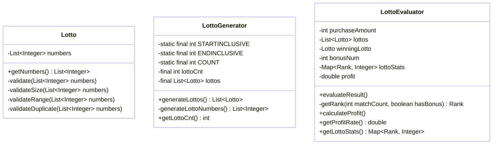
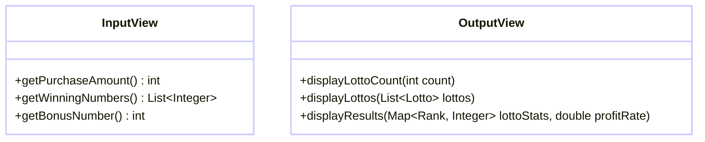

# java-lotto-precourse

## 기능 요구 사항

간단한 로또 발매기 구현

### 로또

- **로또 번호 범위**: 1부터 45까지의 숫자
- **로또 발행**: 중복되지 않는 6개의 숫자
- **당첨 번호 추첨**: 중복되지 않는 6개 번호와 보너스 번호 1개

### 당첨 기준

- **1등**: 6개 번호 일치 / 2,000,000,000원
- **2등**: 5개 번호 + 보너스 번호 일치 / 30,000,000원
- **3등**: 5개 번호 일치 / 1,500,000원
- **4등**: 4개 번호 일치 / 50,000원
- **5등**: 3개 번호 일치 / 5,000원

### 로또 구입

- 입력받은 금액으로 로또를 발행, 로또 1장 당 1,000원

### 입력

1. **구입 금액**: 1,000원 단위의 입력

    ```
    14000
    ```

2. **당첨 번호**: 쉼표(,)로 구분된 번호 입력

    ```
    1,2,3,4,5,6
    ```

3. **보너스 번호**: 단일 번호 입력

    ```
    7
    ```

### 출력

1. 발행한 로또 수량 및 번호를 출력, 로또 번호는 오름차순으로 정렬

    ```
    8개를 구매했습니다.
    [8, 21, 23, 41, 42, 43]
    [3, 5, 11, 16, 32, 38]
    [7, 11, 16, 35, 36, 44]
    [1, 8, 11, 31, 41, 42]
    [13, 14, 16, 38, 42, 45]
    [7, 11, 30, 40, 42, 43]
    [2, 13, 22, 32, 38, 45]
    [1, 3, 5, 14, 22, 45]
    ```

2. 당첨 내역 출력

    ```
    3개 일치 (5,000원) - 1개
    4개 일치 (50,000원) - 0개
    5개 일치 (1,500,000원) - 0개
    5개 일치, 보너스 볼 일치 (30,000,000원) - 0개
    6개 일치 (2,000,000,000원) - 0개
    ```

3. 수익률 출력, 소수점 둘째 자리에서 반올림

    ```
    총 수익률은 62.5%입니다.
    ```

4. 예외 상황 시 에러 문구 출력, 에러 문구는 "[ERROR]"로 시작

    ```
    [ERROR] 로또 번호는 1부터 45 사이의 숫자여야 합니다.
    ```

## 기능 구현 목록

*오류 발생 시 다시 입력 받는다*

1. 구입 금액 입력
  - 사용자로부터 로또 구입 금액을 입력받는다.
  - 구매 내역을 출력한다.
  - 유효성 검사 : 숫자 형식, 양수, 1,000원 단위
2. 로또 번호 생성
  - 사용자가 입력한 금액에 따라 로또 번호를 자동으로 생성한다.
  - 각 로또는 1부터 45 사이의 숫자 중에서 중복 없이 6개의 번호로 구성된다.
  - 구매한 로또 번호를 정렬하여 출력한다.
3. 당첨 번호 입력
  - 사용자로부터 당첨 번호 6개를 입력받는다.
  - 유효성 검사 : 숫자 형식, 1~45 사이의 숫자, 중복 체크
4. 보너스 번호 입력
  - 보너스 번호 1개를 입력받는다.
  - 유효성 검사 : 숫자 형식, 1~45 사이의 숫자, 중복 체크
5. 로또 결과 평가 및 출력
  - 생성된 로또 번호와 당첨 번호를 비교하여 당첨 결과를 평가한다.
  - 각 등급별 당첨 횟수와 총 수익률을 계산하여 출력한다.

## 디렉토리 구조

```
lotto/
├── model/
│   ├── Lotto.java
│   ├── LottoGenerator.java
│   ├── LottoEvaluator.java
│   ├── Validator.java
│   └── Rank.java
│
├── view/
│   ├── InputView.java
│   └── OutputView.java
│
├── controller/
│   └── LottoController.java
│
└── main/
    └── Application.java
```

## 클래스 다이어그램

*Model*



*View*


