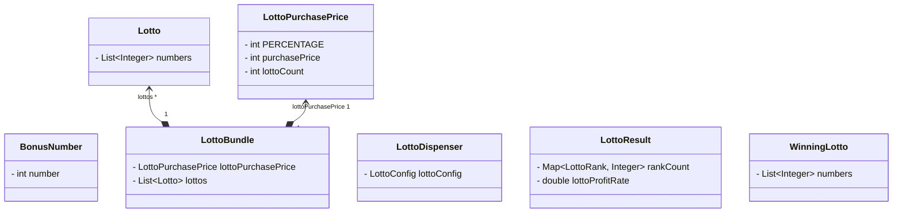
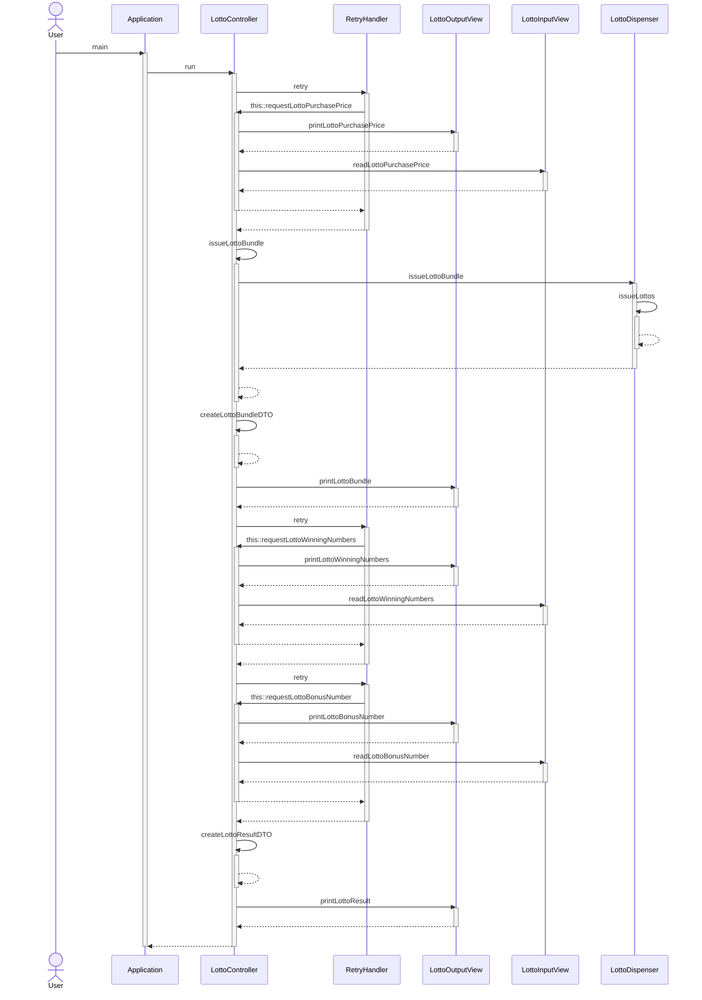

# java-lotto-precourse
## 프로젝트 설명

> 주어진 금액에 맞는 로또를 발급하고, 발급된 로또들의 당첨 여부를 검사해주는 애플리케이션입니다.
>

### 기능

1. 입력해주신 금액에 맞춰 로또를 발행합니다.
2. 발급된 로또들의 수와 이 로또들의 번호들을 오름차순 정렬하여 볼 수 있습니다.
3. 당첨 번호와 보너스 번호를 입력해주시면 이를 토대로 앞에서 발급한 로또들의 당첨 통계와 수익률을 계산하여 볼 수 있습니다. (당첨 기준은 아래의 출력에 나타나 있습니다.)

**1. 로또의 구입과 발급**

- 아래는 6000원의 구입 금액을 입력 하였고, 로또 가격에 맞춰 6개의 로또를 발행한 뒤, 오름차순으로 발행된 로또들의 번호들을 보여줍니다.

```
구입금액을 입력해 주세요.
6000

6개를 구매했습니다.
[17, 30, 33, 39, 42, 44]
[1, 16, 30, 33, 37, 43]
[8, 13, 14, 16, 34, 40]
[1, 5, 14, 17, 28, 42]
[1, 11, 13, 15, 33, 39]
[2, 9, 12, 39, 43, 44]
```

**2. 로또의 당첨 통계와 수익률**

- 아래는 당첨번호 `17,30,33,1,2,3` 와 보너스 번호 `42` 를 입력하였고, 결과로 3등이 2개 당첨되었습니다.
- 6000원으로 10000원의 수익을 얻어 166.7%의 수익률을 보였습니다.

```
당첨 번호를 입력해 주세요.
17,30,33,1,2,3

보너스 번호를 입력해 주세요.
42

당첨 통계
---
3개 일치 (5,000원) - 2개
4개 일치 (50,000원) - 0개
5개 일치 (1,500,000원) - 0개
5개 일치, 보너스 볼 일치 (30,000,000원) - 0개
6개 일치 (2,000,000,000원) - 0개
총 수익률은 166.7%입니다.
```

### **입력 가이드**

### 로또 구입 금액 입력

구입하시려는 로또 금액은 다음의 조건이 있고, 아래는 예제 입력입니다.

1. 로또 가격 이상의 금액을 입력하셔야 합니다.
2. 최대 구매 가격은 10억원 미만입니다.
3. 로또 가격으로 나누어 떨어지는 금액을 입력하셔야 합니다.

```
// o
1000 
20000
999999000

// x
0
1500
1000000000
```

### 로또 당첨 번호 입력

로또 당첨 번호의 입력은 다음의 조건이 있고, 아래는 예제 입력입니다.

1. 6개의 당첨 번호를 입력하셔야 합니다.
2. 로또 당첨 번호에는 중복이 없어야 합니다.
3. 각 번호들은 1이상, 45이하의 값이 주어져야 합니다.
4. 각 번호들은 ‘,’ 구분자로 구분되어 입력되어야 합니다.

```
// o
1,2,3,4,5,6
10,11,12,13,14,15

// x
1,2,3,4,5,6,7
1, 2, 3, 4, 5, 6, 7
1,2,3,4,5,46
1,2,3
```

### 보너스 번호 입력

보너스 번호 입력은 다음의 조건이 있고, 아래는 예제 입력입니다.

1. 앞에서 입력하신 로또 당첨번호와 중복되지 않는 수를 입력해야 합니다.
2. 번호는 1이상, 45 이하의 값이 주어져야 합니다.

```
// 로또 당첨 번호가 아래가 같은 경우로 가정
1,2,3,4,5,6
// o
7
15
45

// x
0
1
46
```

### 프로젝트 패키지 구조
**Class Diagram**

> 도메인들의 연관관계
>



**Sequence Diagram**

> 도메인의 흐름을 제외한, 컨트롤러 흐름을 나타내는 시퀀스 다이어그램
>


**트리 구조**
```
lotto
  ├── Application.java
  ├── controller
  │   └── LottoController.java
  ├── domain
  │   ├── BonusNumber.java
  │   ├── Lotto.java
  │   ├── LottoBundle.java
  │   ├── LottoDispenser.java
  │   ├── LottoPurchasePrice.java
  │   ├── LottoResult.java
  │   └── WinningLotto.java
  ├── dto
  │   ├── LottoBundleDTO.java
  │   └── LottoResultDTO.java
  ├── enums
  │   ├── LottoConfig.java
  │   ├── LottoError.java
  │   └── LottoRank.java
  ├── factory
  │   └── WoowaLottoControllerFactory.java
  ├── handler
  │   └── RetryHandler.java
  └── view
      ├── LottoInputParser.java
      ├── LottoInputValidator.java
      ├── LottoInputView.java
      └── LottoOutputView.java
```
### 프로젝트 기능 목록

### 1. 로또 구입 금액을 입력받는다.

- [x]  로또 구입 금액을 입력받기 위한 문자열을 출력한다.
- [x]  로또 구입 금액을 입력받는다.

### 2. 로또 구입 금액을 검증한다.
- 기능 요구사항
  - [x]  로또 구입 금액이 1000원으로 나누어 떨어지지 않는다면, 예외를 발생시킨다.
  - [x]  로또 구입 금액이 1000원보다 작다면, 예외를 발생시킨다.
  - [x]  로또 구입 금액이 10억 이상이라면, 예외를 발생시킨다.
- 입력 요구사항
  - [x]  숫자로 이루어져 있지 않다면, 예외를 발생시킨다.

### 3. 앞의 과정에서 예외가 발생한다면 1번으로 돌아간다.

- [x]  예외 메시지를 출력한다.
- [x]  1번으로 돌아간다.

### 4. 로또 구입 금액만큼 로또를 발행한다.

- [x]  중복되지 않는 난수를 뽑는다.
- [x]  난수들을 이용해 로또를 발행한다.

### 5.  구입한 로또를 출력한다.

- [x]  로또의 구매 갯수를 출력한다.
- [x]  로또 번호들을 오름차순으로 출력한다.

### 6. 당첨 번호를 입력받는다.

- [x]  당첨 번호를 입력받기 위한 문자열을 출력한다.
- [x]  당첨 번호들을 입력받는다.

### 7. 당첨 번호를 검증한다.
- 기능 요구사항
  - [x]  당첨 번호들의 수가 6개가 아니라면, 예외를 발생시킨다.
  - [x]  당첨 번호들 중 중복이 존재하면, 예외를 발생시킨다.
  - [x]  당첨 번호들 중 1미만이 존재하면. 예외를 발생시킨다.
  - [x]  당첨 번호들 중 45초과가 존재하면, 예외를 발생시킨다.
- 입력 요구사항
  - [x]  당첨 번호의 형식이 올바르지 않다면, 예외를 발생시킨다.
     - [x]  “숫자, 숫자,숫자” 와 같은 패턴인가?

### 8. 앞의 과정에서 예외가 발생한다면 6번으로 돌아간다.

- [x]  예외 메시지를 출력한다.
- [x]  6번으로 돌아간다.

### 9. 보너스 번호를 입력받는다.

- [x]  보너스 번호를 입력받기 위한 문자열을 출력한다.
- [x]  보너스 번호를 입력받는다.

### 10. 보너스 번호를 검증한다.

- 기능 요구사항
  - [x]  보너스 번호가 1미만이라면, 예외가 발생한다.
  - [x]  보너스 번호가 45초과라면, 예외가 발생한다.
  - [x]  보너스 번호가 당첨 번호들에 포함되어 있다면, 예외를 발생시킨다.
- 입력 요구사항
  - [x]  보너스 번호가 숫자로 구성되어 있지 않다면, 예외를 발생시킨다.

### 11. 앞의 과정에서 예외가 발생한다면 9번으로 돌아간다.

- [x]  예외 메시지를 출력한다.
- [x]  9번으로 돌아간다.

### 12. 당첨 통계를 생성한다.

- [x]  각 로또를의 당첨 여부를 검사한다.
- [x]  당첨 여부를 바탕으로 당첨 통계를 생성한다.

### 13. 당첨 통계를 출력한다.

- [x]  당첨 통계 출력을 위한 문자열을 출력한다.
- [x]  당첨 통계를 출력한다.

### 14. 수익률을 계산한다.

- [x]  구입 금액 대비 당첨금을 계산하여 수익률을 계산한다.

### 15. 수익률을 출력한다.

- [x]  수익률을 출력한다.


### 도메인 예외 상황 
**LottoPurchasePrice**
- [x]  로또 구입 금액이 1000원으로 나누어 떨어지지 않는다면, 예외를 발생시킨다.
- [x]  로또 구입 금액이 1000원보다 작다면, 예외를 발생시킨다.
- [x]  로또 구입 금액이 10억 이상이라면, 예외를 발생시킨다.

**WinningLotto**
- [x]  당첨 번호들의 수가 6개가 아니라면, 예외를 발생시킨다.
- [x]  당첨 번호들 중 중복이 존재하면, 예외를 발생시킨다.
- [x]  당첨 번호들 중 1미만이 존재하면. 예외를 발생시킨다.
- [x]  당첨 번호들 중 45초과가 존재하면, 예외를 발생시킨다.

**BonusNumber**
- [x]  보너스 번호가 1미만이라면, 예외가 발생한다.
- [x]  보너스 번호가 45초과라면, 예외가 발생한다.
- [x]  보너스 번호가 당첨 번호들에 포함되어 있다면, 예외를 발생시킨다.

**LottoBundle**
- [x]  purchasePrice의 로또 개수와, lottos의 개수가 다르다면, 예외가 발생한다.  