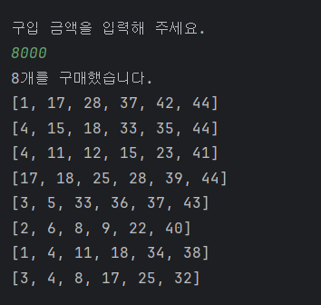
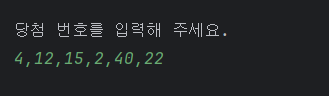
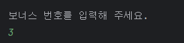
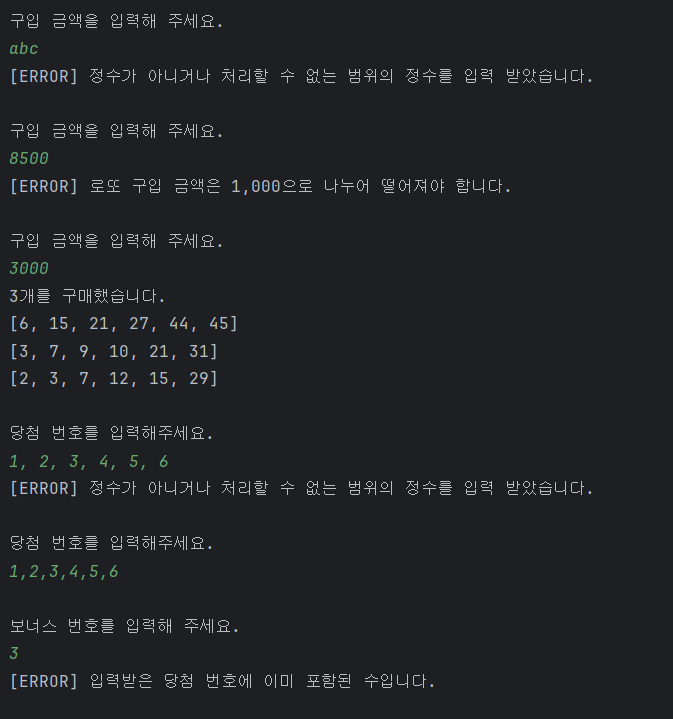
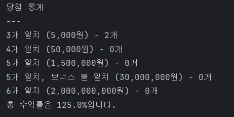
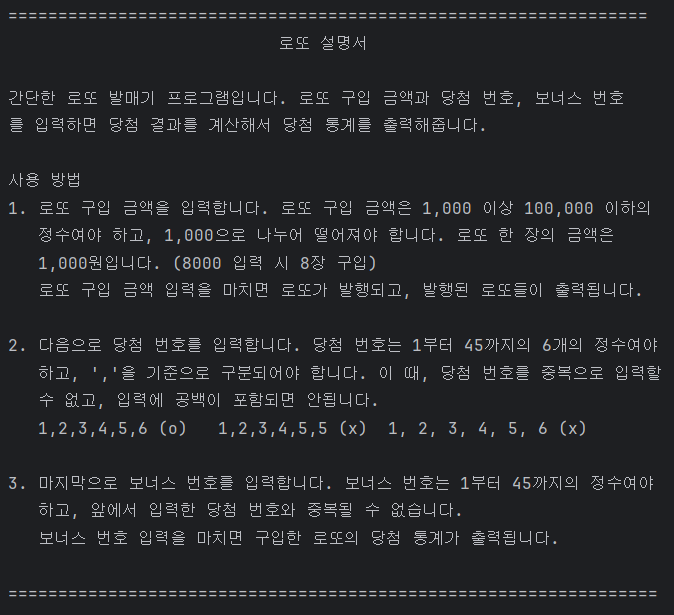
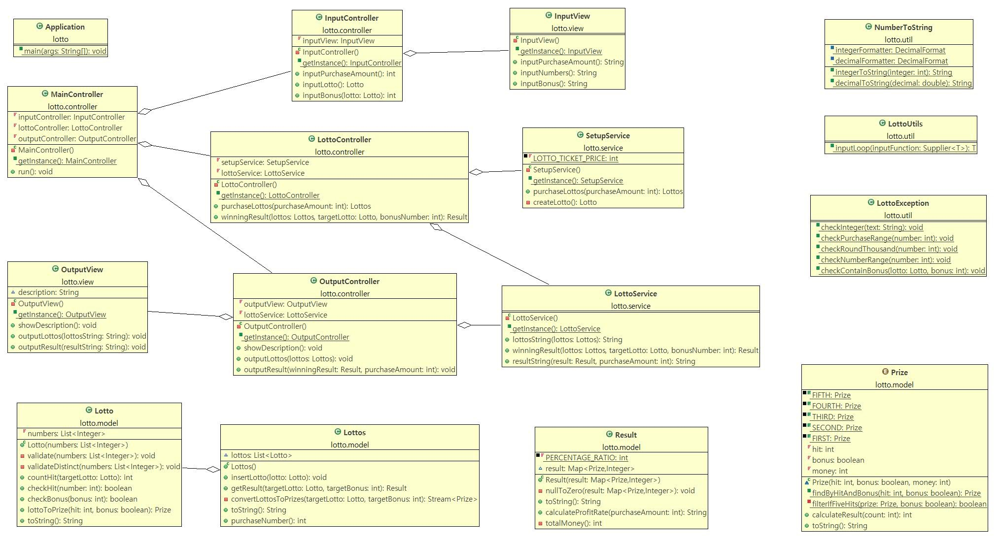

# 🎰 우테코 프리코스 3주차 - 로또


<hr>

## 🔍목차

1. [개요](#1-개요)
2. [주요 기능](#2-주요-기능)
3. [설치 및 시작하기](#3-설치-및-시작하기)
4. [프로젝트 구조](#4-프로젝트-구조)
5. [구현 기능 목록](#5-구현-기능-목록)

## 1. 개요

### Team

- 윤상민

### Project Summary

간단한 로또 발매기 프로그램입니다. 로또는 1부터 45까지의 6개의 수를 뽑고, 당첨 번호/보너스 번호와 얼마나 일치하는 지에 따라 등수와 금액이 정해집니다.<br>
프로그램을 실행하고 로또 구입 금액과 당첨 번호, 보너스 번호를 입력하면, 당첨 결과를 계산해 당첨 통계를 출력해줍니다.
<br><br>

## 2. 주요 기능

- **로또 구입 금액을 입력 받습니다.**<br>

  <br><br>

  로또 구입 금액을 입력 받습니다. 입력 가능한 금액은 1,000 이상 100,000 이하의 정수이며, 1,000으로 나누어 떨어져야 합니다.
  로또 한 장의 금액은 1,000원입니다.<br> 로또 구입 금액 입력을 마치면, 구입한 금액만큼의 로또가 발행되며, 발행된 로또들이 출력됩니다.  
  <br><br><br>

- **당첨 번호를 입력 받습니다.**<br>

  <br><br>

  당첨 번호에 해당하는 1부터 45까지의 6개의 정수를 입력 받습니다.<br>
  6개의 정수는 ','로 구분되어야 하며, 중복될 수 없습니다. 또한, 입력에 공백이 포함될 수 없습니다.
  <br><br><br>

- **보너스 번호를 입력 받습니다.**<br>

  <br>

  보너스 번호에 해당하는 1부터 45까지의 정수를 입력 받습니다.<br>
  보너스 번호는 앞에서 입력한 당첨 번호와 중복될 수 없습니다.
  <br><br><br>

- **만약 유효하지 않은 입력을 받을 시, 에러 메시지와 함께 그 부분부터 다시 입력을 받습니다.**<br>

  

  수 대신 문자를 입력하거나 당첨 번호와 중복된 보너스 번호를 입력하는 등 사용자에게 유효한 입력을 받지 못한 경우,
  에러 메시지를 출력하고 그 부분부터 다시 입력을 받습니다.
  <br><br><br>

- **보너스 번호까지 입력을 마치면 당첨 통계가 출력됩니다.**<br>

  

  입력 받은 당첨 번호와 보너스 번호를 기준으로 당첨 결과가 계산되고, 구입한 로또 중에 각 등수에 해당하는 로또가 몇 개가 있는지와 수익률이 출력됩니다.
  <br><br><br>

- **프로그램을 실행할 시에 사용자에게 위 기능을 설명하는 설명서를 제공합니다.**<br>

  

## 3. 설치 및 시작하기

#### Prerequisite

- **Java**
- **Gradle** build tool

<br>
레포지토리를 clone하고 IntelliJ IDEA, Eclipse 등의 IDE에서 src/main/java에 있는 Application.java를 실행합니다.

```conventionalcommit
https://github.com/cinador/java-lotto-7.git
```

## 4. 프로젝트 구조

```conventionalcommit

📦src
 ┣ 📂main
 ┃ ┗ 📂java
 ┃ ┃ ┗ 📂lotto
 ┃ ┃ ┃ ┣ 📂controller
 ┃ ┃ ┃ ┃ ┣ 📜InputController.java
 ┃ ┃ ┃ ┃ ┣ 📜LottoController.java
 ┃ ┃ ┃ ┃ ┣ 📜MainController.java
 ┃ ┃ ┃ ┃ ┗ 📜OutputController.java
 ┃ ┃ ┃ ┣ 📂model
 ┃ ┃ ┃ ┃ ┣ 📜Lotto.java
 ┃ ┃ ┃ ┃ ┣ 📜Lottos.java
 ┃ ┃ ┃ ┃ ┣ 📜Prize.java
 ┃ ┃ ┃ ┃ ┗ 📜Result.java
 ┃ ┃ ┃ ┣ 📂service
 ┃ ┃ ┃ ┃ ┣ 📜LottoService.java
 ┃ ┃ ┃ ┃ ┗ 📜SetupService.java
 ┃ ┃ ┃ ┣ 📂util
 ┃ ┃ ┃ ┃ ┣ 📜LottoException.java
 ┃ ┃ ┃ ┃ ┣ 📜LottoUtils.java
 ┃ ┃ ┃ ┃ ┗ 📜NumberToString.java
 ┃ ┃ ┃ ┣ 📂view
 ┃ ┃ ┃ ┃ ┣ 📜InputView.java
 ┃ ┃ ┃ ┃ ┗ 📜OutputView.java
 ┃ ┃ ┃ ┗ 📜Application.java
 ┗ 📂test
 ┃ ┗ 📂java
 ┃ ┃ ┗ 📂lotto
 ┃ ┃ ┃ ┣ 📂controller
 ┃ ┃ ┃ ┃ ┣ 📜InputControllerBonusTest.java
 ┃ ┃ ┃ ┃ ┣ 📜InputControllerLoopTest.java
 ┃ ┃ ┃ ┃ ┣ 📜InputControllerLottoTest.java
 ┃ ┃ ┃ ┃ ┗ 📜InputControllerPurchaseTest.java
 ┃ ┃ ┃ ┣ 📂model
 ┃ ┃ ┃ ┃ ┣ 📜LottosTest.java
 ┃ ┃ ┃ ┃ ┣ 📜LottoTest.java
 ┃ ┃ ┃ ┃ ┣ 📜PrizeTest.java
 ┃ ┃ ┃ ┃ ┗ 📜ResultTest.java
 ┃ ┃ ┃ ┣ 📂service
 ┃ ┃ ┃ ┃ ┣ 📜LottoServiceTest.java
 ┃ ┃ ┃ ┃ ┗ 📜SetupServiceTest.java
 ┃ ┃ ┃ ┣ 📂util
 ┃ ┃ ┃ ┃ ┗ 📜NumberToStringTest.java
 ┃ ┃ ┃ ┗ 📜ApplicationTest.java
```



## 5. 구현 기능 목록

- 일치하는 개수에 따른 당첨 금액을 나타내는 enum 클래스 : model.Prize


- 6개의 수를 저장하는, 로또를 나타내는 객체 클래스, 유효하지 않은 로또 예외 처리 : model.Lotto


- 사용자가 구입한 로또를 저장하는 기능 : model.Lottos


- 사용자가 구입한 로또의 당첨 결과를 계산하는 기능 : model.Result


- 사용자의 입력을 받고, 결과를 처리하는 기능 : service.LottoService


- 사용자의 입력 관련 처리와 새로운 로또 생성 기능 : service.SetupService


- 사용자와의 상호작용, 입출력 기능 : view.InputView, view.OutputView


- 세부 controller와 view를 연결 : controller.MainController


- 사용자에게 받는 입력 및 입력 예외처리를 담당하는 controller : controller.InputController


- 사용자에게 받은 입력 처리를 담당하는 controller : LottoController


- 사용자에게 보여줄 출력을 담당하는 controller : controller.OutputController


- 수를 원하는 형식의 문자열로 변환하는 기능 : util.NumberToString


- 입력 예외처리와 유효한 입력을 받을 때까지 입력을 반복하는 기능 : util.LottoException, util.LottoUtils
