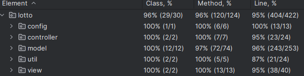

# ✏️우아한 테크 프리코스 3주차 - 로또 

## 🥅목표

이전 코드에서는 **디자인 패턴**을 중심으로 프로젝트를 설계해나가는 방식으로 구성하였습니다. 그렇게 진행하니, 코드 자체에 대한 복잡도가 증가하여 너무 많은 분리가 일어나는 문제점이 존재했습니다. 그래서 이번
주차의 목표는 **도메인** 클래스를 만들고, 딱 필요한 **기능 클래스**만을 만들기 위해서 노력했습니다.

## 도메인 명세서

| 번호 | 도메인 명                 | 설명                                                                                                                                                                                                       | 수행 유무 |
|----|-----------------------|----------------------------------------------------------------------------------------------------------------------------------------------------------------------------------------------------------|-------|
| 1  | Lotto                 | 6개의 로또 번호를 담고 있는 클래스  **[조건]** 1. 로또 번호가 6자리여야함. 2. 로또 번호에 중복이 없어야함. 3. 로또 번호는 1~45까지의 숫자 중 하나로 구성되어야함.                                                                              | Y     |
| 2  | LottoBuyer            | 로또를 구매하는 사람  **[조건]** 1.로또를 구매할 때, money가 null이 아니여야함.                                                                                                                                       | Y     |
| 3  | LottoTicket           | Lotto와 Money를 담고 있는 클래스  **[조건]** 1. Lotto와 Money가 null이 아니여야함.                                                                                                                              | Y     |
| 4  | LottoTickets          | LottoTicket 리스트와 총 금액을 담고 있는 클래스                                                                                                                                                                         | Y     |
| 5  | Money                 | 로또를 사기 위한 돈을 담는 클래스  **[조건]** 1. 금액이 1000원 단위로 끊어져야함. 2. 금액이 0원 보다 커야함.                                                                                                                  | Y     |
| 6  | ProfitRate            | 수익률을 담는 클래스(BigDecimal로 정확도 가져감)  **[조건]** 1. ProfitRate를 만들 때, origin Money가 null이 아니여야함.                                                                                                   | Y     |
| 7  | WinningAnalysisReport | 추첨 분석 결과에 대한 리포트를 보여주는 클래스  **[조건]**  1.WinningStatistics가 null이 아니여야함. 2. profitRate가 null이 아니여야함.                                                                                          | Y     |
| 8  | WinningNumbers        | 추첨 번호를 담고 있는 클래스 (Lotto + bonusNumber)  **[조건]** 1.mainNumbers가 null이 아니여야함. 2.bonusNumber가 null이 아니여야함. 3.mainNumber와 bonusNumber가 중복[ApplicationConfig.java](src%2Fmain%2Fjava%2Flotto%2Fconfig%2FApplicationConfig.java)되지 않아야함. 4. bonusNumber이 1~45사이의 숫자를 가져야함. | N     |
| 9  | WinningRule           | 추첨 결과에 대한 규칙이 들어있다. (상금과, 해당 상금을 받는 조건 포함)                                                                                                                                                               | Y     |
| 10 | WinningStatistics     | 추첨 결과를 담고 있는 클래스 (수익률, 당첨유무 포함)    **[조건]** 1. TreeMap으로 구성하여 정렬된 상태로 구성되어야함. 2. increment를 할 때 Rule이 null이 아니여야함.                                                                       | Y     |

## 📜기타 기능 명세

사용자가 잘못된 값을 입력할 경우 IllegalArgumentException을 발생시키고, "[ERROR]"로 시작하는 에러 메시지를 출력 후 그 부분부터 입력을 다시 받는다.
Exception이 아닌 IllegalArgumentException, IllegalStateException 등과 같은 명확한 유형을 처리한다.

위의 조건에 맞게 retry 로직을 구성하기 위해서 **함수형 인터페이스**로 SupplierWithException을 구성하고 retryOnError 메소드에서 이에 대한 처리를 해주고, 다른 입력 메소드에서 이를
사용하여 input에 대해서 공통적으로 에러 처리를 해준다.

이를 사용하게 되면, 무한정으로 retry로직을 보내는 것을 막기위해서 최대 횟수를 5회로 제한하여 구성했다.

## 🚂테스트 커버리지

평균 **96%** 정도의 테스트 커버리지를 달성했습니다.

## 소감 및 코드의 주요 포인트

해당 소규모의 프로젝트에서 Exception을 어떻게 가져가야할까? validation은 또 어떻게 구성해야할까? 에 대한 고민을 많이했습니다.
그러던 중 생각이 난게, 이전에 책에서 읽었던 내용 중에 "함수를 나누는 기준은 직관성이 떨어짐에서 시작했다."라는 문구가 생각났습니다.
그래서, null과 기본적인 존재 유무에 대한 조건은 가독성이 높다고 생각했습니다. 그렇기 때문에 오히려 분리를 하는 것이 코드의 판편화로 가독성을 떨어트린다고 생각헀고, 이를 막기 위해서 꼭 분리가 필요한 부분에 대해서만 분리를 하였습니다.

추가로, exception같은 경우도 도메인을 중심으로 쪼개고 디테일한 부분은 추가적으로 구성하면서, 여러 상황에서 사용할 수 있는 Exception을 구성하도록 노력했고, 이는 추후에 Test를 진행하면서도 해당 Error에 어디에 근거되는지를 바로 확인할 수 있어 직관성을 높일 수 있다고 생각했습니다.
