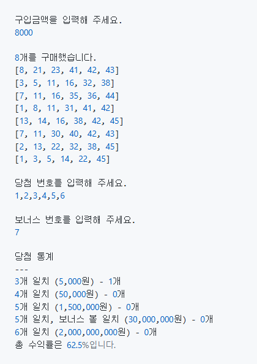

    

# 프리코스 3주차 미션 - 로또

---

> 우아한테크코스 7기 3주차 미션, 로또를 구현한 저장소입니다.

 

# 목차

- [기능 요구 사항](#기능-요구-사항)
- [입력 요구 사항](#입력 요구 사항)
- [출력 요구 사항](#출력 요구 사항)
- [실행 결과 예시](#실행-결과-예시)
- [구현 기능 목록](#구현-기능-목록)
    - [입력](#입력)
    - [입력 유효성 검사](#입력-유효성-검사)
    - [로또 번호 발행](#로또-번호-발행)
    - [로또 번호 저장](#로또-번호-저장)
    - [출력](#출력)
    - [공통 에러 출력](#공통-에러-출력)
    - [사용 라이브러리](#사용-라이브러리)

---

## 기능 요구 사항
* 로또 번호의 숫자 범위는 1~45까지이다.
* 1개의 로또를 발행할 때 중복되지 않는 6개의 숫자를 뽑는다.
* 당첨 번호 추첨 시 중복되지 않는 숫자 6개와 보너스 번호 1개를 뽑는다.
* 당첨은 1등부터 5등까지 있다. 당첨 기준과 금액은 아래와 같다.
    * 1등: 6개 번호 일치 / 2,000,000,000원
    * 2등: 5개 번호 + 보너스 번호 일치 / 30,000,000원
    * 3등: 5개 번호 일치 / 1,500,000원
    * 4등: 4개 번호 일치 / 50,000원
    * 5등: 3개 번호 일치 / 5,000원

* 로또 구입 금액을 입력하면 구입 금액에 해당하는 만큼 로또를 발행해야 한다.
* 로또 1장의 가격은 1,000원이다.
* 당첨 번호와 보너스 번호를 입력받는다.
* 사용자가 구매한 로또 번호와 당첨 번호를 비교하여 당첨 내역 및 수익률을 출력하고 로또 게임을 종료한다.
* 사용자가 잘못된 값을 입력할 경우 IllegalArgumentException을 발생시키고, "[ERROR]"로 시작하는 에러 메시지를 출력 후 그 부분부터 입력을 다시 받는다.
* Exception이 아닌 IllegalArgumentException, IllegalStateException 등과 같은 명확한 유형을 처리한다.

## 입력 요구 사항
* 로또 구입 금액을 입력 받는다. 구입 금액은 1,000원 단위로 입력 받으며 1,000원으로 나누어 떨어지지 않는 경우 예외 처리한다.
* 당첨 번호를 입력 받는다. 번호는 쉼표(,)를 기준으로 구분한다.
* 보너스 번호를 입력 받는다.

## 출력 요구 사항
* 발행한 로또 수량 및 번호를 출력한다. 로또 번호는 오름차순으로 정렬하여 보여준다.
* 당첨 내역을 출력한다.
* 수익률은 소수점 둘째 자리에서 반올림한다. (ex. 100.0%, 51.5%, 1,000,000.0%)
* 예외 상황 시 에러 문구를 출력해야 한다. 단, 에러 문구는 "[ERROR]"로 시작해야 한다.

## 실행 결과 예시

    

## 구현 기능 목록

### 입력
* 당첨 번호 & 보너스 번호 입력 받기
* 당첨 번호는 쉼표(,)로 구분

### 입력 유효성 검사
* 숫자만 입력 되어야 한다.
* 숫자 정상 입력시 배열로 잘 변환되어야 한다
* 숫자와 문자가 섞여서 입력시 예외 처리
* 숫자와 공백이 섞여서 입력시 예외 처리
* 1미안 || 45초과 숫자 입력되면 예외 발생
* 구매 금액은 1000원 이상, 1000원 단위여야 한다
* 6자리를 입력 해야 한다.
* 중복 되지 않아야 한다.
* 당첨 번호와 보너스 번화는 중복 되지 않아야 한다. _ contain()

### 로또 번호 발행
* 로또 번호 발행 _ Randoms.pickUniqueNumbersInRange(1, 45, 6);

### 로또 번호 저장
* ENUM 클래스 활용하여 5가지 생성

### 출력
* 구매 수량 만큼 로또번호 출력
* 오름차순으로 정렬하여 출력 _ Collection.sort()
* 구매한 로또 번호와 당첨 번호 비교후 겹치는 수 출력 _ retainAll()
* Map에 저장하여 출력
* system.out.printf("%d개 일치, 보너스 볼 일치 (%,d원) - %d개")

### 공통 에러 출력
* 잘못된 값 입력시 IllegalArgumentException을 발생
* "[ERROR]"로 시작하는 에러 메시지를 출력
* 해당 부분부터 다시 입력 받기
* Exception이 아닌 IllegalArgumentException, IllegalStateException 등과 같은 명확한 유형을 처리

### 사용 라이브러리
* camp.nextstep.edu.missionutils에서 제공하는 Randoms 및 Console API를 사용하여 구현해야 한다
* Random 값 추출은 camp.nextstep.edu.missionutils.Randoms의 pickUniqueNumbersInRange()를 활용
* 사용자가 입력하는 값은 camp.nextstep.edu.missionutils.Console의 readLine()을 활용한다.