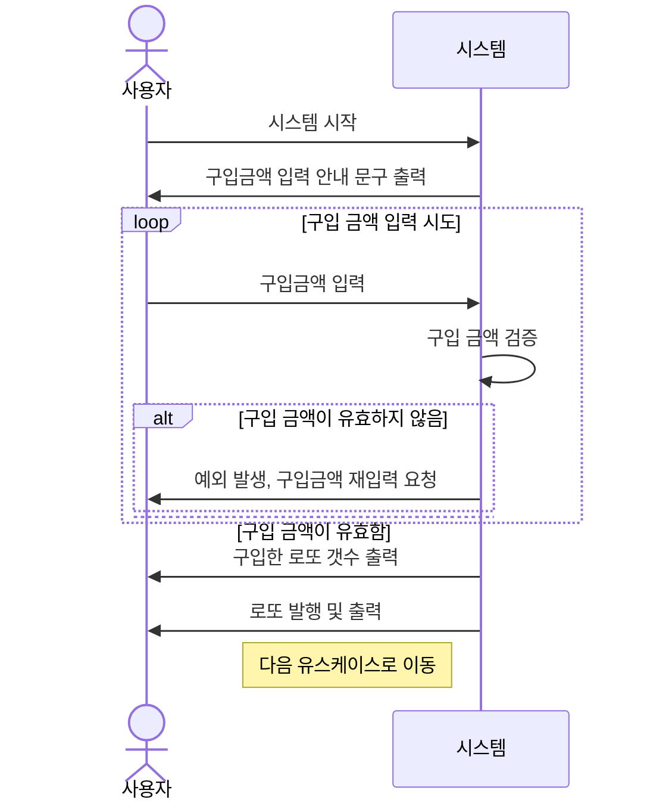
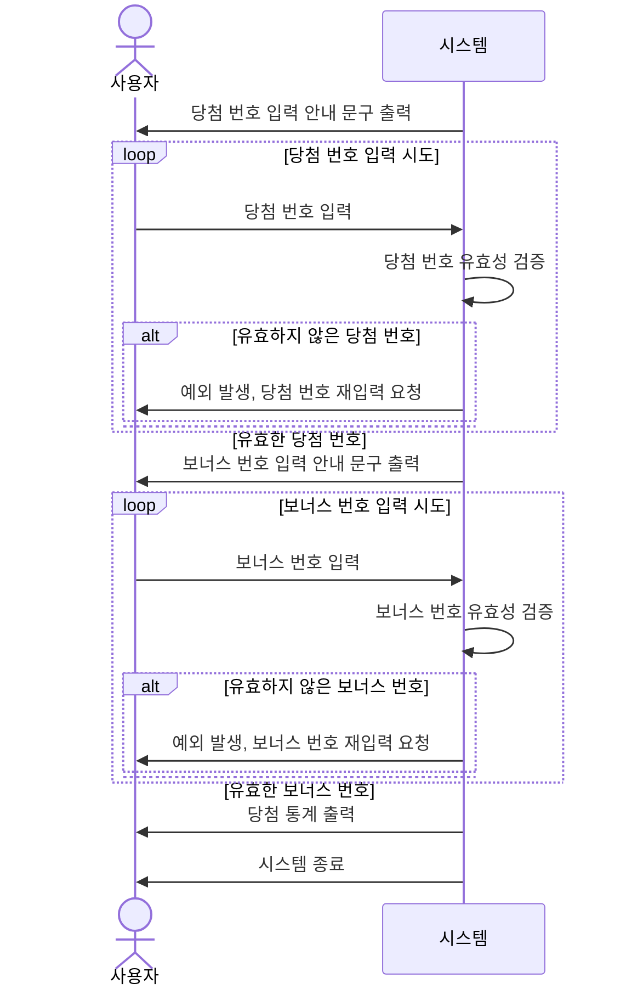

# java-lotto-precourse

## 1. 기능 목록

### 1-1. 기능 목록

- [x] 구입 금액은 1000원 단위로 입력된다.
    - [x] 구입 금액 입력이 숫자가 아니면 에러 메세지를 출력하고 다시 입력받는다.
    - [x] 구입 급액 입력이 1000원 단위가 아니면 에러 메세지를 출력하고 다시 입력받는다.
- [x] 구입 갯수를 출력 한다.
    - [x] 구입 갯수 = { 구입 금액 / 1000 }
- [x] 로또를 발행 한다.
    - [X] 로또 발행 시 1~45 범위의 고유 숫자를 6개 선정한다.
    - [x] 로또 번호가 6개가 아니면 예외를 발생시킨다.
    - [x] 로또 번호가 1~45 범위가 아니면 예외를 발생시킨다.
    - [x] 로또 번혹가 중복되면 예외를 발생시킨다.
    - [x] 로또 발행에 랜덤을 적용한다.
- [x] 발행된 로또들을 출력한다.
    - [x] 로또 출력은 한 줄에 로또 하나씩 출력한다.
    - [x] 로또 하나 출력은 []로 묶고 숫자 사이에 ", "를 입력한다.
- [x] 당첨 번호 추첨은 1~45 범위의 고유 숫자 6개와 (,)로 구분한다.
    - [x] 당첨 번호 입력이 숫자,숫자,숫자,숫자,숫자,숫자 패턴이 아니면 에러 메세지를 출력하고 다시 입력받는다.
    - [x] 당첨 번호 입력에 중복이 있으면 에러 메세지를 출력하고 다시 입력받는다.
    - [ ] 1~9까지의 입력을 01~09로 입력해도 정상적으로 처리한다.
- [x] 보너스 번호 추첨은 1~45 범위의 당첨 번호와 중복 되지 않는 양수 숫자가 입력 되어야 한다.
    - [x] 보너스 번호 입력이 1~45 범위가 아니면 에러 메세지를 출력하고 다시 입력받는다.
    - [x] 보너스 번호 입력이 당첨 번호 입력과 중복되면 에러 메세지를 출력하고 다시 입력받는다.
- [x] 담첨 통계를 계산한다.
    - [x] 3개 일치 : 가중치 5
    - [x] 4개 일치 : 가중치 50
    - [x] 5개 일치 : 가중치 1,500
    - [x] 5개 일치 + 보너스 번호 일치 : 가중치 2,000
    - [x] 6개 일치 : 가중치 2,000,000
    - [ ] 수익률 : (가중치 총합 / 구입 갯수) 소수점 둘째 자리에서 반올림
- [ ] 당첨 통계 출력
    - [ ] 하나의 출력은 다음과 같다. ( X개 일치 (당첨 금액) - x)
    - [ ] 3,4,5,5+1,6 모든 경우를 출력한다.
    - [ ] 총 수익률을 출력한다.
- [x] 입력 서비스를 구현한다.
- [ ] 각 기능을 통합한다.

### 1-2 기능 구현을 위해 고민한 것

## 2. 요구 사항의 유스케이스 분석해보기

### 2-1. 유스케이스 1: 구입 금액 입력

1. 사용자가 시스템을 시작
2. 시스템이 구입금액 입력 안내 문구 출력
3. 사용자가 구입금액 입력
4. 시스템이 구입금액 입력을 검증
    1. 구입 금액이 1000 단위 정수 아니면 예외 발생 후 3번 다시 호출
    2. 빈 값, 널 값 입력 시 예외발생

   {type="alpha-lower"}
5. 시스템이 구입한 로또 갯수를 출력
6. 시스템이 갯수만큼의 로또 발행 및 출력

### 2-2. 유스케이스 2: 당첨 번호 입력

1. 시스템이 당첨 번호 입력 안내 문구를 출력
2. 사용자가 당첨번호 입력
3. 시스템이 당첨번호 입력을 검증
    1. 당첨 번호가 숫자와 구분자 만으로 구성되지 않으면 예외 발생 후 1번 다시 호출
    2. 당첨 번호가 6개가 아니면 예외 발생 후 1번 다시 호출
    3. 당첨 번호에 중복이 있으면 예외 발생 후 1번 다시 호출
    4. 당첨 번호 범위가 1~45를 벗어나면 예외 발생 후 1번 다시 호출
    5. 빈 값, 널 값 입력 시 예외 발생

   {type="alpha-lower"}
4. 시스템이 보너스 번호 입력 안내 문구를 출력
5. 사용자가 보너스 번호 입력
6. 시스템이 보너스 번호 입력 검증
    1. 누적된 당첨 번호에 중복이 있으면 예외 발생 후 4번 다시 호출
    2. 당첨 번호 범위가 1~45를 벗어나면 예외 발생 후 4번 다시 호출
    3. 당첨 번호 입력이 숫자가 아니면 예외 발생 후 4번 다시 호출
    4.

   {type="alpha-lower"}
7. 시스템이 당첨 통계를 출력함
8. 시스템이 종료됨

### 2-3 다이어그램

#### 2-3-1 유스케이스 1: 구입 금액 입력



#### 2-3-2 유스케이스 2: 당첨 번호 입력



## 3. 요구 사항 요약 : 로또 {id="로또"}

### 과제 진행 요구 사항 {id="과제-진행-요구-사항"}

- [로또 저장소](https://github.com/woowacourse-precourse/java-lotto-7) 포크 & 클론
- 기능 구현 전 구현할 기능 목록을 정리 및 추가(README.md)
- Git 커밋 단위: README.md에 정리한 기능 목록 단위
    - 커밋 메시지 작성 : AngularJS Git Commit Message Conventions을 참고
    - 프리코스 진행 가이드 문서 참고

### 기능 요구 사항 {id="기능-요구-사항"}

> 간단한 로또 발매기를 구현한다.

- `로또 번호` 숫자 범위 : "1~45"
- 1개의 `로또 발행` => "고유 숫자 6개" `뽑음`
- `당첨 번호 추첨` => "고유 숫자 (6+1)개" : 로또 6, 보너스 번호 1" `입력 받음`
- `당첨 기준 및 금액`(당첨: 1등 ~ 5등)
    - 1등: 6개 번호 일치 / 2,000,000,000원
    - 2등: 5개 번호 + 보너스 번호 일치 / 30,000,000원
    - 3등: 5개 번호 일치 / 1,500,000원
    - 4등: 4개 번호 일치 / 50,000원
    - 5등: 3개 번호 일치 / 5,000원
- 로또 `구입 금액 입력` => "구입 금액 해당 수량"의 `로또 발행`
- 로또 1장 가격 : 1,000원
- 사용자가 구매한 `로또 번호`, `당첨 번호`를 비교 => `당첨 내역 및 수익률을 출력`, `게임 종료`
- 사용자 잘못된 입력
    - `throw new IllegalArgumentException`
        - "[ERROR]"로 시작하는 에러 메시지 출력,
        - 해당 부분부터 다시 입력 받음
    - `Exception` 대신 명확한 유형으로 처리
        - `IllegalArgumentException`, `IllegalStateException` 등

### 입출력 요구 사항 {id="입출력-요구사항"}

#### 입력 {id="입력"}

##### 1. 로또 `구입 금액` {id="입력-1"}

- 구입 금액은 "1,000원 단위"로 입력 받으며
- "1,000원으로 나누어 떨어지지 않는 경우"  => `예외`

```Console
	14000
```

##### 2. 당첨 번호 {id="입력-2"}

	- 쉼표(,)로 구분

```Console
	1,2,3,4,5,6
```

##### 3. 보너스 번호를 입력 받는다. {id="입력-3"}

```Console
7
```

#### 출력

##### 1. 발행 로또 수량 및 번호를 출력 {id="출력-1"}

- 로또 번호 오름차순으로 정렬

```Console
	8개를 구매했습니다.
	[8, 21, 23, 41, 42, 43]
	[3, 5, 11, 16, 32, 38]
	[7, 11, 16, 35, 36, 44]
	[1, 8, 11, 31, 41, 42]
	[13, 14, 16, 38, 42, 45]
	[7, 11, 30, 40, 42, 43]
	[2, 13, 22, 32, 38, 45]
	[1, 3, 5, 14, 22, 45]
```

##### 2. 당첨 내역을 출력한다. {id="출력-2"}

```
	3개 일치 (5,000원) - 1개
	4개 일치 (50,000원) - 0개
	5개 일치 (1,500,000원) - 0개
	5개 일치, 보너스 볼 일치 (30,000,000원) - 0개
	6개 일치 (2,000,000,000원) - 0개
	수익률은 소수점 둘째 자리에서 반올림한다. (ex. 100.0%, 51.5%, 1,000,000.0%)
	총 수익률은 62.5%입니다.
```

##### 3. 예외 상황 에러 문구 출력 {id="출력-3"}

- 에러 문구 "[ERROR]"로 시작

```Console
	[ERROR] 로또 번호는 1부터 45 사이의 숫자여야 합니다.
```

#### 실행 결과 예시

```Console
	구입금액을 입력해 주세요.
	8000
	
	8개를 구매했습니다.
	[8, 21, 23, 41, 42, 43]
	[3, 5, 11, 16, 32, 38]
	[7, 11, 16, 35, 36, 44]
	[1, 8, 11, 31, 41, 42]
	[13, 14, 16, 38, 42, 45]
	[7, 11, 30, 40, 42, 43]
	[2, 13, 22, 32, 38, 45]
	[1, 3, 5, 14, 22, 45]
	
	당첨 번호를 입력해 주세요.
	1,2,3,4,5,6
	
	보너스 번호를 입력해 주세요.
	7
	
	당첨 통계
	---
	3개 일치 (5,000원) - 1개
	4개 일치 (50,000원) - 0개
	5개 일치 (1,500,000원) - 0개
	5개 일치, 보너스 볼 일치 (30,000,000원) - 0개
	6개 일치 (2,000,000,000원) - 0개
	총 수익률은 62.5%입니다.
```

### 프로그래밍 요구 사항

#### 프로그래밍 요구 사항 1 {id="프로그래밍-요구-사항-1"}

- JDK 21 버전에서 실행 가능해야 한다.
- 프로그램 실행 시작점 : `Application`의 `main()`
- `build.gradle` 파일은 변경할 수 없음, 이외의 외부 라이브러리는 사용 금지
- 프로그램 종료 시 `System.exit()` 호출 금지
- 파일, 패키지 등의 이름 변경 및 이동 금지 (프로그래밍 요구 사항에서 달리 명시하지 않는 한)
- 자바 코드 컨벤션을 지키면서 프로그래밍
    - [Java Style Guide](https://github.com/woowacourse/woowacourse-docs/blob/main/styleguide/java)

#### 프로그래밍 요구 사항 2 {id="프로그래밍-요구-사항-2"}

- indent(인덴트, 들여쓰기) depth 2 이하
    - ex) while문 안에 if문이 있으면 들여쓰기는 2이다.
    - 힌트) 메서드를 분리하자
- 3항 연산자를 금지
- 메서드는 한 가지 일만 하도록 (최대한 작게)
- JUnit 5, AssertJ => 정리한 기능 목록이 정상적으로 작동하는지 테스트 코드로 확인한다.
    - 학습한 후 테스트를 구현
        - [JUnit 5 User Guide](https://junit.org/junit5/docs/current/user-guide)
        - [AssertJ User Guide](https://assertj.github.io/doc)
        - [AssertJ Exception Assertions](https://www.baeldung.com/assertj-exception-assertion)
        - [Guide to JUnit 5 Parameterized Tests](https://www.baeldung.com/parameterized-tests-junit-5)

#### 프로그래밍 요구 사항 3 {id="프로그래밍-요구-사항-3"}

- 메서드 길이 15라인 이내로 조절
    - 메서드 : 한 가지 일만 잘 하도록
- else/switch/case 예약어 사용 금지
    - 힌트: if 문에 조기 반환 구현
- Java Enum 적용
- 구현한 기능에 대한 단위 테스트를 작성
    - UI(System.out, System.in, Scanner) 로직 제외

### 라이브러리 {id="라이브러리"}

- camp.nextstep.edu.missionutils 의 Randoms, Console API 사용
    - Random 값 추출 : `Randoms.pickUniqueNumbersInRange()`
    - 사용자가 입력하는 값은 : `Console.readLine()`

#### 사용 예시 {id="라이브러리-사용-예시"}

- 1에서 45 사이 고유 정수 6개 반환
  `Randoms.pickUniqueNumbersInRange(1, 45, 6);`

### Lotto 클래스 {id="Lotto-클래스"}

- 제공된 Lotto 클래스를 사용해 구현
    - numbers 이외의 필드(인스턴스 변수)를 추가할 수 없다.
    - numbers 접근 제어자(private) 변경 불가
    - 패키지를 변경 가능

```Java
public class Lotto {
    private final List<Integer> numbers;

    public Lotto(List<Integer> numbers) {
        validate(numbers);
        this.numbers = numbers;
    }

    private void validate(List<Integer> numbers) {
        if (numbers.size() != 6) {
            throw new IllegalArgumentException(
                    "[ERROR] 로또 번호는 6개여야 합니다.");
        }
    }

    // TODO: 추가 기능 구현

}
```

## 2주차 공통 피드백 {id="2주차-피드백"}

2주 차 미션의 학습 목표 : 함수 분리, 테스트 도구의 사용법 학습

다른 사람과 비교하다 보면 조바심이 생길 수 있습니다.
어제의 나와 비교, 자신의 속도에 맞추어 마무리하는 것을 목표로 삼아 보세요.

좋은 프로그래머로 성장하는 중요한 역량을 키우는 과정임을 기억해 주세요.

입학 설명회에서 설명하였듯이 메타인지를 위한 최고의 도구 중 하나는 회고입니다.
회고를 통해 우리는 학습과 경험을 그냥 지나치지 않고 반성하고 개선할 수 있습니다.

아직 중간 회고를 작성하지 않았거나 회고를 공유하고
싶다면 프리코스 커뮤니티의 회고 채널에서 공유해 주세요.

한 주 한 주 지나면서 성장하는 여러분의 모습을 기대하겠습니다.
우아한테크코스 크루들이 쓴 내용이 궁금하다면 이 링크에서 회고록을 확인할 수 있습니다.

단위 테스트와 같은 용어가 아직 낯설 수 있지만,
작은 기능부터 테스트를 작성하는 연습을 차근차근 해 나가면 빠르게 성장하실 수 있습니다.

1주 차 피드백의 강의에 단위 테스트를 작성하는 내용이 있으니 이를 참고해 주세요.

이번 주도 여러분에게 의미 있는 시간이 되기를 바랍니다.

### README.md 상세히 작성 {id="readme"}

- README.md => 소스 코드 이전에 프로젝트의 개요 소개 문서
    - 어떤 프로젝트인지
    - 주요 기능이 무엇인지
    - 등을 서술
- 마크다운 문법 학습

### 기능 목록 재검토 {id="기능-목록"}

- 기능 목록 작성시 상세한 내용 포함 X
    - 클래스 설계와 구현
    - 메서드 설계와 구현
    - 등

> 언제든지 변경될 수 있기 때문

- 구현해야 할 기능 목록을 중심으로 작성
    - 정예외 상황도 함께 정리
    - 예외 상황은 시작 단계에서 파악하기 어려움
    - 기능 구현하며 지속적으로 업데이트

### 기능 목록 업데이트 {id="기능-목록-업데이트"}

- README.md 파일의 기능 목록은 구현 과정 중 변경될 수 있음

- 시작부터 모든 기능을 완벽하게 정리해야 한다는 부담 X
- 기능 구현 중 문서의 지속적 업데이트를 목표
- 죽은 문서가 => 살아있는 문서

### 값 하드 코딩 X {id="하드-코딩-금지"}

- 문자열, 숫자 값 등 하드 코딩 금지
- 상수(static final) 정의
    - 의미 있는 이름 부여
    - 해당 값 역할 명시

### 구현 순서도 코딩 컨벤션 {id="구현-순서도"}

- 클래스는 상수 => 멤버 변수 => 생성자 => 메서드 순으로 작성

```
	class A {
		상수(static final) 또는 클래스 변수
		인스턴스 변수
		생성자
		메서드
	}
```

### 변수 이름에 자료형 사용 x {id="변수명-자료형"}

- 변수명 : 자료형, 자료 구조 등 포함 X
    - 의미를 명확히 드러낼 수 있도록 작성
    - 자료형은 코드 작성 시점에 자연스럽게 이해될 수 있도록 함

```
	String carNameList = Console.readLine();
	String[] arrayString = carNameList.split(",");
```

### 한 메서드 한 가지 기능만 담당

- 메서드 길이가 길어짐 => 여러 기능을 처리하는 신호일 가능성 높음

- 예시: 안내 문구 출력, 사용자 입력 처리, 유효값 검증 등의 작업이 하나의 메서드에 있으면
    - 각기 다른 메서드로 분리

```Java
public List<String> userInput() {
    System.out.println("경주할 자동차 이름을 입력하세요(이름은 쉼표(,)를 기준으로 구분).");
    String userInput = Console.readLine().trim();
    String[] splittedName = userInput.split(",");
    for (int index = 0; index < splittedName.length; index++) {
        if (splittedName.length < 1 || splittedName.length > 5) {
            throw new IllegalArgumentException("[ERROR] 자동차 이름은 1자 이상 5자 이하만 가능합니다.");
        }
    }
    return Arrays.asList(splittedName);
}
```

### 메서드의 SRP 확인 기준 정립

- 메서드에서 중복되는 코드 => 별도 메서드 분리 고려
    - 길이가 길어지면 여러 기능을 포함하고 있을 가능성이 커짐
    - => 15라인이 넘지 않도록 구현
    - 의식적으로 메서드를 분리하는 연습

### 테스트 작성 이유에 대해 본인의 경험 토대로 정리

- 테스트를 작성하면
    - 기능의 정확성을 점검함
    - 이를 넘어 코드의 즉각적 피드백을 제공
- 구현 기능 문제 빠르게 발견 + 코드 구조, 의도 명확히 이해에도 도움
- 학습 도구로도 활용 가능

> 수 많은 테스트의 장점 중 본인이 가장 공감하는 작성 이유를 작성해 볼것!!!!

{style="note"}

-

참고 : [학습테스트를 통해 JUnit 학습하기.pdf](https://techcourse-storage.s3.ap-northeast-2.amazonaws.com/9b82d8a360c548fcadd14c551dbcbe06)

### 처음부터 큰 단위의 테스트 작성 금지

- 코드에 대해 빠르고 자주 피드백을 받는 것(테스트의 핵심 목적 중 하나)
- 큰 단위 테스트로 시작 => 코드 문제 발견까지 긴 시간 소요
- 문제를 작게, 핵심 기능부터 작게 테스트 작성하는 것이 효과적

#### 큰 단위의 테스트

- 자동차 경주 게임을 시작하여, 사용자가 이름과 진행 횟수를 입력하고, 게임을 진행한 후 결과를 확인한다.

#### 작은 단위의 테스트

- 무작위 값이 4 이상이면 자동차가 전진한다.
- 무작위 값이 3 이하이면 자동차가 전진하지 않는다.
