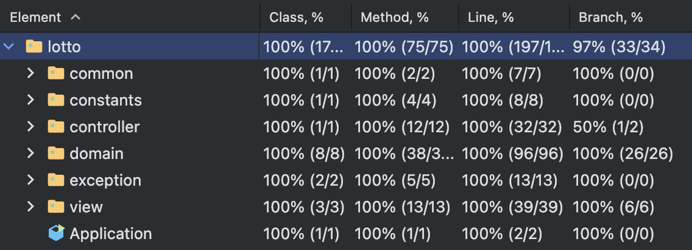

# java-lotto-precourse

## 구현할 기능 목록

> 사용자가 잘못된 값을 입력할 경우, `IllegalArgumentException`을 발생시키고, `[ERROR]`로 시작하는 에러 메시지를 출력 후 그 부분부터 입력을 다시 받는다.

1. 로또 구입 금액을 입력 받는다.
    - `구입금액을 입력해 주세요.` 라는 메세지를 출력하여 로또 구입 금액을 입력 받는다.
        - `camp.nextstep.edu.missionutils.Console`의 `readLine()`을 활용한다.
    - 구입 금액은 `1,000원 단위`로 입력 받으며, 1,000원으로 나누어 떨어지지 않는 경우, `IllegalArgumentException`을 발생시킨다.
        - 구입 금액은 `int` 타입으로 입력 받는다.
        - 에러 메세지: `[ERROR] 구입 금액을 1,000원 단위로 입력해주시길 바랍니다.`
        - 예시: `1050`, `2030`
    - 구입 금액은 1,000원보다 작을 경우, `IllegalArgumentException`을 발생시킨다.
        - 에러 메세지: `[ERROR] 구입 금액이 1,000원보다 작을 수 없습니다.`
        - 예시: `-100`, `0`
    - 구입 금액이 숫자가 아닐 경우, `IllegalArgumentException`을 발생시킨다.
        - 에러 메세지: `[ERROR] 잘못된 입력 값입니다.`
        - 예시: `abc`, `3000.10`
2. 구입한 로또 개수와 번호 출력하기
    - `{개수}개를 구매했습니다.` 라는 메세지를 출력한다.
        - 개수는 `로또 구입 금액 / 1000`이다.
        - 예시: 로또 구입 금액이 `8,000원`일 경우, `8개를 구매했습니다.`
    - 구입한 로또 번호들을 `오름차순`으로 출력한다.
        - `1 ~ 45` 범위의 `중복되지 않은 6개의 숫자`를 뽑는다.
            - 예시: `[8, 21, 23, 41, 42, 43]`
        - 중복된 숫자가 존재할 경우, `IllegalArgumentException`을 발생시킨다.
            - 에러 메세지: `[ERROR] 로또 번호에 중복된 번호가 존재합니다.`
            - 예시: `[1, 2, 3, 4, 5, 5]`
3. 당첨 번호와 보너스 번호를 입력 받는다.
    - `당첨 번호를 입력해 주세요.` 라는 메세지를 출력하여 `중복되지 않는 숫자 6개 당첨 번호`를 입력 받는다.
        - `camp.nextstep.edu.missionutils.Console`의 `readLine()`을 활용한다.
        - 구분자는 `쉼표(,)`로 구분한다.
            - 예시: `1,2,3,4,5,6`
    - `보너스 번호를 입력해 주세요.` 라는 메세지를 출력하여 `보너스 번호 1개`를 입력 받는다.
        - `camp.nextstep.edu.missionutils.Console`의 `readLine()`을 활용한다.
        - 예시: `1`
    - `당첨 번호`와 `보너스 번호`를 포함하여 중복되는 번호가 있을 경우, `IllegalArgumentException`을 발생시킨다.
        - 에러 메세지: `[ERROR] 당첨 번호에 중복된 번호가 존재합니다.`
        - 예시: `당첨 번호: 1,2,3,4,5,1`, `보너스 번호: 1`
    - `당첨 번호`와 `보너스 번호`를 포함하여 `1 ~ 45` 범위를 벗어날 경우, `IllegalArgumentException`을 발생시킨다.
        - 에러 메세지: `[ERROR] 로또 번호는 1부터 45 사이의 숫자여야 합니다.`
        - 예시: `당첨 번호: 1,2,3,4,5,100`, `보너스 번호: 90`
    - `당첨 번호`와 `보너스 번호`를 포함하여 숫자가 아닐 경우, `IllegalArgumentException`을 발생시킨다.
        - 에러 메세지: `[ERROR] 잘못된 번호를 입력하셨습니다.`
        - 예시: `당첨 번호: 1,2,3,4,5,a`, `보너스 번호: b`
    - `당첨 번호`와 `보너스 번호`는 `int` 타입이다.
4. 당첨 통계 출력하기
    - `사용자가 구매한 로또 번호`와 `당첨 번호`를 비교하여 `당첨 내역 및 수익률`을 출력하고 로또 게임을 종료한다.
        - 수익률은 `소수점 둘째 자리에서 반올림`한다.
    - 예시:

```
당첨 통계
---
3개 일치 (5,000원) - 1개
4개 일치 (50,000원) - 0개
5개 일치 (1,500,000원) - 0개
5개 일치, 보너스 볼 일치 (30,000,000원) - 0개
6개 일치 (2,000,000,000원) - 0개
총 수익률은 62.5%입니다.
```

---

## 실행 결과

```
구입금액을 입력해 주세요.
8000

8개를 구매했습니다.
[8, 21, 23, 41, 42, 43] 
[3, 5, 11, 16, 32, 38] 
[7, 11, 16, 35, 36, 44] 
[1, 8, 11, 31, 41, 42] 
[13, 14, 16, 38, 42, 45] 
[7, 11, 30, 40, 42, 43] 
[2, 13, 22, 32, 38, 45] 
[1, 3, 5, 14, 22, 45]

당첨 번호를 입력해 주세요.
1,2,3,4,5,6

보너스 번호를 입력해 주세요.
7

당첨 통계
---
3개 일치 (5,000원) - 1개
4개 일치 (50,000원) - 0개
5개 일치 (1,500,000원) - 0개
5개 일치, 보너스 볼 일치 (30,000,000원) - 0개
6개 일치 (2,000,000,000원) - 0개
총 수익률은 62.5%입니다.
```

## 프로젝트 구조

```
├── main
│   └── java
│       └── lotto
│           ├── Application.java
│           ├── common
│           │   └── InputParser.java
│           ├── constants
│           │   └── LottoConstants.java
│           ├── controller
│           │   └── LottoController.java
│           ├── domain
│           │   ├── Lotto.java
│           │   ├── LottoNumber.java
│           │   ├── LottoResult.java
│           │   ├── LottoRound.java
│           │   ├── Money.java
│           │   ├── RandomLottoGenerator.java
│           │   ├── WinningLotto.java
│           │   └── constants
│           │       └── Rank.java
│           ├── exception
│           │   ├── LottoException.java
│           │   └── constants
│           │       └── ErrorMessage.java
│           └── view
│               ├── InputView.java
│               ├── OutputView.java
│               └── constants
│                   └── ViewMessage.java
└── test
    └── java
        └── lotto
            ├── ApplicationTest.java
            ├── common
            │   └── InputParserTest.java
            └── domain
                ├── LottoNumberTest.java
                ├── LottoResultTest.java
                ├── LottoTest.java
                ├── MoneyTest.java
                ├── RandomLottoGeneratorTest.java
                └── WinningLottoTest.java

```

## 테스트 커버리지

