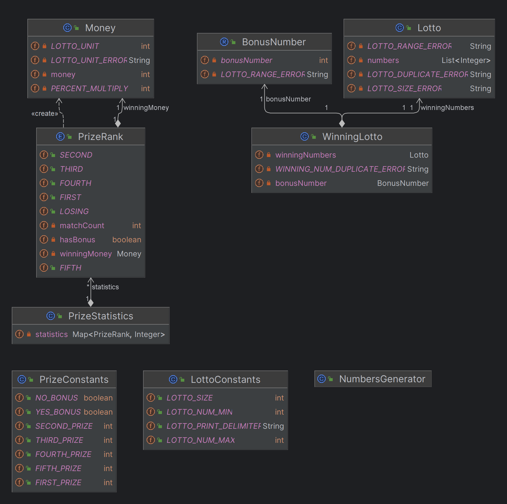

# 로또 💸

## 💸 구현 기능 목록

#### 1. 로또 발매기 생성
 ```text
- 로또 번호 생성기 구현
    - 1~45 사이의 숫자 중 중복되지 않는 6개 번호 생성
    - 생성된 번호 오름차순 정렬
```

#### 2. 로또 구매

```text
- 구매 금액 입력 및 검증
    - 1000원 단위 금액 검증
    - 구매 가능한 로또 수량 계산
   
- 구매한 수량만큼 로또 번호 생성
- 생성된 로또 번호 출력
```

#### 3. 당첨 내역 관리

```text
- 당첨 번호 입력 및 검증
    - 6개의 당첨 번호 입력 (쉼표 구분)
    - 보너스 번호 입력
    - 입력값 범위 검증 (1~45)
    - 중복 번호 검증
```

#### 4. 당첨 확인 및 결과 출력

```text
- 당첨 여부 확인 로직
    - 일치하는 번호 개수 계산
    - 보너스 번호 일치 여부 확인
    - 당첨 등수 판단
    
- 당첨 통계 계산
    - 총 수익률 계산
    
- 결과 출력
    - 등수별 당첨 내역 출력
    - 수익률 출력 (소수점 둘째자리 반올림)
```
#### 5. 예외 처리

```text
- 구매 금액 예외 처리
    - 1000원 단위가 아닌 경우: [ERROR] 구입 금액은 1000원 단위여야 합니다.
    - 숫자가 아닌 입력의 경우: [ERROR] 숫자를 입력해 주세요.
    
- 당첨 번호 입력 예외 처리
    - 1~45 범위를 벗어난 숫자: [ERROR] 로또 번호는 1부터 45 사이의 숫자여야 합니다.
    - 중복된 숫자: [ERROR] 로또 번호는 중복될 수 없습니다.
    - 잘못된 형식(쉼표 구분): [ERROR] 올바른 형식으로 입력해 주세요.
    - 6개 숫자가 아닌 경우: [ERROR] 로또 번호는 6개여야 합니다.
    
- 보너스 번호 입력 예외 처리
    - 1~45 범위를 벗어난 숫자: [ERROR] 로또 번호는 1부터 45 사이의 숫자여야 합니다.
    - 기존 당첨 번호와 중복: [ERROR] 보너스 번호는 당첨 번호와 중복될 수 없습니다.
```

<br/>


## 💸 구조



<br/>

## 💸 추가 테스트 케이스 작성
#### 1. Lotto 테스트
- [X] 로또번호_생성_성공_테스트()
- [X] 로또티켓_번호생성_성공_테스트()
- [X] 로또티켓_정렬확인_테스트()
- [X] 로또티켓_당첨확인_테스트()
- [X] 로또발행_수량확인_테스트()
- [X] 당첨통계_계산_테스트()
- [X] 수익률_계산_테스트()

#### 2. 예외 테스트
- [X] 구입_금액이_1000원으로_나누어떨어지지_않으면_예외가_발생한다()
- [X] 구입_금액이_1000원_미만이면_예외가_발생한다()
- [X] 로또_번호의_개수가_6개_이상이면_예외가_발생한다()
- [X] 로또_번호가_6개가_이하면_예외가_발생한다()
- [X] 로또_번호에_중복된_숫자가_있으면_예외가_발생한다()
- [X] 보너스_번호가_당첨_번호와_중복되면_예외가_발생한다()
- [X] 로또_번호가_1부터_45_사이의_숫자가_아니면_예외가_발생한다()

#### 3. 통합 테스트
- [X] 기능_테스트()
- [X] 예외상황_처리후_재시도_테스트()


<br/>

## 💸 SRP 원칙

### 1. LottoController
- **단일 책임**: 전체 게임 흐름 조정 및 컴포넌트 조합
- **적용 방식**:
    - 직접적인 입력/출력/계산 처리를 하지 않고 다른 클래스에 위임

### 2. LottoInput
- **단일 책임**: 사용자 입력 처리 및 입력값 검증
    - 출력이나 계산 로직은 포함하지 않는당!

### 3. LottoOutput
- **단일 책임**: 게임 결과 출력
    - 순수하게 출력 관련 책임만 가짐

### 4. LottoGenerator
- **단일 책임**: 로또 번호 생성
    - 번호 생성에만 집중, 검증이나 출력 책임은 없당!

### 5. LottoResultCalculator
- **단일 책임**: 당첨 결과 계산

### 6. WinningResult
- **단일 책임**: 당첨 결과 상태 관리

### 7. Prize (Enum)
- **단일 책임**: 당첨 등수와 상금 정보 관리

### SRP 원칙 적용의 이점:
1. **높은 응집도**
    - 각 클래스가 **하나의 책임만** 가짐
    - 관련된 데이터와 메서드가 함께 위치

2. **낮은 결합도**
    - 각 클래스는 **자신의 책임만** 수행
    - 다른 클래스의 변경에 영향을 최소화!!!

3. **유지보수성 향상**
    - 특정 기능 수정 시 **관련 클래스만** 수정
    - 코드 변경의 영향 범위가 **명확**
### 
