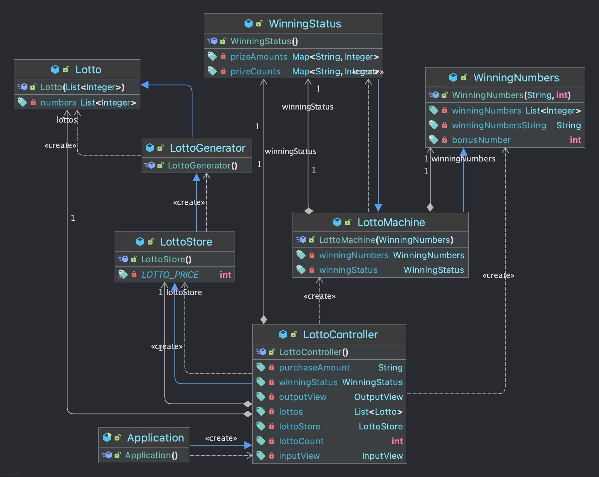

# java-lotto-precourse

## 기능 목록

- [x] 로또 구매 금액 입력
- [x] 로또 당첨 번호 입력
- [x] 보너스 번호 입력
- [x] 발행할 로또 수 계산
- [x] 발행할 로또 개수만큼 로또 발행
- [x] 로또 당첨 번호와 비교해서 로또 당첨 여부 확인
- [x] 발행한 로또 목록 출력
- [x] 당첨 내역 출력
- [x] 수익률 계산
- [x] 수익률 출력

## 예외 목록

- [x] 로또 구매 금액이 1000원 미만인 경우
- [x] 로또 구매 금액이 1000원 단위가 아닌 경우
- [x] 로또 당첨 번호가 1~45가 아닌 경우
- [x] 보너스 번호가 1~45가 아닌 경우
- [x] 로또 당첨 번호와 보너스 번호가 중복되는 경우
- [x] 로또 구매 금액이 null인 경우
- [x] 로또 구매 금액이 숫자가 아닐 경우
- [x] 로또 당첨 번호가 null인 경우
- [x] 로또 당첨 번호에 구분자를 제외한 문자가 존재하는 경우
- [x] 보너스 번호가 null인 경우
- [x] 보너스 번호가 숫자가 아닐 경우

## 클래스 다이어그램



## 프로세스 흐름

### 1. 구매 금액 입력

사용자는 InputView의 requestPurchaseAmount 메서드를 통해 로또 구매 금액을 입력합니다.
입력된 금액은 InputValidator를 통해 유효성 검사를 거쳐 1,000원 이상, 1,000원 단위인지 확인됩니다.
<br>

### 2. 구매할 로또 수량 계산 및 발행

LottoStore의 getLottoCount 메서드를 통해 입력된 금액에 따라 구매할 로또 수량을 계산합니다.
이후 LottoGenerator를 사용해 필요한 수량만큼의 로또(Lotto)를 생성하고,
각 로또는 중복되지 않는 6개의 숫자로 이루어집니다.
<br>

### 3. 발행된 로또 출력

생성된 로또 목록은 OutputView의 printLottoCount 메서드를 통해 콘솔에 출력됩니다.
<br>

### 4. 당첨 번호와 보너스 번호 입력

사용자는 InputView의 requestWinningNumbers와 requestBonusNumber 메서드를 통해 당첨 번호와 보너스 번호를 입력합니다.
입력된 번호들은 InputValidator를 통해 유효성 검사를 거쳐 1부터 45 사이의 유효한 값인지,
중복된 값이 있는지 등을 확인합니다.
<br>

### 5. 당첨 번호와 보너스 번호를 이용한 당첨 여부 확인

LottoMachine 클래스에서 checkWinningStatus 메서드를 사용해 각 로또 번호와 당첨 번호를 비교하여 당첨 여부를 검사합니다.
매칭된 숫자 수에 따라 1등부터 5등까지 해당되는 당첨 정보를 WinningStatus에 기록합니다.

### 6. 당첨 내역 출력

OutputView의 printWinningStatistics 메서드를 통해 각 당첨 등급별 당첨 개수를 콘솔에 출력합니다.

### 7. 수익률 계산 및 출력

LottoMachine의 calculateYield 메서드를 사용해 총 당첨 금액과 구매 금액을 비교하여 수익률을 계산하고,
OutputView의 printYield 메서드로 콘솔에 출력합니다.

## 프로그램 실행 결과

```
구입금액을 입력해 주세요.
15000

당첨 번호를 입력해 주세요.
6,23,12,9,4,30

보너스 번호를 입력해 주세요.
1

15개를 구매했습니다.
[4, 40, 3, 14, 10, 38]
[44, 10, 43, 37, 4, 34]
[4, 29, 39, 20, 40, 45]
[38, 8, 27, 17, 29, 26]
[23, 17, 20, 1, 34, 35]
[29, 26, 25, 12, 6, 2]
[39, 8, 19, 31, 2, 23]
[35, 9, 22, 14, 18, 21]
[26, 24, 39, 2, 18, 25]
[17, 22, 41, 34, 3, 33]
[28, 41, 13, 35, 19, 4]
[2, 45, 19, 3, 13, 11]
[45, 18, 15, 1, 20, 6]
[30, 16, 17, 29, 13, 2]
[16, 9, 41, 7, 31, 30]

당첨 통계
---
3개 일치 (5,000원) - 0개
4개 일치 (50,000원) - 0개
5개 일치 (1,500,000원) - 0개
5개 일치, 보너스 볼 일치 (30,000,000원) - 0개
6개 일치 (2,000,000,000원) - 0개
총 수익률은 0.0%입니다.
