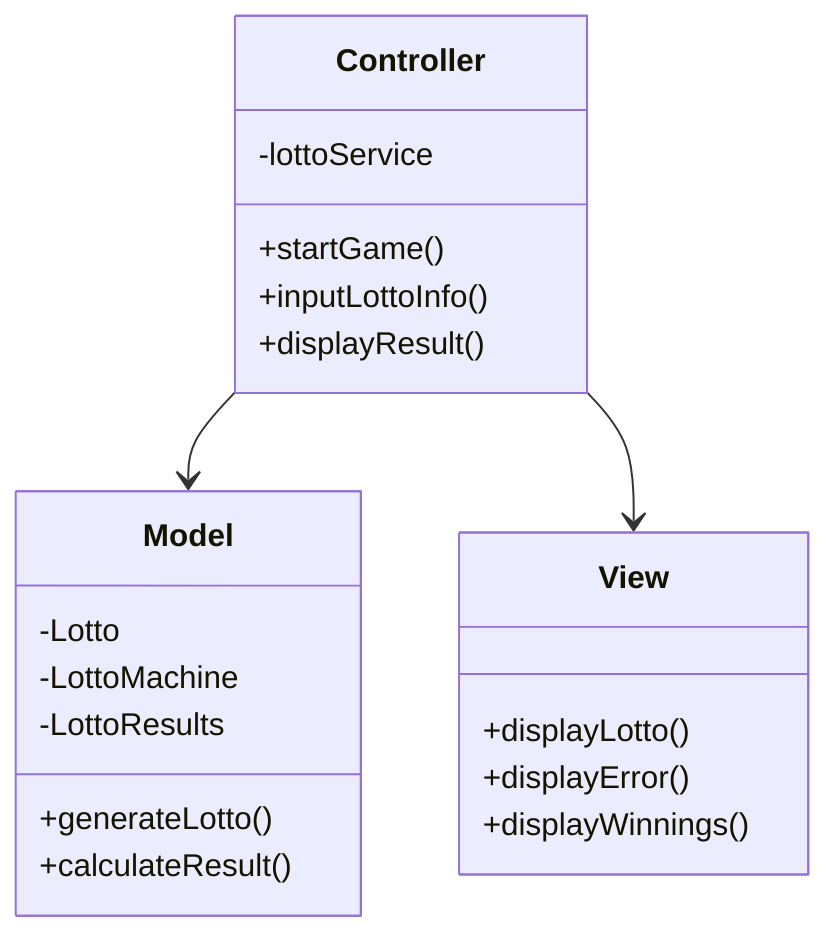

# java-lotto-precourse

### 1. 클래스 다이어 그램 (MVC 패턴)

- **Controller**: `LottoController` 클래스는 전체 게임을 관리하고, 유저 입력을 받아 모델과 뷰 간의 데이터 흐름을 조율합니다.
- **Model**: `Lotto`, `LottoMachine`, `LottoResults` 클래스는 로또와 관련된 주요 로직을 관리합니다. `Lotto`는 개별 로또 티켓을, `LottoMachine`은 발행기를, `LottoResults`는 결과를 처리합니다.
- **View**: `LottoView` 클래스는 콘솔에 출력하는 내용을 담당합니다.

### 2. 기능 구현 체크리스트

#### **Controller**
- [ ] 게임 실행을 관리하는 `startGame()` 메서드 작성
- [ ] 유저 입력을 관리하는 `inputLottoInfo()` 메서드 작성
- [ ] 게임 결과를 표시하는 `displayResult()` 메서드 작성

#### **Model**
- **Lotto**:
  - [ ] 로또 티켓 생성 및 번호 유효성 검사
- **LottoMachine**:
  - [ ] 로또 번호를 무작위로 생성하는 `generateLotto()` 메서드 작성
  - [ ] 유저 구매 로또 수량 계산 및 발행
- **LottoResults**:
  - [ ] 당첨 결과 계산 로직 작성
  - [ ] 각 당첨 등급별 당첨 횟수와 수익률 계산

#### **View**
- [ ] 로또 티켓 및 구매 내역 표시하는 `displayLotto()`
- [ ] 에러 메시지 표시하는 `displayError()`
- [ ] 당첨 결과와 수익률을 표시하는 `displayWinnings()`

### 3. 싱글톤 패턴 적용
- [ ] `LottoMachine` 클래스에 싱글톤 패턴을 적용해 하나의 로또 발행기를 유지하도록 구현