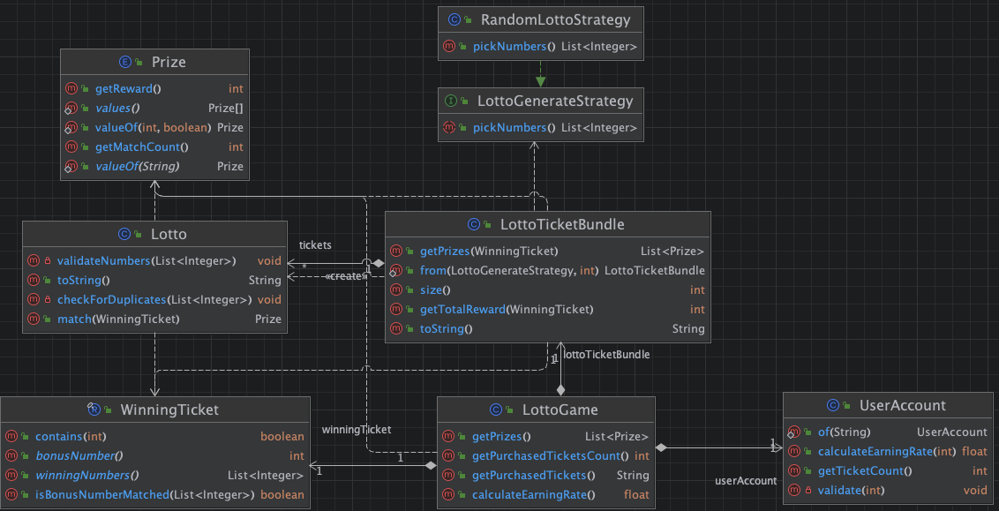

# 로또 게임 어플리케이션



이 어플리케이션은 콘솔을 통해 사용자로부터 구입 금액과 당첨 번호를 입력받고, 사용자가 구매한 로또 티켓의 당첨 여부를 확인하여 최종 수익률을 계산하는 게임입니다.

---

## 어플리케이션 흐름

1. **게임 초기화**
  - 컨트롤러가 사용자로부터 구입 금액을 입력받고, 유효성을 검증합니다.
  - 구입 금액에 따라 로또 티켓의 개수를 계산하고, 해당 개수만큼 로또 번호를 생성합니다.

2. **당첨 번호 입력**
  - 컨트롤러가 사용자로부터 당첨 번호와 보너스 번호를 입력받고, 유효성을 검증합니다.

3. **게임 실행 및 결과 처리**
  - 각 로또 티켓에 대해 당첨 번호와 비교하여 일치하는 번호 개수를 확인합니다.
  - 당첨 내역을 기반으로 당첨 금액을 계산하고, 최종 수익률을 산출합니다.
  - 게임 결과와 수익률을 출력합니다.

---

## 도메인 요구사항

### 1. 로또 

- **행동**
  - 중복되지 않은 숫자로 구성된 6개의 번호를 가진 로또 티켓을 생성한다.
  - 당첨 번호와 보너스 번호를 입력받아, 해당 로또 티켓의 일치 개수를 판별한다.
- **상태**
  - 로또 번호: 1~45 범위의 중복되지 않은 6개의 숫자를 가짐.
  - 로또 번호는 라이브러리를 통해 무작위로 생성되며, 중복을 허용하지 않는다.

### 2. 로또 번들

- **행동**
  - 여러 장의 로또 티켓을 관리한다.
  - 모든 로또 티켓의 당첨 결과를 판별하고, 각 등수별 당첨 개수를 리턴한다.
  - 총 당첨금을 계산한다.
- **상태**
  - 로또 티켓 컬렉션: 사용자가 구매한 로또 티켓들의 모음.

### 3. 로또 생성 전략 

- **행동**
  - 무작위로 중복되지 않은 6개의 번호를 생성하여 반환한다.

### 4. 유저 계좌 

- **행동**
  - 구입 금액을 입력받아 구매할 로또 티켓의 개수를 계산한다.
  - 총 당첨금과 구입 금액을 기반으로 수익률을 계산하여 반환한다.
- **상태**
  - 구입 금액: 사용자가 로또를 구매하는 데 사용한 금액.

### 5. 로또 게임 

- **행동**
  - 게임을 실행하고, 당첨 통계를 생성하여 최종 결과를 반환한다.
  - 수익률을 계산한다.
- **상태**
  - 로또 티켓 번들: 사용자가 구매한 로또 티켓 컬렉션.
  - 당첨 번호 및 보너스 번호.
  - 유저 계좌: 구입 금액과 수익률 계산을 관리.

---

## 입출력 요구사항

1. **구입 금액 입력**
  - 구입 금액 입력 전 `"구입금액을 입력해 주세요."` 문구 출력.
  - 구입 금액이 양의 정수가 아니거나 1000으로 나누어 떨어지지 않으면 예외 발생.

2. **구매한 로또 개수 및 번호 내역 출력**
  - 구입 금액에 따라 구매한 로또 개수와 로또 번호 목록을 출력.

3. **당첨 번호 입력**
  - 당첨 번호 입력 전 `"당첨 번호를 입력해 주세요."` 문구 출력.
  - ','로 구분된 6개의 번호가 양의 정수인지, 중복되지 않았는지, 1~45 범위에 있는지 검증.

4. **보너스 번호 입력**
  - 보너스 번호 입력 전 `"보너스 번호를 입력해 주세요."` 문구 출력.
  - 보너스 번호가 양의 정수인지, 1~45 범위에 있는지, 당첨 번호와 중복되지 않았는지 검증.

5. **당첨 내역 출력**
  - 당첨 개수와 등수별 당첨 내역을 출력.
  - 출력 형식 예:
    ```
    3개 일치 (5,000원) - 1개
    4개 일치 (50,000원) - 0개
    5개 일치 (1,500,000원) - 0개
    5개 일치, 보너스 볼 일치 (30,000,000원) - 0개
    6개 일치 (2,000,000,000원) - 0개
    ```

6. **수익률 출력**
  - 수익률을 계산하여, 소수점 첫째 자리에서 반올림하여 출력.
  - 출력 형식 예: `"총 수익률은 62.5%입니다."`

---

## 당첨 조건 및 당첨금

| 등수 | 조건                              | 당첨금         |
|------|----------------------------------|---------------|
| 1등  | 6개 번호 일치                    | 2,000,000,000원 |
| 2등  | 5개 번호 + 보너스 번호 일치       | 30,000,000원   |
| 3등  | 5개 번호 일치                    | 1,500,000원    |
| 4등  | 4개 번호 일치                    | 50,000원       |
| 5등  | 3개 번호 일치                    | 5,000원        |

