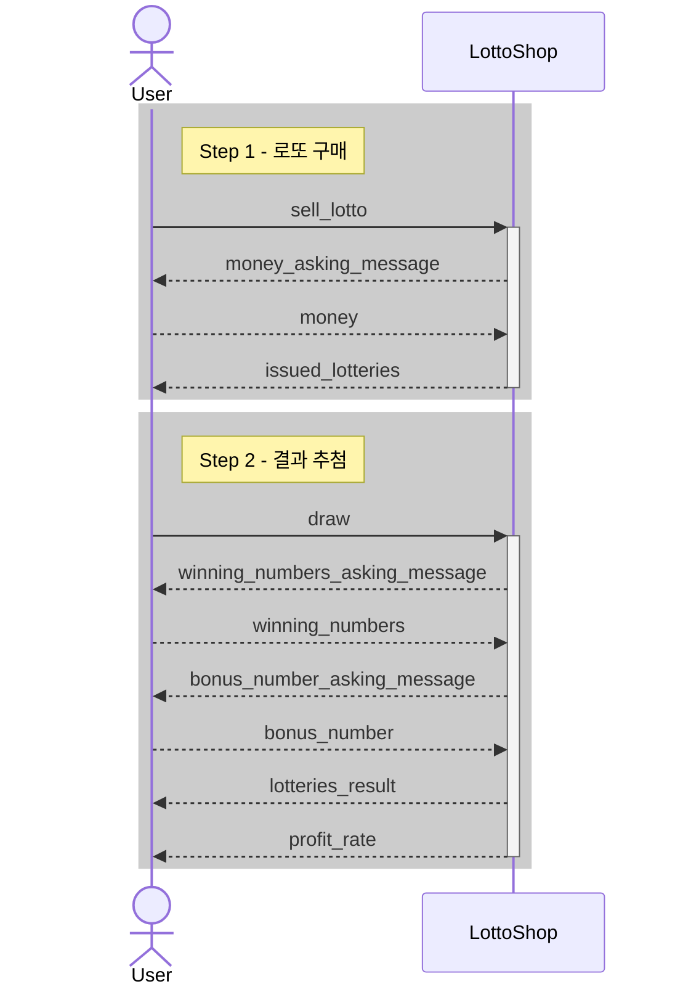

# java-lotto-precourse

## Diagrams

### System Sequence

### Domain Architecture

### Composition

## 기능 요구사항

> 입력에 문제가 있으면 **해당 지점**부터 다시 입력받는다.

### 로또 구매 및 발행

- [x] 로또 숫자는 [1, 45] 범위만 가능하다.
- [x] 로또는 6개의 숫자로 이루어진다.
- [x] 로또는 중복 숫자를 가지지 않는다.
- [x] 로또는 숫자를 정렬하여 저장한다.
- [x] 로또 가격은 1,000원이다.
- [x] 지불한 금액만큼 로또를 발급한다.

### 로또 추첨

- [x] 로또 당첨 번호는 [1, 45] 범위만 가능하다.
- [x] 로또 당첨 번호는 6개의 숫자로 이루어진다.
- [x] 로또 당첨 번호는 중복 숫자를 가지지 않는다.
- [x] 보너스 번호는 [1, 45] 범위만 가능하다.
- [x] 보너스 번호는 당첨 번호와 중복되지 않는다.

### 상금 및 수익률 계산

- [x] 로또 당첨 번호와 보너스 번호를 비교하여 등수를 계산한다.
- [x] 상금은 다음과 같다.
    - 1등: 6개 일치
    - 2등: 5개 일치 + 보너스 번호 일치
    - 3등: 5개 일치
    - 4등: 4개 일치
    - 5등: 3개 일치
    - 꽝: 그 외
- [x] 수익률은 다음과 같다.
    - 수익률 = 총 상금 / 총 구매 금액
- [x] 수익률은 소수점 둘째 자리에서 반올림하여 첫째자리까지 표시한다.
