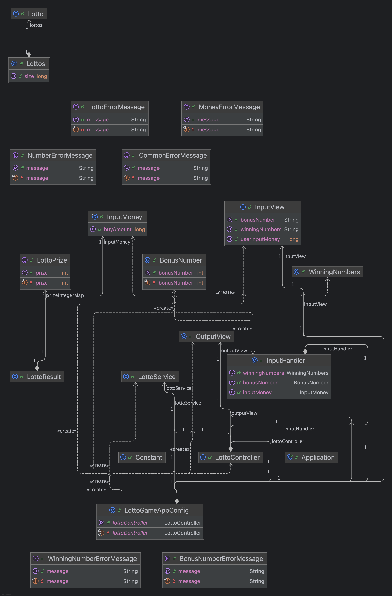

# Lotto Program Specification

## 기능 명세서

### 1. 구입금액 입력
- **기능**: 구입 금액을 입력받는다.
- **조건**:
   - 로또 한 장의 가격은 **1,000원**이다.
   - 반드시 **1,000원 단위**로 입력해야 하며, 그렇지 않으면 `IllegalArgumentException` 에러가 발생한다.
   - 예시: **15,000원**을 지불하면 **로또 15장**을 구매해야 한다.

### 2. 구매 개수와 로또 번호 출력
- **기능**: 구매한 로또의 개수와 각 로또의 랜덤 숫자 6개를 출력한다.
- **조건**:
   - 로또 번호는 **오름차순으로 정렬**되어야 한다.
   - `Randoms.pickUniqueNumbersInRange()` 메서드를 사용하여 **랜덤한 6개의 숫자**를 선택한다.
   - 반환된 값을 그대로 정렬하지 않고, 새로운 `List`에 담아서 정렬을 수행한다.

### 3. 당첨 번호 입력
- **기능**: 당첨 번호 6개를 입력받는다.
- **조건**:
   - 번호는 **쉼표(,)** 로 구분한다.
   - 입력이 올바르지 않은 경우 `IllegalArgumentException` 에러를 발생시킨다.

### 4. 보너스 번호 입력
- **기능**: 보너스 번호 1개를 입력받는다.
- **조건**:
   - 입력이 올바르지 않은 경우 `IllegalArgumentException` 에러를 발생시킨다.

### 5. 당첨 로또 확인 및 등수 판별
- **기능**: 구매한 로또 중 몇 개가 당첨되었는지 확인한다. 당첨 로또가 **몇 등에 해당하는지도 판별**한다.
- **조건**:
   - **보너스 번호**는 **2,3등**을 판별할 때 사용된다. (예: **5개 숫자 일치 + 보너스 번호 일치** 하면 2등, **보너스 번호 외 5개의 번호가 일치할 경우** 3등)

### 6. 당첨 내역 출력
- **기능**: 당첨 내역을 출력한다.
- **조건**:
   - **5, 4, 3, 2, 1등** 순서대로 출력하며, 당첨된 로또가 없으면 **0개**로 출력한다.

### 7. 수익률 출력
- **기능**: 수익률을 출력한다.
- **조건**:
   - 수익률은 **소수점 둘째 자리**에서 반올림한다.

### 8. 예외 처리 및 에러 문구 출력
- **기능**: 잘못된 입력 시 에러 문구를 출력하고, 해당 부분부터 다시 입력을 받는다.
- **조건**:
   - 에러 메시지는 반드시 `[ERROR]`로 시작한다.
   - `IllegalArgumentException`, `IllegalStateException` 등 명확한 에러 유형을 표시한다.

> **Note**: 위 명세에 따라 프로그램을 구현하며, 요구사항에 맞지 않는 입력은 예외 처리 및 에러 메시지를 통해 사용자에게 알리고 잘못 입력한 부분부터 다시 입력받아야 합니다.

---

## 클래스 다이어그램

