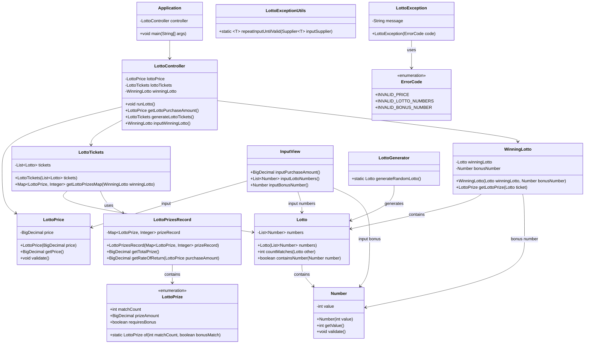

# java-lotto-precourse

## 주요 프로세스
1. 유저 돈 입력 (1,000 원 단위)
   - 1,000 원 단위 아닐 시 예외 발생
2. 로또 구입 갯수(= 유저 입력 한 돈 / 1,000) 만큼 로또 생성 후 출력
3. 로또 당첨 번호 입력. 
   - 조건: 1-45까지 번호 6개가 쉽표로 구분하여야 한다.
   - 위의 조건을 만족하지 않으면 예외 발생
4. 보너스 번호 입력
    - 조건: 1-45까지 번호여야 한다.
    - 위의 조건을 만족하지 않으면 예외 발생
5. 당첨 통계 출력
   - 당첨 기준:
     - 1등: 6개 번호 일치 / 2,000,000,000원
     - 2등: 5개 번호 + 보너스 번호 일치 / 30,000,000원
     - 3등: 5개 번호 일치 / 1,500,000원
     - 4등: 4개 번호 일치 / 50,000원
     - 5등: 3개 번호 일치 / 5,000원
   - 각 기준별로 몇 개 당첨 됐는지 출력
   - 수익률 출력
     - 수익률(%) = 수익금 / 유저 입력 한 돈 * 100
     - 조건: 소숫점 2자리에서 반올림

## 기능 구현 TODO
### 입력
- [X] 유저 로또 구입금액 입력
  - [X] 1,000 원 단위 아닐 시 `IllegalArgumentException` 발생
- [X] 로또 당첨 번호 입력
  - [X] 1-45까지 번호 6개가 쉽표로 구분되지 않을 시 `IllegalArgumentException` 발생
- [X] 보너스 번호 입력
  - [X] 1-45까지 번호 아닐 시 `IllegalArgumentException` 발생
- [X] 각 입력, `IllegalArgumentException`발생 시 에러 메시지 출력 후 재입력 실행
  - [X] case 1. 유저 로또 구입금액 입력
  - [X] case 2. 로또 당첨 번호 입력
  - [X] case 3. 보너스 번호 입력
### 주요 기능
- [X] 유저 로또 구입금액 / 1000 만큼 로또 생성
- [X] 각 로또 마다 등수 확인
- [X] 로또 등수 별로 갯수 저장
- [X] 로또 수익률 계산
### 출력
- [X] 유저 로또 구입금액 입력 후 만들어진 생성된 로또 번호 출력(오름차순)
  - 예시<br>
    [8, 21, 23, 41, 42, 43]<br>
    [3, 5, 11, 16, 32, 38]<br>
    [7, 11, 16, 35, 36, 44]<br>
    [1, 8, 11, 31, 41, 42]<br>
    [13, 14, 16, 38, 42, 45]<br>
    [7, 11, 30, 40, 42, 43]<br>
    [2, 13, 22, 32, 38, 45]<br>
    [1, 3, 5, 14, 22, 45]<br>
- [X] 당첨 통계 출력
  - 예시:<br>
    당첨 통계<br>
      \-\-\-<br>
      3개 일치 (5,000원) - 1개<br>
      4개 일치 (50,000원) - 0개<br>
      5개 일치 (1,500,000원) - 0개<br>
      5개 일치, 보너스 볼 일치 (30,000,000원) - 0개<br>
      6개 일치 (2,000,000,000원) - 0개<br>
      총 수익률은 62.5%입니다.<br>
- [X] 예외 메시지 출력
  - 주의 사항: "[ERROR]"으로 시작.

## 클래스 다이어그램



## 로또 시퀀스 다이어그램

```mermaid
sequenceDiagram
    participant User
    participant InputView
    participant LottoController
    participant LottoPrice
    participant LottoTickets
    participant WinningLotto
    participant LottoPrizesRecord
    participant OutputView

    User->>InputView: 구입금액을 입력해 주세요
    InputView->>LottoPrice: inputPurchaseAmount()
    LottoPrice->>LottoPrice: validate()  // 1000원 단위 유효성 검사
    LottoPrice-->>LottoController: LottoPrice 객체 반환

    LottoController->>LottoTickets: generateLottoTickets()
    LottoTickets->>LottoGenerator: 랜덤 로또 생성 반복

    LottoGenerator-->>LottoTickets: 로또 번호 리스트 반환
    LottoTickets-->>LottoController: LottoTickets 객체 반환
    LottoController-->>OutputView: 발행한 로또 수량 및 번호 출력

    User->>InputView: 당첨 번호를 입력해 주세요
    InputView->>WinningLotto: inputLottoNumbers()
    WinningLotto->>WinningLotto: 로또 번호 유효성 검사
    WinningLotto-->>LottoController: WinningLotto 객체 반환

    User->>InputView: 보너스 번호를 입력해 주세요
    InputView->>WinningLotto: inputBonusNumber()
    WinningLotto->>WinningLotto: 보너스 번호 유효성 검사
    WinningLotto-->>LottoController: 보너스 번호 설정 완료

    LottoController->>LottoTickets: getLottoPrizesMap(WinningLotto)
    LottoTickets->>Lotto: 구매한 로또 번호와 당첨 번호 비교

    Lotto-->>LottoPrizesRecord: 당첨 내역 저장
    LottoTickets-->>LottoController: LottoPrizesRecord 객체 반환

    LottoController->>OutputView: 당첨 통계 출력
    LottoController->>LottoPrizesRecord: 수익률 계산
    LottoPrizesRecord-->>OutputView: 총 수익률 출력