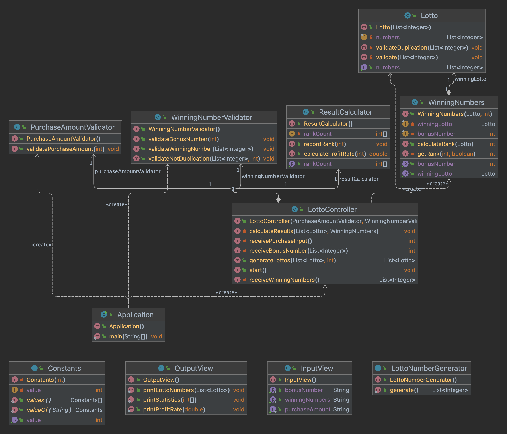

# java-lotto-precourse
## 미션 개요
- **프리코스 3주차 미션**입니다.
- 다음과 같은 목표로 미션을 수행하겠습니다.
    - 관련 함수를 묶어 클래스를 만들고, 객체들이 협력하여 하나의 큰 기능을 수행하도록 한다.
    - 클래스와 함수에 대한 단위 테스트를 통해 의도한 대로 정확하게 작동하는 영역을 확보한다.
    - 2주 차 공통 피드백을 최대한 반영한다.
## 클래스 다이어 그램

## 구현 기능 목록
### ✔️ 입력
- 사용자에게 `int`형으로 로또 구입 금액 입력 받기
    - 1,000원 당 로또 한 장으로 계산해 구입 금액을 통해 발행할 로또 개수를 결정하기
- 사용자에게 `int`형으로 당첨 번호 입력 받기
    - 쉼표(,)를 기준으로 각 당첨 번호 구분하기
- 사용자에게 `int`형으로 보너스 번호 입력 받기
#### ❗ 예외 상황
- 로또 구입 금액 입력이 1,000원으로 나누어 떨어지지 않는 경우 `IllegalArgumentException` 발생시키기
    - "[ERROR] 구입 금액은 1,000원 단위로 입력해야 합니다." 출력하기
    - 이후 다시 로또 구입 금액 입력 받기
- 당첨 번호 및 보너스 번호가 1~45 사이의 숫자가 아닐 경우 `IllegalArgumentException` 발생시키기
    - "[ERROR] 로또 번호는 1부터 45 사이의 숫자여야 합니다." 출력하기
    - 이후 다시 당첨 번호 및 보너스 번호 입력 받기
- 보너스 번호가 당첨 번호와 중복될 경우 `IllegalArgumentException` 발생시키기
    - "[ERROR] 로또 번호와 보너스 번호는 중복되지 않아야 합니다." 출력하기
    - 이후 다시 보너스 번호 입력 받기
- 로또 구입금액과 로또 번호 및 보너스 번호 입력에 숫자가 아닌 문자가 넘어올 경우 `NumberFormatException` 에러에 대한 예외 처리하기
    - "[ERROR] 올바른 숫자를 입력해야 합니다."
    - 이후 다시 당첨 번호 및 보너스 번호 입력 받기

### ✔️ 출력
- 발행한 로또 개수만큼 각 로또의 번호를 출력하기
    - 오름차순으로 로또 번호를 정렬해 출력하기
- 당첨 내역을 등수별로 출력하기
    - 1등: 6개 번호 일치 / 2,000,000,000원
    - 2등: 5개 번호 + 보너스 번호 일치 / 30,000,000원
    - 3등: 5개 번호 일치 / 1,500,000원
    - 4등: 4개 번호 일치 / 50,000원
    - 5등: 3개 번호 일치 / 5,000원
- 수익률 출력하기

### ✔️ 당첨 내역 저장
- 사용자가 발행한 로또 당첨 내역을 등수와 그에 맞는 수익 저장하기
    - 1등: 2,000,000,000원
    - 2등: 30,000,000원
    - 3등: 1,500,000원
    - 4등: 50,000원
    - 5등: 5,000원

### ✔️ 수익률 계산
- 당첨 내역를 바탕으로 수익률 산출하기
    - 수익률 공식: 수익금 / 로또 구입 금액 * 100%
 
### ✔️ 로또 번호 생성
- 각 로또의 6개 번호와 1개의 보너스 번호를 생성하기
    - `camp.nextstep.edu.missionutils`에서 제공하는 `Randoms` 사용
    - `Randoms.pickUniqueNumberInRange(1, 45, 6);`를 사용해 1에서 45 사이의 중복되지 않은 정수 6개 반환

### ✔️ 등수 판별
- 사용자가 입력한 당첨 번호와 보너스 번호를 저장하기
- 랜덤으로 생성한 로또 번호와 비교해 등수를 판별하기
    - 1등: 6개 번호 일치
    - 2등: 5개 번호 + 보너스 번호 일치
    - 3등: 5개 번호 일치
    - 4등: 4개 번호 일치
    - 5등: 3개 번호 일치

### ✔️ 로또 발매기의 전체 흐름 관리
- 사용자에게 구입 금액 입력 받기
    - 입력 받은 구입 금액을 로또 번호를 생성하는 클래스에게 넘기기 
- 사용자에게 당첨 번호와 보너스 번호 입력 받기
    - 입력 받은 당첨 번호와 보너스 번호를 등수와 수익률 계산하는 클래스에게 넘기기 
- 로또의 결과를 출력 담당 클래스에게 전달하기
- 예외 상황에 대한 처리 담당하기
