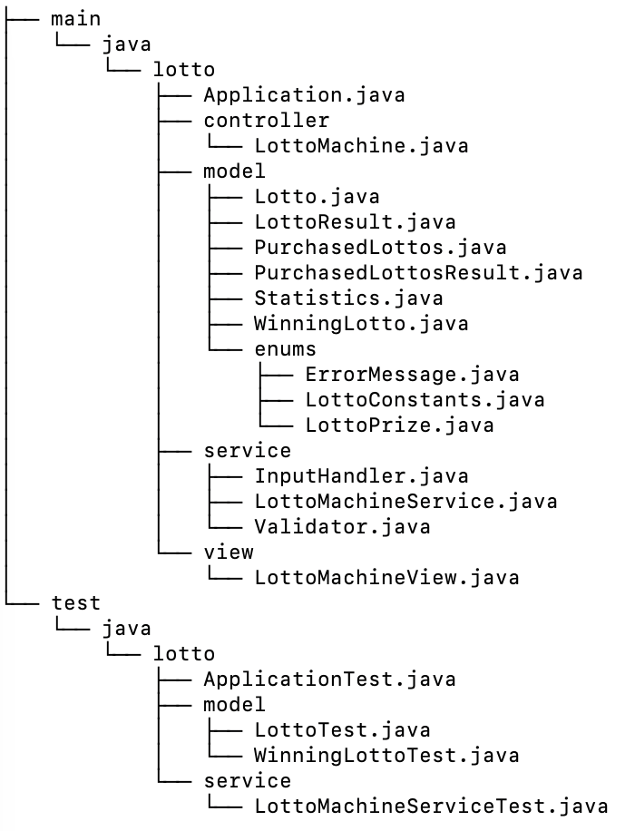
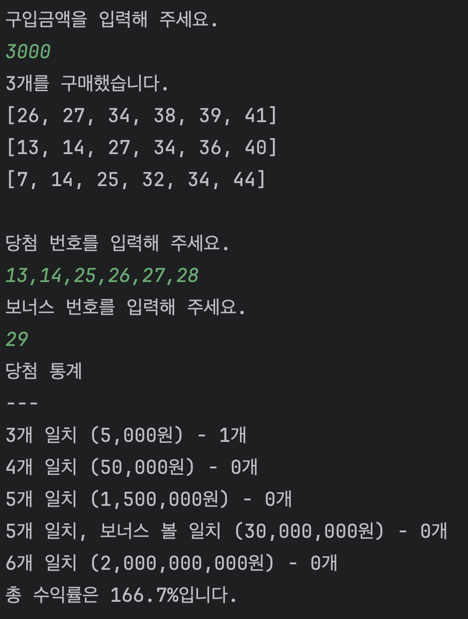

# java-lotto-precourse

--- 
> 패키지 구조
<p align="center">
    
</p>

## 제약 조건
1. 구매액은 반드시 1,000원 단위의 int 범위 이내의 자연수
2. 당첨 번호는 쉼표로 구분되는 1부터 45 사이의 중복되지 않는 자연수 6개
3. 보너스 번호는 1부터 45 사이의 자연수 1개

## 기능 구현 목록
1. 로또 자동 번호 구매
2. 당첨 번호 입력
3. 통계 계산, 출력

## 입출력
> 입력 :

1. 천원 단위의 로또 구매액
2. 당첨 번호 6개
3. 보너스 번호 1개

> 예시
```
3000
1,21,31,41,15,26
7
```

> 출력 :

1. 로또 자동 번호(오름차순)
2. 당첨 통계 

> 예시
```
3개를 구매했습니다.
[26, 27, 34, 38, 39, 41]
[13, 14, 27, 34, 36, 40]
[7, 14, 25, 32, 34, 44]
```
```
당첨 통계
---
3개 일치 (5,000원) - 1개
4개 일치 (50,000원) - 0개
5개 일치 (1,500,000원) - 0개
5개 일치, 보너스 볼 일치 (30,000,000원) - 0개
6개 일치 (2,000,000,000원) - 0개
총 수익률은 166.7%입니다.
```

---

## 실행 결과 예시
<p align="center">
    
</p>
