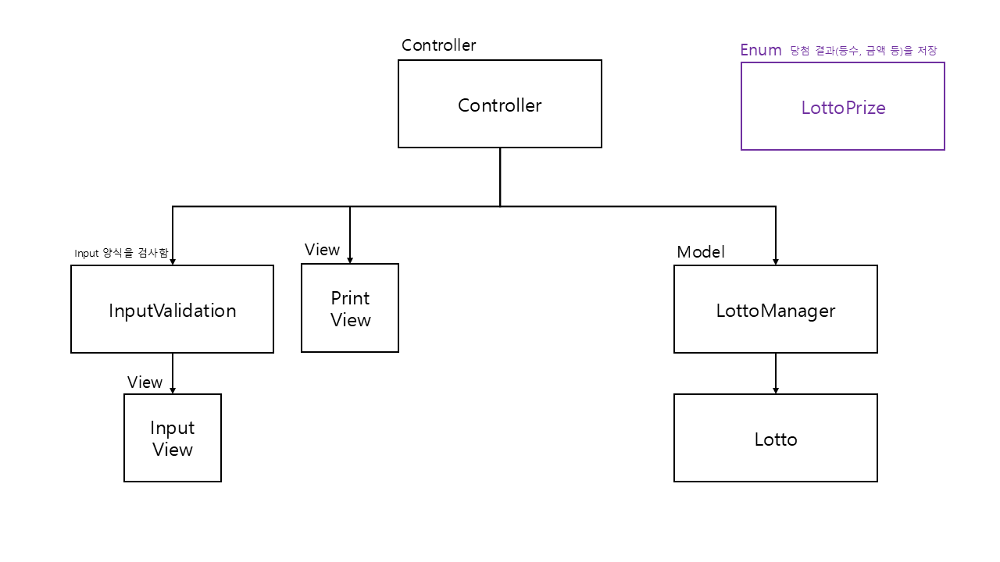

# java-lotto-precourse
## 로또 발매기 소개
#### 설명
로또를 구매하고, 당첨 번호를 입력해서 구매한 로또의 수익률을 확인할 수 있는 프로젝트이다. 

#### 사용법
1. 로또 구입 금액을 입력 한다. 
    * 이때 로또는 1장에 1000원으로 1000원 단위로 입력한다. 해당 금액 입력을 통해 원하는 수 만큼의 로또를 발권받을 수 있다.
    * 구입 금액은 **long 범위**여야 한다.
2. 당첨 번호를 6개 입력 한다.
   * 이때 당첨번호는 1~45 사이로 입력해야 하고, 쉼표(,)로 구분해야 한다.
3. 보너스 번호를 1개 입력한다.
   * 보너스 번호도 마찬가지로 1~45 사이로 입력해야 한다.

위 과정을 마치면 당첨된 복권 통계와 수익률을 보여준다.

#### 사용자 입출력 예시
```java
구입금액을 입력해 주세요.
8000 // 사용자 입력

8개를 구매했습니다.
[8, 21, 23, 41, 42, 43] 
[3, 5, 11, 16, 32, 38] 
[7, 11, 16, 35, 36, 44] 
[1, 8, 11, 31, 41, 42] 
[13, 14, 16, 38, 42, 45] 
[7, 11, 30, 40, 42, 43] 
[2, 13, 22, 32, 38, 45] 
[1, 3, 5, 14, 22, 45]

당첨 번호를 입력해 주세요.
1,2,3,4,5,6 // 사용자 입력

보너스 번호를 입력해 주세요.
7 // 사용자 입력

당첨 통계
---
3개 일치 (5,000원) - 1개
4개 일치 (50,000원) - 0개
5개 일치 (1,500,000원) - 0개
5개 일치, 보너스 볼 일치 (30,000,000원) - 0개
6개 일치 (2,000,000,000원) - 0개
총 수익률은 62.5%입니다.
```
---
## Class Diagram



___
## 기능 목록

### View
#### InputView
1. 복권 구입 금액 입력
2. 복권 당첨 번호 6개 입력
3. 보너스 번호 1개 입력

#### PrintView
1. 로또 번호 출력
2. 당첨 통계 출력하기 

<br>

### InputValidation Class (입력 에러 처리 용도)
View 에서 들어온 입력이 유효한 입력인지 검사하는 클래스이다. (아래 넘버링은 View 기능의 넘버링을 따름)

0.0 (공통) null 체크 <br>

1-1. 1000원 단위인지 확인 <br>
1-2. 숫자로 이루어진 입력인지 확인 <br>
1-3. 0원은 예외처리 <br>
1-4. 금액이 양수인지 확인 <br>

2-1. 6개의 입력인지 확인 <br>
2-2. 양식을 잘 지켰는지 확인 (쉼표와 숫자로 이루어져 있는지 확인) <br>
2-3. 숫자가 1~45 범위인지 확인 <br>
2-4. 중복되지 않는 숫자인지 확인 <br>

3-1. 숫자로 이루어져 있는지 확인 <br>
3-2. 숫자가 1~45 범위인지 확인 <br>
3-3. 기존 당첨 번호와 중복되는지 확인 <br>

<br>

### Controller
1. 로또 구입 과정 제어
2. 당첨 번호 + 보너스 번호 입력 과정 제어
3. 당첨 통계 출력 제어

<br>

### Model
#### Lotto Class
1. 주어진 클래스에 getter 추가
2. 발권된 번호의 중복 여부 검사

#### LottoManager Class
1. 로또 번호 발권 기능
2. 로또 리스트 생성
3. 당첨 번호 비교하는 기능
4. 보너스 번호 비교하는 기능
5. 당첨 여부 결정
6. 수익률 계산

<br>


#### LottoPrize Enum Class
당첨 결과인 등수와 금액을 상수화 해놓은 클래스