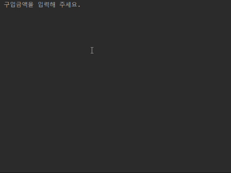

    

# 프리코스 3주차 미션 - 로또

---

> 우아한테크코스 7기 프리코스 3주차 미션, 로또 게임을 구현한 저장소입니다.

 

# Lotto Game

# 목차

- [시작하기](#시작하기)
- [프로젝트 개요](#프로젝트-개요)
- [기능 목록](#기능-목록)
  - [로또 구매 및 초기 설정](#로또-구매-및-초기-설정)
  - [로또 번호 생성](#로또-번호-생성)
  - [당첨 번호 및 보너스 번호 입력](#당첨-번호-및-보너스-번호-입력)
  - [당첨 결과 확인](#당첨-결과-확인)
  - [결과 출력](#결과-출력)
  - [예외 처리](#예외-처리)

## 프로젝트 개요
이 프로젝트는 간단한 로또 발매기를 구현하는 것을 목표로 합니다. 사용자는 금액을 입력하여 로또를 구매하고, 추첨된 당첨 번호와 비교하여 당첨 여부를 확인할 수 있습니다. 최종적으로 당첨 내역과 수익률을 출력합니다.

이 프로젝트는 객체지향 설계 원칙에 따라 관련된 함수를 묶어 클래스로 구성하고, 각 객체가 협력하여 하나의 큰 기능을 수행하도록 설계되었습니다. 또한, 모든 클래스와 함수에는 단위 테스트를 작성하여 예상한 대로 동작하는지 검증합니다.

## 기능 목록

### 1. 로또 구매 및 초기 설정
- **구입 금액 입력 받기**: 사용자는 로또 구입 금액을 입력하며, 1,000원 단위로 입력합니다. 
  - 입력이 유효하지 않으면 `[ERROR]` 메시지를 출력하고 재입력을 받습니다.
- **로또 발행 개수 계산**: 구입 금액에 따라 발행할 로또 개수를 계산하여 출력합니다.

### 2. 로또 번호 생성
- **로또 번호 생성**: 1~45 사이에서 중복되지 않는 6개의 숫자를 무작위로 생성하여 로또 번호를 만듭니다.
- **로또 번호 정렬**: 각 로또 번호는 오름차순으로 정렬하여 출력합니다.

### 3. 당첨 번호 및 보너스 번호 입력
- **당첨 번호 입력**: 당첨 번호 6개를 쉼표(`,`)로 구분하여 입력받습니다. 
  - 입력이 유효하지 않으면 `[ERROR]` 메시지를 출력하고 재입력을 받습니다.
- **보너스 번호 입력**: 보너스 번호 1개를 입력받으며, 당첨 번호와 중복되지 않아야 합니다. 
  - 입력이 유효하지 않으면 `[ERROR]` 메시지를 출력하고 재입력을 받습니다.

### 4. 당첨 결과 확인
- **당첨 번호 일치 확인**: 사용자가 구매한 각 로또와 당첨 번호를 비교하여 일치하는 번호의 개수를 확인합니다.
- **등수 계산**:
    - **1등**: 6개 번호 일치
    - **2등**: 5개 번호 + 보너스 번호 일치
    - **3등**: 5개 번호 일치
    - **4등**: 4개 번호 일치
    - **5등**: 3개 번호 일치

### 5. 결과 출력
- **구매한 로또 목록 출력**: 사용자가 구매한 각 로또 번호와 발행 개수를 출력합니다.
- **당첨 통계 출력**: 일치 개수별 당첨 금액과 해당 개수를 출력합니다.
- **수익률 계산 및 출력**: 수익률을 소수점 둘째 자리에서 반올림하여 출력합니다.

### 6. 예외 처리
- 모든 입력 오류는 `IllegalArgumentException`을 발생시키며 `[ERROR]` 메시지를 출력합니다.
- 입력 오류 발생 시 해당 입력부터 다시 받도록 합니다.

## 예외 상황 및 처리
- **구입 금액이 1,000원으로 나누어떨어지지 않는 경우**: `[ERROR]` 메시지를 출력하고 재입력 받음
- **로또 번호(+ 보너스 번호) 1~45 범위를 벗어나거나 중복되는 경우**: `[ERROR]` 메시지를 출력하고 재입력 받음
- **로또 번호가 6개 입력되지 않는 경우**: `[ERROR]` 메시지를 출력하고 재입력 받음
- **당첨 번호와 보너스 번호가 중복되는 경우**: `[ERROR]` 메시지를 출력하고 재입력 받음
