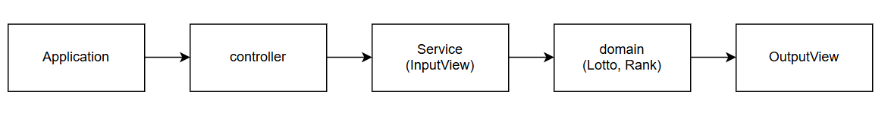

# java-lotto-precourse



## **Controller (LottoController)**:  
  >사용자로부터 입력을 받고(`InputView`), 비즈니스 로직(`LottoService`)을 수행한 후, 결과를 출력(`OutputView`)하는 전체 흐름을 제어합니다.  
  - 구매금액 입력 → 구매 개수 계산  
  - 로또 티켓 구매  
  - 당첨 번호 및 보너스 번호 입력  
  - 당첨 결과 계산 및 수익률 출력

## **Model/Service (LottoService)**:  
  >Lotto 핵심 로직을 담당합니다.  
  - 로또 티켓 구매 로직 수행  
  - 당첨 번호 설정 및 당첨 결과 계산  
  - 당첨 통계(등수별 개수), 총 상금, 수익률 계산

## **View (InputView, OutputView)**:  
  >I/O를 담당하며, 비즈니스 로직이 포함되지 않습니다.  
  - **InputView**:  
    사용자로부터 입력(구매금액, 당첨번호, 보너스번호)을 받습니다.  
  - **OutputView**:  
    당첨 통계, 수익률 등을 출력합니다.

# 실행 방법

1. `Application.java`를 실행합니다.
2. 콘솔을 통해 구매 금액, 당첨 번호, 보너스 번호를 입력합니다.
3. 결과로 구매한 로또 번호, 당첨 통계, 총 수익률이 출력됩니다.

## 예외 상황 처리

- 구매 금액이 0 이하인 경우 `[ERROR]` 메시지를 출력하고, 테스트 환경을 고려해 -1을 반환하여 재실행을 방지할 수 있습니다. 실사용 환경에서는 재입력 받는 로직을 추가할 수 있습니다.
- 숫자 형식이 아닌 값 입력 시 `[ERROR]` 메시지를 출력할 수 있으며, 예외 처리 로직을 통해 사용자 경험 개선이 가능합니다.

# Package 구조
```
>📦lotto
 ┣ 📂controller
 ┃ ┗ 📜LottoController.java
 ┣ 📂domain
 ┃ ┣ 📜Lotto.java
 ┃ ┣ 📜LottoService.java
 ┃ ┗ 📜Rank.java
 ┣ 📂view
 ┃ ┣ 📜InputView.java
 ┃ ┗ 📜OutputView.java
 ┗ 📜Application.java
 ```
