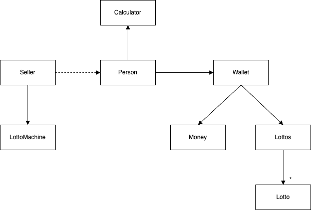

# java-lotto-precourse
# Lotto프로젝트 개요
사용자가 구매한 로또가 얼마의 수익률을 냈는지 나타낸다

# 요구사항
- 1개의 로또숫자는 1~45의 숫자 6개로 이루어져있다
    - 0이나 음수, 46이상의 수는 예외 메시지 출력 후 다시 입력받는다
    - 숫자는 중복되지 않는다
- 당첨번호 추첨는 1~45의 중복되지않는 6개의 숫자와 1개의 보너스 번호이다

- 당첨기준은 추첨된 당첨번호와 비교하고 등수는 아래와 같다
    - 1등: 6개 번호일치
    - 2등: 5개 번호일치 + 보너스번호 일치
    - 3등: 5개 번호일치
    - 4등: 4개 번호일치
    - 5등: 3개 번호일치

- 로또 구입은 금액을 입력하면 해당 금액만큼 로또를 발행한다
    - 개당 가격은 1,000원

- 구매한 로또 목록을 나타낸다
  - 로또의 각 번호를 오름차순으로 나타낸다 

- 보너스 번호를 포함한 7개의 로또 당첨번호를 입력한다
  - 입력 번호는 ','로 구분한다
  - 입력되는 번호를 검증한다

- 당첨번호와 구매한 번호를 비교하고 수익률을 계산한다
  - 수익률은 소수점 둘쨰 자리에서 반올림한다

<hr>

# 기능 목록
**📃 로또 발급**
- 구매하는 금액만큼의 로또를 발급한다 [X]
- 구매한 로또의 개수를 나타낸다 [X]

**🍀 로또번호 생성** []
- 1~45사이의 중복되지 않는 번호를 생성한다 [X]
- 생성된 로또 목록을 보관한다 []

**📟 로또번호 판독** []
- 구매한 로또 각각 당첨번호와 비교한다 [X]
- 결과는 등수로 나타낸다 []

**👛 수익률 계산** []
- 구매한 총 로또금액과 총 당첨금액을 비교하여 수익률을 구한다 []
  - 수익률은 소수점 둘째자리에서 반올림한다 []

**⌨️ 입력**
- 개당 1,000원의 로또 구매금액을 입력받는다 - `구입금액을 입력해 주세요.`[]
  - ❗️`a1000`과 같이 문자가 포함되어 있을 경우 `[ERROR] 숫자만 입력해주세요` 라는 메시지를 출력하고 다시 금액을 입력받는다 [X]
  - ❗️`1500`과 같이 로또구매 후 잔돈이 남게 될 경우 `[ERROR] 구매 금액을 딱 맞추어주세요` 라는 메시지를 출력하고 다시 금액을 입력받는다 [X]
  - ❗️`1,000`과 같이 쉼표로 숫자를 구분할 경우 `[ERROR] 숫자만 입력해주세요` 라는 메시지를 출력하고 다시 금액을 입력받는다 []

- 로또 당첨번호를 입력받는다 [] - `당첨 번호를 입력해 주세요.`[]
  - 1~45사이의 숫자 6개를 입력받는다 []
  - 당첨 번호는 ','로 구분한다 []
  - ❗️`0,1,2,3,4,47`과 같이 로또번호 생성 범위에 해당되지 않는 번호가 입력될 경우 `[ERROR] 로또 범위를 벗어나는 숫자가 입력되었습니다` 라는 메시지를 출력하고 다시 당첨번호를 입력받는다 [X]
  - ❗️`a1,2,3,4,5,6`과 같이 숫자가 아닌 다른 값이 포함될 경우 `[ERROR] 숫자만 입력해주세요` 라는 메시지를 출력하고 다시 당첨번호를 입력받는다 []
  - ❗️`1,1,2,3,4,5`과 같이 중복되는 숫자가 포함될 경우 `[ERROR] 중복되는 번호가 존재합니다` 라는 메시지를 출력하고 다시 당첨번호를 입력받는다 [X]
  - ❗️`1,2,3,4,5`과 같이 6개의 숫자가 모두 입력되지 않았을 경우 `[ERROR] 로또 번호는 6개여야 합니다` 라는 메시지를 출력하고 다시 당첨번호를 입력받는다 [X]
  - ❗️`1,2,3,4,5,6,7`과 같이 보너스 번호를 함께 입력하였을 경우 `[ERROR] 로또 번호는 6개여야 합니다` 라는 메시지를 출력하고 다시 당첨번호를 입력받는다 [X]

- 보너스 번호를 입력받는다 [] - `보너스 번호를 입력해 주세요`[]
  - 1개의 보너스 번호를 입력받는다 []
  - ❗️`1,2`와 같이 여러개의 보너스 번호를 입력하려 할 경우 `[ERROR] 1개의 당첨번호를 입력해주세요` 라는 메시지를 출력하고 다시 보너스 번호를 입력받는다 [X]
  - ❗️`0`와 같이 범위에 벗어나는 번호를 입력할 경우 `[ERROR] 1개의 당첨번호를 입력해주세요` 라는 메시지를 출력하고 다시 보너스 번호를 입력받는다 [X]
  - ❗️`a`와 같이 문자가 입력될 경우 `[ERROR] 1개의 당첨번호를 입력해주세요` 라는 메시지를 출력하고 다시 보너스 번호를 입력받는다 [X]

**🖥️ 출력**
- 구매한 로또의 개수를 출력한다 []
  - `N개를 구매했습니다`

- 구매한 로또의 번호목록을 출력한다 []
  - `[1, 2, 3, 4, 5, 6]`

- 당첨 통계를 출력한다 []
```
당첨 통계
---
3개 일치 (5,000) - N개
4개 일치 (50,000) - N개
5개 일치 (1,500,000) - N개
5개 일치, 보너스 볼 일치 (30,000,000) - N개
6개 일치 (2,000,000,000) - N개
```

- 총 수익률을 출력한다 []
  - `총 수익률은 N%입니다.`

<hr>

# 클래스 구조도
